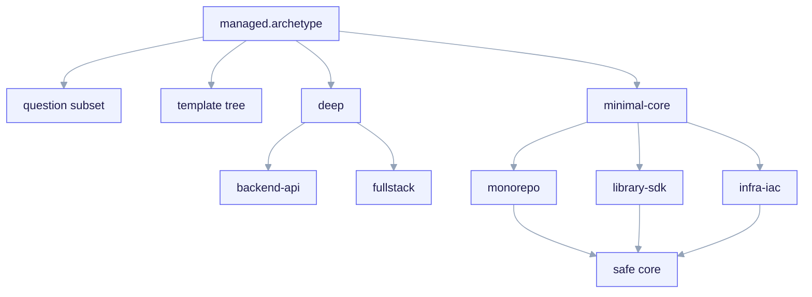

# Archetypes

The **archetype** is the branch axis of ai-core-kit. It is the first, mandatory
question `/ack-init` asks, and its answer narrows every subsequent interview
question (via `applies_to` gating) and selects which template set is rendered
into the forked child. One manifest key — `managed.archetype` — drives the whole
branching tree (invariant **I3**).

There are **five v1 archetypes**, split into two tiers of depth.

<small>One manifest key — `managed.archetype` (the branch axis, invariant I3) — selects both the question subset (via `questions.yaml` `applies_to`) and the template set (`templates/archetypes/&lt;archetype&gt;/`). Deep archetypes (backend-api, fullstack — the latter adds design-system) ship a dedicated tree; minimal-core archetypes render only the safe universal core.</small>

## The five v1 archetypes

| Archetype | Tier | Interview coverage | Template tree |
|---|---|---|---|
| `backend-api` | **deep** | full (persistence, API spec, contract gate, telemetry) | dedicated tree under `templates/archetypes/backend-api/` |
| `fullstack` | **deep** | full (adds design-system; dual app/api gate) | dedicated tree under `templates/archetypes/fullstack/` |
| `monorepo` | minimal-core | universal core questions only | no dedicated tree (renders the safe core) |
| `library-sdk` | minimal-core | universal core questions only | no dedicated tree (renders the safe core) |
| `infra-iac` | minimal-core | universal core questions only | no dedicated tree (renders the safe core) |

> **v1 scope:** only `backend-api` and `fullstack` are specified deeply. The
> other three are **schema-known**: the manifest schema accepts them, the
> interview answers a safe universal core for them, but they do not yet have a
> dedicated archetype template tree. They render a minimal core and will be
> deepened in v2. See [Minimal-core archetypes](/archetypes/minimal-core).

## Deep vs minimal-core

The split is deliberate (manifest invariant **I3**, and PLAN-REVIEW.md's
"de-scope v1 to two deep archetypes" recommendation). Going deep on an archetype
means three things land together:

1. **A branch-specific question subset.** Deep archetypes answer persistence,
   framework, architecture, and fine-grained gate questions
   (`scope`, `exempt`, `require_approval_by`). Minimal-core archetypes answer
   only the universal core (project identity, language, features, gate `mode` +
   `protected_paths`, telemetry `enabled`, CI/CD).
2. **A dedicated template tree.** `templates/archetypes/<archetype>/` exists for
   the deep archetypes only. Minimal-core archetypes have no such tree — they
   render the universal core (skills, `.claude/` conventions, the manifest, and
   the opted-in hooks/MCP/telemetry) without domain-specific scaffolding.
3. **Per-archetype gate defaults.** `contract_gate.protected_paths`, `scope`,
   and `exempt` carry archetype-appropriate defaults so the gate is never
   vacuous (invariant **I4**, finding 44).

## Where the branching is encoded

| Concern | Source of truth |
|---|---|
| Which questions are asked per archetype | `templates/interview/questions.yaml` (`applies_to`) |
| Which schema blocks are required/forbidden per archetype | `templates/manifest/project.manifest.schema.yaml` (per-archetype `if/then`) |
| Which files render per archetype | `templates/archetypes/render.map.yaml` + `_when.<path>/` path-segment guards |

Two manifest rules make the branching enforceable rather than hopeful:

- `archetype == fullstack` ⟹ `design_system` is **required**.
- `archetype == backend-api` ⟹ `design_system` is **forbidden**.

Because `design_system` questions are gated `applies_to: [fullstack]`, no other
archetype can ever write that block — the schema's forbidden-for-backend branch
is satisfied by construction, not by an LLM remembering to skip it.

## Status today

The archetype contract (which questions, which schema blocks, which render
rules) is part of the **frozen P3 contract** and is shipped. The deep template
**content** is being deepened in **P4** (`done: false` in
`bootstrap/ack.bootstrap.yaml`): today the `backend-api` and `fullstack` trees
exist as structurally-correct skeletons that render and pass the branch-matrix
test, with their full house-style scaffolding marked `TODO(P4)`. Read each
archetype page for exactly what ships today versus what is deferred.
