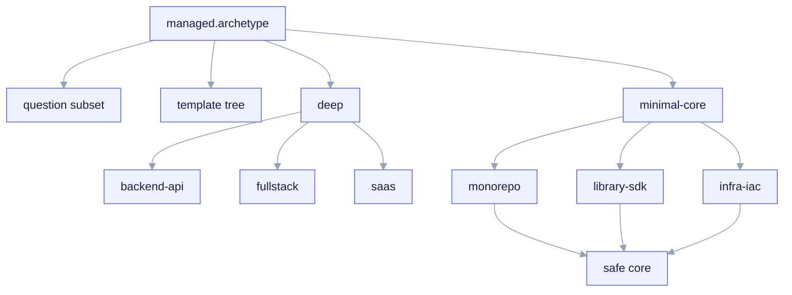
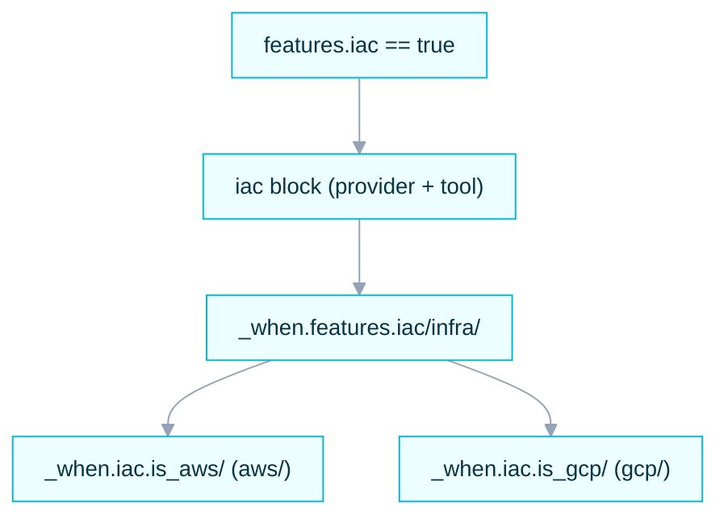

import TerminalCast from '../../../components/TerminalCast'

# Archetypes

The **archetype** is the branch axis of ai-core-kit. It is the first, mandatory
question `/ack-init` asks, and its answer narrows every subsequent interview
question (via `applies_to` gating) and selects which template set is rendered
into the forked child. One manifest key — `managed.archetype` — drives the whole
branching tree (invariant **I3**).

There are **six archetypes**, split into two tiers of depth: **three deep**
(`backend-api`, `fullstack`, `saas`) and **three minimal-core** (`monorepo`,
`library-sdk`, `infra-iac`).

<TerminalCast src="/demo/ack-saas.cast" />

<small>One manifest key — `managed.archetype` (the branch axis, invariant I3) — selects both the question subset (via `questions.yaml` `applies_to`) and the template set (`templates/archetypes/&lt;archetype&gt;/`). Deep archetypes (backend-api, fullstack, saas — the latter two add design-system) ship a dedicated tree; minimal-core archetypes render only the safe universal core. The orthogonal `features.iac` toggle is drawn separately below — it is not an archetype.</small>

## The six archetypes

| Archetype | Tier | Interview coverage | Template tree |
|---|---|---|---|
| `backend-api` | **deep** | full (persistence, API spec, contract gate, telemetry) | dedicated tree under `templates/archetypes/backend-api/` |
| `fullstack` | **deep** | full (adds design-system; dual app/api gate) | dedicated tree under `templates/archetypes/fullstack/` |
| `saas` | **deep** | full (opinionated Vercel+Next+Supabase stack; adds auth/hosting/billing + design-system) | dedicated tree under `templates/archetypes/saas/` |
| `monorepo` | minimal-core | universal core questions only | no dedicated tree (renders the safe core) |
| `library-sdk` | minimal-core | universal core questions only | no dedicated tree (renders the safe core) |
| `infra-iac` | minimal-core | universal core questions only | no dedicated tree (renders the safe core) |

> **Depth:** `backend-api`, `fullstack`, and `saas` are specified **deeply** and
> ship a dedicated template tree. The other three are **schema-known**: the
> manifest schema accepts them and the interview answers a safe universal core for
> them, but they have no dedicated archetype template tree — they render a minimal
> core. See [Minimal-core archetypes](/archetypes/minimal-core). The new `saas`
> archetype is documented at [saas (deep)](/archetypes/saas).

## Deep vs minimal-core

The split is deliberate (manifest invariant **I3**, and PLAN-REVIEW.md's
"de-scope v1 to two deep archetypes" recommendation — `saas` was added as the
third deep archetype later, in schema_version 3). Going deep on an archetype
means three things land together:

1. **A branch-specific question subset.** Deep archetypes answer persistence,
   framework, architecture, and fine-grained gate questions
   (`scope`, `exempt`, `require_approval_by`). Minimal-core archetypes answer
   only the universal core (project identity, language, features, gate `mode` +
   `protected_paths`, telemetry `enabled`, CI/CD).
2. **A dedicated template tree.** `templates/archetypes/<archetype>/` exists for
   the three deep archetypes only. Minimal-core archetypes have no such tree — they
   render the universal core (skills, `.claude/` conventions, the manifest, and
   the opted-in hooks/MCP/telemetry) without domain-specific scaffolding.
3. **Per-archetype gate defaults.** `contract_gate.protected_paths`, `scope`,
   and `exempt` carry archetype-appropriate defaults so the gate is never
   vacuous (invariant **I4**, finding 44).

## Where the branching is encoded

| Concern | Source of truth |
|---|---|
| Which questions are asked per archetype | `templates/interview/questions.yaml` (`applies_to`) |
| Which schema blocks are required/forbidden per archetype | `templates/manifest/project.manifest.schema.yaml` (per-archetype `if/then`) |
| Which files render per archetype | `templates/archetypes/render.map.yaml` + `_when.<path>/` path-segment guards |

A few manifest rules make the branching enforceable rather than hopeful:

- `archetype in [fullstack, saas]` ⟹ `design_system` is **required**.
- `archetype == backend-api` ⟹ `design_system` is **forbidden**.
- the `saas` interview branch is the only writer of `auth` / `hosting` / `billing`
  (those questions are gated `applies_to: [saas]`).

Because `design_system` questions are gated `applies_to: [fullstack, saas]`, no
other archetype can ever write that block — the schema's forbidden-for-backend
branch is satisfied by construction, not by an LLM remembering to skip it.

## Infrastructure as Code (IaC)

IaC is **orthogonal** to the archetype axis. It is not an archetype (except for
the pure `infra-iac` minimal-core repo) — it is a boolean toggle, `features.iac`,
that **any deep archetype** (`backend-api`, `fullstack`, `saas`) can switch on to
add an infrastructure subtree alongside its normal scaffold. So you can have
`saas + IaC`, `fullstack + IaC`, or `backend-api + IaC` without changing the
archetype.

When `features.iac == true`, the schema **requires** the `iac` block:

- `iac.provider` — `aws` | `gcp` | `none`
- `iac.tool` — `terraform` (default) | `pulumi` | `cloudformation` | `cdk` | `none`
- `iac.is_aws` / `iac.is_gcp` — **derived** booleans emitted by `lib/manifest.mjs`
  from `provider` (exactly one is true), schema-declared so they survive
  `additionalProperties:false`.

The subtree renders under `_when.features.iac/infra/` and is then provider-split
by **path-segment guards** `_when.iac.is_aws/` vs `_when.iac.is_gcp/`. Using the
derived booleans keeps provider selection inside the deterministic boolean-only
conditional-inclusion layer (decision O6) — no equality operator in the render
engine. The IaC subtree is deliberately **not** mapped by a `**/infra/**` glob in
`render.map.yaml`: that glob would falsely match the fullstack persistence path
`src/infra/db/**`, which is governed by `_when.persistence.enabled/`.

For a worked example see the inline `saas + IaC` instance in the v3 manifest
schema (`archetype: saas`, `features.iac: true`, `iac.provider: aws`).

## Status today

The archetype contract (which questions, which schema blocks, which render
rules) is part of the **frozen P3 contract** and is shipped. The `saas` archetype
and the orthogonal `features.iac` toggle shipped in **schema_version 3**: `saas`
renders a real, integrated Vercel + Next + Supabase scaffold and `features.iac`
adds a provider-split Terraform subtree to any deep archetype. The `backend-api`
and `fullstack` trees still have some full house-style scaffolding marked
`TODO(P4)`. Read each archetype page for exactly what ships today versus what is
deferred.
