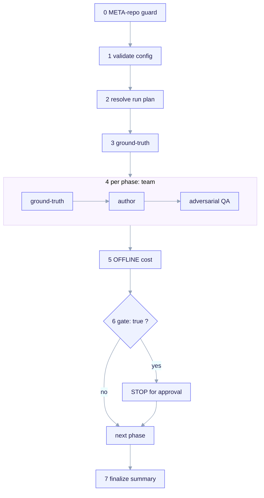

# /ack-build orchestrator

`/ack-build` (`.claude/commands/ack-build.md`) is the command that drives
ai-core-kit's **own** build. It reads the data-driven config
[`bootstrap/ack.bootstrap.yaml`](/build/bootstrap-config), validates it against
its JSON-Schema, resolves a run plan, and drives the build **phase-by-phase**
with a multi-agent team per phase — stopping at every gate for approval. It is
the config-driven evolution of `docs/BOOTSTRAP.md §6` (the paste-in TEAMS
command): the phase plan, roster, budgets, and acceptance tests now live as data,
so re-planning is a config edit, not a prompt rewrite.

<em>/ack-build runs seven steps: META-repo guard (fail-closed) → load + validate config vs <code>bootstrap.schema.json</code> → resolve run plan (order, skip done, model/budget) → mandatory ground-truth → drive each eligible phase as one team (ground-truth → author, one worker per deliverable → adversarial QA vs <code>acceptance_tests[]</code>) → cumulative OFFLINE cost (<code>aggregate.py</code> or "unavailable, P6 pending") → STOP at every gate for approval → finalize. </em>

> **Two-layer discipline.** `/ack-build` builds the **META** repo — the machine
> that stamps out the standard. It does NOT define or run a child contract gate
> and never writes a `project.manifest.yaml` at the META root (findings
> 12/35/54). The CHILD payload is only what lives under `templates/` and is
> rendered by [`/ack-init`](/reference/commands). Building the kit ≠
> initializing a child — `/ack-build` is the inverse of `/ack-init`.

## Arguments

All optional:

| Flag | Effect |
|---|---|
| `--phase <Pn>` | Run exactly one phase (still honors its `depends_on`; aborts if a dependency is not `done`). |
| `--from <Pn>` | Start the sweep at `Pn` (skip already-`done` earlier phases, but still verify their acceptance tests as a regression gate). |
| `--dry-run` | Print the resolved plan (phase order, per-phase team, model + budget resolution, gates) and STOP. Author nothing. |
| `--no-stop` | Do not pause at `gate: true` phases (CI sweeps). Default is to STOP at every gate. |
| `--rebuild` | Re-author a phase even if it is `done: true` (overrides the resume-from-checkpoint skip; still runs acceptance tests after). |

## How it runs

The orchestrator executes a fixed sequence of steps.

### STEP 0 — META-repo guard (fail-closed, first)

`/ack-build` runs **only** inside the ai-core-kit META repo. It confirms BOTH
META sentinels are present:

- `bootstrap/ack.bootstrap.yaml`
- `docs/BOOTSTRAP.md`

If either is absent it STOPS and tells the user to run `/ack-init` instead. This
is the exact inverse of the `/ack-init` guard, which refuses *inside* the META
repo.

### STEP 1 — Load and validate the config (fail-closed)

It reads the config and validates it against
`bootstrap/schema/bootstrap.schema.json` (draft 2020-12). On `INVALID` or a
missing `pyyaml`/`jsonschema` it STOPS and authors nothing. Beyond the schema it
also cross-checks that every referenced `agent` file exists once P2 is `done`
(warning, not a hard stop) and that `depends_on` forms a cycle-free DAG (a cycle
is a hard stop).

### STEP 2 — Resolve the run plan

- **Order** = the `phases` array order (P1..P8), but a phase is *eligible* only
  once every id in its `depends_on` is `done` (or completed earlier in this
  sweep) — this enforces the sequencing DAG.
- **Skip rule:** a `done: true` phase is skipped for authoring (resume from
  checkpoint) unless `--rebuild` or an explicit `--phase` target. Skipped phases
  still have their `acceptance_tests` run as a regression gate so a completed
  phase cannot silently rot.
- **Model + budget resolution per member:** effective model = `team[].model` if
  set, else `models.<role>`, else `models.default`. Effective budget =
  `team[].token_budget` if set, else `budgets.per_role.<role>`, else
  `budgets.per_phase_tokens / Σcount`. Budgets are advisory.

`--dry-run` prints this resolved plan as a table and stops.

### STEP 3 — Preconditions: ground-truth is mandatory per phase

Every authoring phase is grounded before writing: clone the
`meta.reference_repos` into a scratch dir for **exact** extraction (quotes +
paths, not paraphrase), respect the license posture from the config (only
`vendorable: true` files may be copied, only WITH attribution; doc skills are
reference-only), and verify each `.claude/` primitive against the live
docs.claude.com specs before writing it.

### STEP 4 — Drive each eligible phase (ground-truth → author → QA)

Each phase runs as **one multi-agent team** with three barriers:

1. **Ground-truth barrier** — `research` member(s) clone + extract exact
   conventions/licenses and WebFetch the relevant docs.claude.com specs. Returns
   `facts`. Authoring does not start until this barrier joins.
2. **Author barrier** — one worker per `deliverables[]` path, grounded in
   `facts`, writing production-quality files (no stubs/TODOs). Child-payload
   deliverables under `templates/` MUST use `${CLAUDE_PROJECT_DIR}` +
   child-relative paths, never `templates/` or absolute ack paths (forkability,
   invariant I7).
3. **Adversarial QA barrier** — the `qa` member validates the authored (or, for a
   skipped `done` phase, the existing) artifacts against this phase's
   `acceptance_tests[]`, reporting each id PASS / FAIL / N-A with evidence. A FAIL
   on any acceptance test means the phase is NOT complete.

After QA it prints a per-phase status line: phase id + title, the acceptance-test
results, the per-member model used and an advisory budget note, and the
cumulative OFFLINE cost so far.

### STEP 5 — Cumulative OFFLINE cost

Cost is reported via the offline aggregator, **never** a live API:

- If `telemetry/aggregate.py` exists (P6 complete), it is run read-only over
  `~/.claude/projects/**/*.jsonl` × `telemetry/pricing.json` and the total (plus
  a feature/agent breakdown when available) is reported.
- If it does NOT yet exist (P6 still pending in this very build), it reports
  `cost: unavailable (P6 pending — offline aggregator not yet built)` and
  continues. The cost feature is intentionally decoupled from live orchestration
  (finding 8 / issue #11008): it is computed post-run from transcripts, so its
  absence never blocks earlier phases.
- It NEVER fabricates a number and NEVER reads a live `/usage` endpoint.

### STEP 6 — Gate stop (default behavior)

After completing a `gate: true` phase, unless `--no-stop` is set, `/ack-build`
**STOPS and asks for approval** (via AskUserQuestion), presenting the
acceptance-test results, the deliverables written, and the cumulative OFFLINE
cost. Options: approve → continue, stop here, re-run this phase. A gate phase
with **failing** acceptance tests is itself a stop — the build cannot proceed
past an unmet gate even with `--no-stop`. The gate phases are P1, P3, P4, P5, P8.

### STEP 7 — Finalize

When the run list is exhausted (or it stopped at a gate / on a failure), it
prints a build summary: which phases completed this run, which were skipped as
already-`done`, which are blocked (with the blocking acceptance-test ids), the
next eligible phase, and the final cumulative OFFLINE cost (or `unavailable`). It
reminds the operator that re-planning the build is an edit to
`bootstrap/ack.bootstrap.yaml` (re-validated via STEP 1), not to this command,
and it does NOT flip `done:` flags itself — `done` is an operator-managed
checkpoint decision after reviewing QA.

## Relationship to BOOTSTRAP.md

| Source | Role |
|---|---|
| `docs/BOOTSTRAP.md` | The human narrative (framing, references, corrections, the §6 TEAMS skeleton). |
| `bootstrap/ack.bootstrap.yaml` | The machine plan this command consumes. |
| `.claude/commands/ack-build.md` | This orchestrator: reads → validates → drives. |

`BOOTSTRAP.md` stays the canonical narrative (the "why"); the config is the
canonical executable plan (the "what/how/when"). When they disagree, the config
wins for execution.

## Status

The orchestrator command and its config + schema are **shipped**. What
`/ack-build` *drives* reflects the current checkpoint state: P1 and P3 are
`done`; P2, P4–P8 are `done: false`. Cost reporting is OFFLINE only and will read
`unavailable (P6 pending)` until the P6 aggregator phase is complete.
