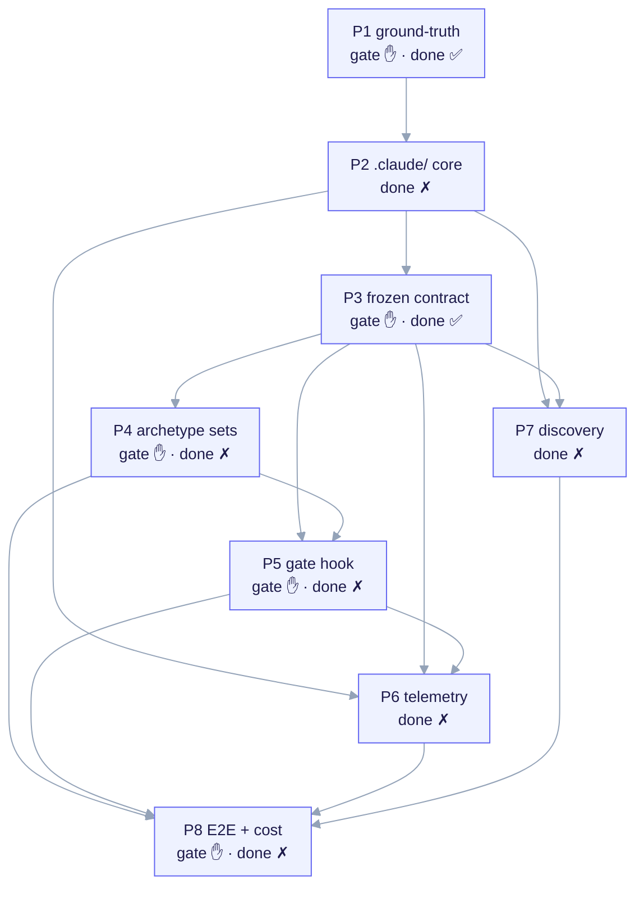

import TerminalCast from '../../../components/TerminalCast'

# Bootstrap config (ack.bootstrap.yaml)

<TerminalCast src="/demo/ack-bootstrap-config.cast" />

`bootstrap/ack.bootstrap.yaml` is the **data-driven build config** for the
ai-core-kit META repository — the single machine-readable source of truth for
*how the kit builds itself*. It is the config-driven evolution of the prose plan
in `docs/BOOTSTRAP.md`: the 8-phase plan, team roster, model assignments,
advisory budgets, and per-phase acceptance tests all live here as data, so
re-planning the build is an edit to one validated YAML file rather than a prompt
rewrite.



<em>The eight phases as a `depends_on` DAG: P1 ground-truth + repo tree + license ledger; P2 `.claude/` core + agents + frontmatter linter; P3 frozen contract (schema + questions + render + `/ack-init`); P4 archetype template sets; P5 contract template + 3-mode gate hook; P6 offline telemetry aggregator; P7 discovery + scheduled-PR Action; P8 E2E + per-feature cost. Gate phases (P1, P3, P4, P5, P8) STOP /ack-build for approval; only P1 and P3 are done today.</em>

> **Layer discipline (never conflate).** This config governs the **META** build
> only. It does NOT define a child contract, manifest, or contract gate — those
> are CHILD-layer artifacts authored under `templates/` and rendered by
> `/ack-init`. Edit this file to re-plan the META build; edit `templates/` to
> change what a forked child receives. There is intentionally **no** `contract`,
> `manifest`, or `contract_gate` key here (findings 12/35/54): the META repo
> neither owns a manifest nor gates itself.

## The three files

| File | Role |
|---|---|
| `bootstrap/ack.bootstrap.yaml` | The build config: `meta`, `models`, `budgets`, `teams`, `phases[]`. |
| `bootstrap/schema/bootstrap.schema.json` | JSON-Schema (draft 2020-12, `additionalProperties:false` everywhere) that validates the config. Fail-closed: `/ack-build` refuses to run on an invalid config. |
| `.claude/commands/ack-build.md` | The orchestrator. Reads the config, validates it, resolves a run plan, and drives each phase as a multi-agent team. See [/ack-build](/build/ack-build). |

This mirrors the same producer/consumer discipline the CHILD layer uses (one
frozen schema, one validated instance, one consumer command) — but at the META
layer, for the kit's own build.

## Config anatomy

The config has five top-level keys, all `snake_case`.

### meta

Kit identity plus the cloned reference repos with their license posture.

- `kit_name` — constant `ai-core-kit`.
- `version_source` — `git-describe` (default) | `package_json` | `manual` (with
  `manual`, a `version_override` is required). Used for run provenance.
- `reference_repos[]` — each `{name, url, license, vendorable, notes?}`. The
  schema **enforces** that `source-available`/`proprietary` repos have
  `vendorable: false`. This encodes the hard licensing rule: the anthropics doc
  skills (`docx/pdf/pptx/xlsx`) are reference-only and must never be copied or
  derived from, while Apache-2.0 / MIT files may be vendored WITH attribution.

The four shipped reference repos: `anthropics/skills` (Apache-2.0, vendorable
example skills; doc skills source-available), `alirezarezvani/claude-skills`
(MIT), `shanraisshan/claude-code-best-practice` (MIT), `affaan-m/ecc` (MIT).

### models

Default model per role, plus a global `default`. Values are
`haiku | sonnet | opus | inherit`. The rationale baked into the defaults:

```yaml
models:
  default: sonnet
  research: sonnet      # reference extraction + license audit (must be exact)
  template: sonnet      # archetype payload + interview branching (load-bearing)
  contract: sonnet      # 3-mode gate hook semantics (footgun-prone, finding 2)
  infra: haiku          # .claude/ tree, settings.json, mostly mechanical
  discovery: haiku      # propose-only; low stakes
  design_system: haiku  # child fullstack tokens/skills
  qa: sonnet            # adversarial verification against acceptance tests
```

Load-bearing work (ground-truth extraction, the frozen contract, gate semantics,
adversarial QA) is **Sonnet**; mechanical authoring is **Haiku**; **Opus** is
reserved for the orchestrator and explicit escalations. A phase's `team[].model`
overrides the role default for that role in that phase.

### budgets

`per_phase_tokens` plus an optional `per_role` map. These are **advisory**
cost-awareness targets surfaced in the status line — never hard caps. They never
block authoring.

```yaml
budgets:
  per_phase_tokens: 180000
  per_role:
    research: 90000
    template: 90000
    contract: 70000
    infra: 60000
    discovery: 40000
    design_system: 40000
    qa: 70000
```

### teams

The roster as data. Each entry binds a `role` to an `agent` (resolving to
`.claude/agents/<agent>.md`, authored in P2), records the `layer` (`meta` vs
`child-payload`), and a `responsibility`. The `layer` field is how the
orchestrator keeps the two-layer boundary honest: `child-payload` roles
(`template`, `contract`, `design_system`) produce `templates/` content; `meta`
roles (`research`, `discovery`, `infra`, `qa`) build the kit.

### phases[]

Exactly **eight** phases, **P1..P8**, in the PLAN-REVIEW.md revised order. Each
phase carries:

| Key | Meaning |
|---|---|
| `id` | Stable `P1`..`P8`. |
| `title`, `goal` | One-line title + the phase's objective. |
| `gate` | `true` ⟹ `/ack-build` STOPS for approval after the phase. |
| `done` | `true` ⟹ complete on disk; `/ack-build` skips authoring and runs only acceptance tests as a regression check. |
| `depends_on[]` | Hard prerequisites (other phase ids); encodes the sequencing as a DAG. |
| `team[]` | `{role, agent, count, model?, token_budget?}`. |
| `deliverables[]` | Repo-relative paths the phase produces. |
| `acceptance_tests[]` | `{id, desc}` testable definition-of-done assertions. |

## The 8 phases (P1–P8)

The config encodes this dependency DAG. **Checkpoint state matters:** only `P1`
and `P3` are `done: true` today; the rest are `done: false`.

| Phase | Title | gate | done | depends_on |
|---|---|---|---|---|
| **P1** | Ground-truth + repo tree + license ledger | ✋ | ✅ | — |
| **P2** | `.claude/` core + team agents + settings.json + frontmatter linter | | | P1 |
| **P3** | Frozen contract — manifest schema + questions.yaml + render engine + `/ack-init` | ✋ | ✅ | P2 |
| **P4** | Archetype template sets (deep) + completeness rubric + license NOTICEs | ✋ | | P3 |
| **P5** | Contract template + 3-mode manifest-driven gate hook | ✋ | | P3, P4 |
| **P6** | Offline telemetry aggregator + pricing.json + README | | | P2, P3, P5 |
| **P7** | Discovery — sources.yaml + proposals + scheduled-PR Action + `/discover` | | | P2, P3 |
| **P8** | E2E + META-hygiene + idempotency + per-feature cost (final gate) | ✋ | | P4, P5, P6, P7 |

> **What's shipped vs in progress.** P3 (the frozen CHILD contract: manifest
> schema, `questions.yaml`, render engine, `/ack-init`) is `done`. P4 (deep
> archetype template content), P5 (the 3-mode gate hook), P6 (the offline
> aggregator), P7 (discovery), and P8 (E2E) are `done: false` — roadmap/partial.
> The config itself, its schema, and the `/ack-build` orchestrator are shipped.

Each phase's `acceptance_tests[]` are the definition of done. For example, P3's
tests assert the manifest schema is draft 2020-12 with `additionalProperties:
false` everywhere, every `questions.yaml` `writes_to` resolves to a schema
property (invariant I1), and `/ack-init` carries a fail-closed META-repo guard.
P5's tests assert the `block` mode uses `exit 2 + permissionDecision: deny` (the
load-bearing footgun, finding 2) and the gate fails open on a missing manifest.

## Cost is OFFLINE, never live (finding 8)

There is **no live token/cost API** exposed to hooks or the orchestrator
(issue #11008 / PLAN-REVIEW.md row 28). Cost is computed **post-run** by the
offline aggregator `telemetry/aggregate.py` over `~/.claude/projects/**/*.jsonl`
× a versioned `telemetry/pricing.json`. Two consequences are encoded in the
config:

- The aggregator is built in **P6**, which `depends_on: [P2, P3, P5]`. Until P6
  is `done`, `/ack-build` reports cost as `unavailable (P6 pending)` and proceeds
  — the cost feature is deliberately decoupled so its absence never blocks the
  build.
- The P8 telemetry acceptance test (`P8-A4`) runs the aggregator against a
  **captured transcript**, not live orchestration.

## Editing the config

Re-planning the build means editing `ack.bootstrap.yaml`, then re-validating
against the schema (fail-closed):

```bash
python3 - <<'PY'
import json, yaml
from jsonschema import Draft202012Validator
cfg = yaml.safe_load(open("bootstrap/ack.bootstrap.yaml"))
schema = json.load(open("bootstrap/schema/bootstrap.schema.json"))
errs = sorted(Draft202012Validator(schema).iter_errors(cfg), key=lambda e: list(e.path))
print("VALID" if not errs else f"{len(errs)} error(s)")
for e in errs:
    print(" -", "/".join(map(str, e.path)) or "<root>", ":", e.message)
PY
```

Common edits: re-sequence via `phases[].depends_on`; re-assign a model
(`models.<role>` for a default, or `team[].model` to override one role in one
phase); tune advisory `budgets`; add an acceptance test
(`{id: "Pn-A<k>", desc}`); mark a phase `done` (an operator checkpoint decision —
`/ack-build` never flips it for you); or add a reference repo (the schema rejects
a `source-available`/`proprietary` repo marked `vendorable: true`).

> **Do not** add child-layer concepts to this config. Child behavior is
> configured by `project.manifest.yaml` in a fork (see the manifest schema and
> render engine), never here.

## See also

- [/ack-build orchestrator](/build/ack-build) — the command that reads,
  validates, and drives this config phase-by-phase.
- [Manifest & Interview](/concepts/manifest-and-interview) — the CHILD-layer
  analogue of this file: one frozen schema, one validated instance
  (`project.manifest.yaml`), one consumer (`/ack-init`).
- [Offline Cost Telemetry](/features/cost-telemetry) — the P6 aggregator this
  config schedules, and why cost is offline-only.
- [Roadmap](/roadmap) — the shipped / partial / roadmap status that mirrors the
  `done` flags in `phases[]`.
