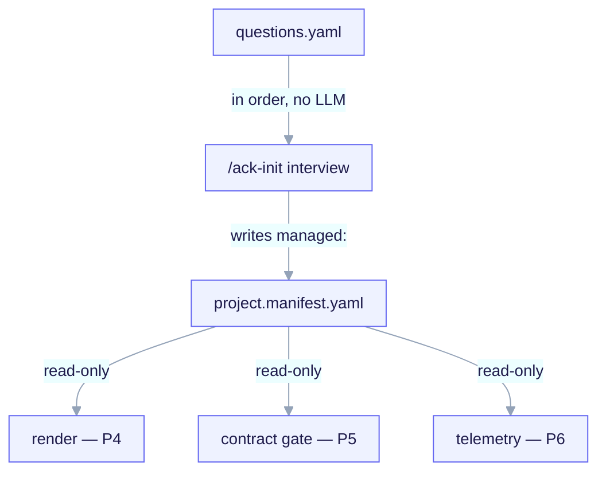

# Interview → Manifest → Render

The heart of `ai-core-kit` is a small, **frozen** pipeline: an archetype-first interview
writes a `project.manifest.yaml`, which a renderer consumes to stamp out your project.
Everything here is the **P3 contract** — the stable interface several downstream
consumers build against.



<small>One producer, three read-only consumers. `templates/interview/questions.yaml` is the deterministic question bank; the `/ack-init` interview is the sole writer of `managed:` (machine-owned), walking the bank in order with no LLM and validating before render. Render (P4) substitutes `${VAR}`, the gate (P5) reads `contract_gate.*` + `contracts[]`, and telemetry (P6) buckets OFFLINE cost via `telemetry.*` — all read-only, so the single source of truth never drifts mid-run.</small>

```
questions.yaml  ──(interview, no LLM)──▶  project.manifest.yaml  ──(validate)──▶  RENDER
 (the question bank)                       (single source of truth)               (P4)
```

## One producer, many consumers

```
PRODUCER
  /ack-init interview     → the ONLY writer of the manifest
      • writes managed: wholesale from templates/interview/questions.yaml
      • seeds user: once on first run, then never touches it
      • validates against the JSON-Schema BEFORE any render

CONSUMERS (read-only; none of them writes the manifest)
  render engine           → substitutes ${VAR} into the archetype scaffold
  contract gate hook      → enforces contract_gate.* + contracts[]
  telemetry aggregator    → buckets OFFLINE cost via telemetry.*
```

The single-writer rule is what makes the manifest a trustworthy single source of truth:
no consumer ever writes it back, so it cannot drift mid-run.

## The four frozen artifacts

| Artifact | File | Role |
|---|---|---|
| Manifest schema (human) | `templates/manifest/project.manifest.schema.yaml` | Authoritative, annotated contract (`schema_version: 2`); doubles as a worked instance. |
| Manifest schema (machine) | `templates/manifest/project.manifest.schema.json` | JSON-Schema draft 2020-12 — the validator the interview runs. |
| Question bank | `templates/interview/questions.yaml` | The deterministic questions the interview walks in order. |
| Render contract | `docs/RENDER-ENGINE.md` | `${VAR}` syntax, `_when.*` conditional dirs, `render.map.yaml`, idempotency. |

## The question bank is deterministic

`/ack-init` walks `questions.yaml` **in order**, with **no LLM in the loop**: the same
answers in always produce a byte-identical manifest out (invariant **I2**). Each question
declares:

| Field | Meaning |
|---|---|
| `id` | unique, stable, kebab-case; referenced by `ask_if`/`skip_if`. |
| `prompt` | the human-facing question text. |
| `type` | `select` \| `multiselect` \| `text` \| `bool`. |
| `options` | for `select`/`multiselect`: list of `{value, label?}`. |
| `default` | pre-filled value; for `select` it must be one of `options.value`. |
| `applies_to` | the archetypes this question is asked for, or `all`. |
| `ask_if` / `skip_if` | optional gating expression over **earlier** answers. |
| `writes_to` | dotted path under `managed:` where the answer is written. |

### Archetype is the first, mandatory question (the branch axis)

The very first question is `archetype` (invariant **I3**). Its answer narrows every
subsequent question through `applies_to` gating — evaluated **before** `ask_if`/`skip_if`.
This is how, for example, persistence (DB/ORM/migration) questions fire only for
`backend-api` and `fullstack`, and the design-system question fires only for `fullstack`.

### The tiny expression grammar

`ask_if`/`skip_if` use an intentionally small, deterministic grammar — operators `==`,
`!=`, `in`, `not_in`, no parentheses or boolean chains — and may reference **only
earlier** questions. A referenced id that was itself skipped evaluates to an *unknown*
sentinel, which makes `==`/`in` false and `!=`/`not_in` true (fail-safe: skip rather
than ask). Example: `migrations_tool` carries `ask_if: "migrations_enabled == true"`, so
it never fires when migrations are disabled.

The full bank — all 39 questions and the branch matrix — is enumerated in the reference
docs; the contract above is the part you need to reason about the flow.

## The manifest envelope

```yaml
schema_version: 2          # const 2; the FORMAT major version
generator:                 # provenance only; OUTSIDE the hash (re-runs stay byte-stable)
  tool: ai-core-kit
  tool_version: "0.4.0"
  rendered_at: "..."       # the only clock value; informational
managed:                   # MACHINE-OWNED. Regenerated wholesale every run.
  manifest_hash: "sha256:..."   # written LAST, over the canonical managed: subtree
  project: { name, language, ... }
  archetype: backend-api
  features: { hooks, mcp, agent_teams, sdd_gate }
  persistence: { ... }
  contract_gate: { mode, protected_paths, scope, exempt }
  contracts: [ ... ]
  telemetry: { ... }
  ci_cd: { target }
  rendered_files: [ ... ]   # ownership ledger; written by the renderer
user:                       # HUMAN-OWNED. Seeded once, then never overwritten.
  notes: ""
  overrides: {}
```

The split is the whole idempotency story: **`managed:`** is machine-owned and
regenerated every run; **`user:`** is human-owned and seeded exactly once. No consumer
reads `user:` behaviorally — it is the user's scratch space (the renderer may consult
`user.overrides.*` for render vars but never requires it).

## The global invariants

These are the frozen guarantees the whole pipeline rests on:

- **I1 — `writes_to` cross-check.** Every question's `writes_to` must resolve to a real
  property declared in the schema. `/ack-init` cross-checks this at startup and
  hard-refuses on any orphan key. The interview and the manifest can never silently
  diverge.
- **I2 — structural idempotency.** `managed:`/`user:` split plus a canonical
  `manifest_hash` plus the `rendered_files[]` ledger give byte-identical output on
  identical answers. There is no 3-way merge engine.
- **I3 — archetype branching.** `archetype` is the first mandatory question and narrows
  all subsequent questions.
- **I4 — the gate is never vacuous.** `contract_gate.protected_paths` is required and
  non-empty per archetype, so even `infra-iac` (no `src/**`) can never ship an empty
  gate.
- **I5 — `additionalProperties: false`.** A typo'd key is a hard validation error, not a
  silent drop.
- **I6 — fail-closed at author time, fail-open at runtime.** Invalid manifest at write
  time aborts `/ack-init`; corrupt/missing manifest at consumption time degrades the
  gate to `off` plus stderr, never wedging a session.
- **I7 — forkability.** The META discovery engine and `.claude/` tooling are never copied
  into a child; rendered child paths use `${CLAUDE_PROJECT_DIR}` and `${dotted.path}`.

## Validation gates the render

The order is load-bearing: **answers → write manifest → validate → render.** The
renderer may assume a schema-valid `managed:` subtree because an invalid manifest aborts
before any file is touched (author-time fail-closed). What happens next is the
[Render engine contract](/concepts/render-engine).
