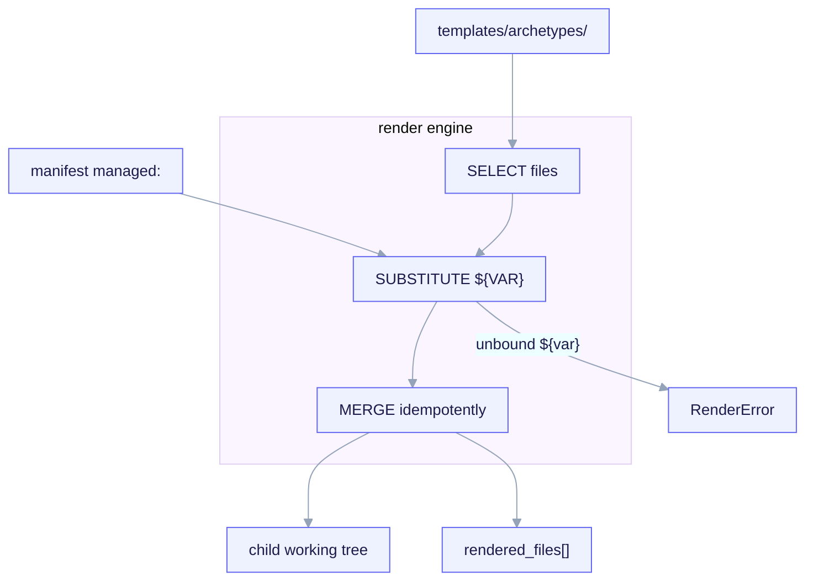

import TerminalCast from '../../../components/TerminalCast'

# Render engine contract

<TerminalCast src="/demo/ack-render.cast" />

Once `/ack-init` has written and validated `project.manifest.yaml`, the **render engine**
turns the manifest plus the `templates/archetypes/<archetype>/` tree into a working child
project. This page is the conceptual contract; the authoritative source is
`docs/RENDER-ENGINE.md`.



<small>Render is three separate jobs: SELECT files (`_when.*` path guards AND `render.map.yaml` globs), SUBSTITUTE `${VAR}` from `managed:` (scalars only), then MERGE idempotently (managed blocks + the `rendered_files[]` ledger) — emitting the child working tree plus a `managed.rendered_files[]` ownership ledger. An unbound `${var}` not in `managed:` raises `RenderError` and is FAIL-CLOSED: a hard error that writes nothing, never a blank.</small>

The design keeps three responsibilities **strictly separate**:

| Layer | Responsibility | Where the logic lives |
|---|---|---|
| 1. Substitution | replace `${VAR}` from the manifest | a tiny renderer regex (§ below) |
| 2. Conditional inclusion | decide **which** files render | the manifest + `_when.*` dirs + `render.map.yaml` — never in-template `if` logic |
| 3. Idempotency | never clobber hand-edits on re-run | the `managed:`/`user:` split + `rendered_files[]` ledger + managed blocks |

Conditionals are out of templates by construction: a template file is either included or
not, decided by the manifest. There are no loops, filters, or inheritance inside a
template, so the engine stays a pure string substitution and is trivially auditable.

## Substitution: `${VAR}` from the manifest

- **Placeholder form:** `${dotted.path}` referencing a key under `managed:` — e.g.
  `${project.name}`, `${persistence.db}`, `${contract_gate.mode}`.
- **`.tpl` suffix stripping:** template files carry a `.tpl.<ext>` suffix. The renderer
  strips `.tpl` on output, so `CLAUDE.md.tpl` becomes `CLAUDE.md` and
  `settings.json.tpl` becomes `.claude/settings.json`. A file **without** `.tpl` is
  copied byte-for-byte with no substitution scan, so literal `${...}` in shipped scripts
  survives.

The core resolver is about a dozen lines of `python3`:

```python
VAR = re.compile(r"\$\{([a-z0-9_]+(?:\.[a-z0-9_]+)*)\}")

def render(text, managed, user):
    def sub(m):
        path = m.group(1)
        val = lookup(path, managed, user)        # dotted-path walk
        if val is MISSING:
            raise RenderError(f"unbound {path} (not in managed:)")   # FAIL-CLOSED
        if isinstance(val, (dict, list)):
            raise RenderError(f"{path} resolves to a container, not a scalar")
        return scalar_to_str(val)                # bool -> "true"/"false", num as-is
    return VAR.sub(sub, text)
```

The rules that matter:

- **Unbound variable is a hard error**, never a silent empty string — the render-time
  mirror of `additionalProperties: false` (invariant **I5**). A typo'd `${...}` fails the
  render rather than emitting blank text.
- **Scalars only.** A `${...}` must resolve to a string, number, or bool. To inject a
  list (e.g. `protected_paths`) the template uses a render directive (below), not a raw
  `${...}`.
- **No re-scan.** Substituted output is not re-scanned, so manifest data can never be
  re-interpreted as a placeholder.
- **JSON-safe variant.** For `*.json.tpl` files the renderer substitutes, then
  `json.loads` and `json.dumps` with sorted keys and 2-space indent, guaranteeing valid,
  deterministic JSON regardless of manifest key order.

### Lists and inline blocks: two render directives

Two explicit, line-oriented directives cover the only non-scalar cases. They are not a
templating language — each is a single line the renderer recognizes:

| Directive | Expands to |
|---|---|
| `#ack:each <list.path> as "<fmt-with-$item>"` | one rendered line per list element, with `$item` bound to the element |
| `#ack:if <bool.path>` … `#ack:endif` | the enclosed lines, only if the bool is truthy |

`#ack:if` is a convenience *within an already-included file*; it does not replace
file-level conditional inclusion, which stays the primary mechanism.

### Why `${CLAUDE_PROJECT_DIR}` survives

The substitution regex matches **lower-case** dotted paths only. The shell variable
`${CLAUDE_PROJECT_DIR}` is upper-case, so it is never matched and passes through
verbatim. That single design choice is what lets a manifest `${...}` and a shell
`${CLAUDE_PROJECT_DIR}` coexist in the same file — and it is why rendered child hooks can
reference `python3 ${CLAUDE_PROJECT_DIR}/.claude/hooks/contract-gate` portably
(forkability, invariant **I7**).

## Conditional inclusion, decided by the manifest

Which files render is decided **by the manifest**, expressed two ways that AND together.

### 1. Path-segment guards (`_when.<bool.path>/`) — evaluated first

A directory segment of the form `_when.<bool.path>/` in a template's output path is an
inclusion guard. If the boolean it names is truthy, the segment is **stripped** from the
output path; if falsy, the file is **omitted** (short-circuit). The canonical example is
the fullstack design-system tree:

```
templates/archetypes/fullstack/_when.design_system.install/design-system/...
```

That whole subtree renders only when `design_system.install` is true, and the
`_when.design_system.install/` segment disappears from the output path. The same
mechanism gates persistence scaffolding under
`_when.persistence.enabled/` and nested `_when.persistence.migrations.enabled/`.

### 2. `render.map.yaml` glob guards

The kit-shipped `templates/archetypes/render.map.yaml` is the glob-guard half, applied to
the post-strip output path for cross-cutting files not naturally expressed as a path
segment. The v1 rules:

```yaml
version: 1
rules:
  - glob: "**/.mcp.json.tpl"
    archetype: "*"
    when: features.mcp                  # MCP wiring only when the child opts in
  - glob: "**/.claude/hooks/contract-gate"
    archetype: "*"
    when: features.sdd_gate             # master switch; false => omit the gate hook entirely
  - glob: "**/design-system/**"
    archetype: "*"
    when: design_system.install
    requires_archetype: [fullstack, saas]   # ASSERTION (list since v3), not a selector
```

The combination rules (mirrored from `RENDER-ENGINE.md`):

1. **Path-segment guards run first.** A false segment short-circuits to omit before the
   map is even consulted.
2. **The map then applies by glob** against the post-strip path. A file guarded by both a
   path segment and a map `when` is included only if **both** are truthy (logical AND).
3. **`requires_archetype` is an assertion, not a selector.** If a rule's glob matches and
   its `when` is truthy but `managed.archetype` is not among `requires_archetype` (a
   **list** since v3, e.g. `[fullstack, saas]`), the render **aborts loudly** (an
   authoring bug). It never silently omits.
4. **An absent `managed:` key referenced by any `when` evaluates false → omit.** This is
   how *design-system renders only for fullstack and saas* falls out for free: the schema
   forbids `design_system` under `backend-api`, so the lookup is absent → false →
   omitted, with no special-casing.

Some v3 subtrees need **no** glob rule at all because a path-segment guard fully expresses
them. The IaC scaffold under `templates/archetypes/{fullstack,saas}/_when.features.iac/`
is gated by `_when.features.iac/` for the whole `infra/` tree, then provider-split by
`_when.iac.is_aws/` vs `_when.iac.is_gcp/` (the *derived* booleans, exactly one of which
is true). It is deliberately left out of `render.map.yaml`: a pure path-segment guard is
both the inclusion control and its own documentation, so adding a redundant glob would
only create a second place to keep in sync.

## Idempotent re-renders

Idempotency is **structural** (invariant **I2**) — there is no 3-way merge engine. Three
mechanisms cooperate.

### The ownership ledger (`managed.rendered_files[]`)

After a successful render, the renderer writes back the list of paths it owns. On re-run
this ledger is authoritative: **anything not in `rendered_files[]` is user territory and
is never touched.** A path that was rendered but whose `when` is now false is left in
place and flagged — the renderer deletes nothing it cannot prove it solely owns.

```yaml
rendered_files:
  - path: .claude/settings.json
    managed_block: "json:hooks,env"   # JSON key-set ownership
  - path: CLAUDE.md
    managed_block: "ack:managed"      # text file: a delimited comment region
  - path: .claude/hooks/contract-gate
    managed_block: null               # whole file is ack-owned
```

### Managed blocks — never clobber a foreign file

For files shared with the human, the renderer owns only a bounded slice:

- **Text files** (`CLAUDE.md`): a delimited comment region between
  `ack:managed` markers. Re-render rewrites only the bytes between the markers; content
  outside is preserved verbatim. If the file exists without markers on first run, the
  renderer appends the managed block at the end and never reorders human content.
- **JSON files** (`settings.json`, `.mcp.json`): there are no comments to delimit, so
  ownership is by **key set**. For `settings.json`, ack owns `hooks` (only when
  `features.sdd_gate` is true) and, within `env`, only the single key
  `CLAUDE_CODE_EXPERIMENTAL_AGENT_TEAMS` (when `features.agent_teams` is true). Every
  other key — `permissions`, user `env` keys, user-added MCP servers — is human-owned and
  never written.

### Whole-file ownership and the no-op fast path

Files the renderer fully owns (`managed_block: null`, e.g. the contract-gate hook
script) are overwritten wholesale on re-run; they are not meant to be hand-edited.
Removing the path from `rendered_files[]` tells the renderer to stop managing it.

The fast path: `/ack-init` computes `manifest_hash` over the canonical `managed:` subtree.
On re-run, if the recomputed hash equals the stored one **and** every
`rendered_files[].path` is unchanged on disk, the result is *nothing to do* — exit 0,
zero writes.

## Determinism and path hygiene guarantees

- **Determinism.** Identical `managed:` plus identical templates produce identical bytes.
  The renderer emits no timestamps of its own into child files; the only clock value,
  `generator.rendered_at`, lives in the manifest and is outside `manifest_hash`.
- **Render only from `templates/`.** The META `.claude/` tree is never copied — meta-only
  agents, the orchestrator, and the telemetry MCP can never leak into a fork.
- **Output-path assertion (fail-closed).** Before writing any child file, the renderer
  asserts the content contains no `templates/archetypes/` substring and no absolute kit
  path. A violation aborts the render.

## Why not copier or cookiecutter

Both copier and cookiecutter impose a hard Python-runtime-plus-dependencies precondition
(jinja2, pyyaml, and friends) on every child fork. The kit ships into JS/Claude-Code
projects via fork; a Python-toolchain precondition would kill the no-Python distribution
story. The one feature copier gives for free — re-render against a versioned answers file
— is unnecessary here, because idempotency is **structural** (the `managed:`/`user:`
split plus an ownership ledger), not a 3-way merge. The result is a renderer with **zero
npm/pip dependencies** that is auditable by inspection.

> **See also:** [Interview → Manifest → Render](/concepts/manifest-and-interview) (the
> producer that writes the `managed:` subtree this engine consumes) ·
> [The META vs CHILD boundary](/concepts/two-layer-model) ·
> the authoritative source, `docs/RENDER-ENGINE.md`.
