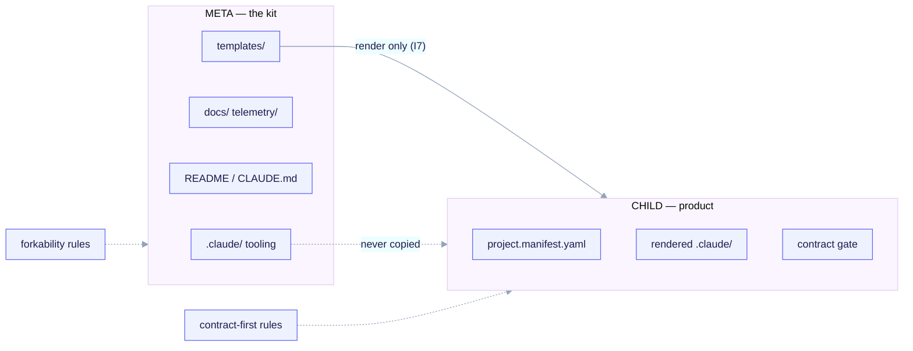

import TerminalCast from '../../../components/TerminalCast'

# The META vs CHILD boundary

<TerminalCast src="/demo/ack-two-layer.cast" />

The single most important idea in `ai-core-kit` is that it lives in **two layers that
must never be conflated**. Get this boundary right and everything else — idempotency,
template hygiene, the contract gate, telemetry — falls into place. Get it wrong and you
leak meta-only tooling into child projects or try to apply child rules to the kit itself.

<small>META authors the CHILD payload under `templates/` and is governed by forkability, idempotency, and template hygiene; CHILD is the rendered product (manifest, rendered `.claude/`, opt-in contract gate) governed by contract-first, interview, and contract-gate rules. The dependency runs one way: META → CHILD.</small>

## The two layers

| Layer | What it is | Where it lives | What governs it |
|---|---|---|---|
| **META** — building the kit itself | the scaffold repo and its build machinery | `README.md`, `CLAUDE.md`, `docs/`, `.claude/` tooling, `templates/` authoring, `telemetry/`, `discovery/` | forkability, idempotency, template hygiene |
| **CHILD** — what `/ack-init` renders into a fork | the actual new project | **only** what lives under `templates/` | design-contract-first, the bootstrap interview, archetype scaffolding, the contract gate |

> META = *building the machine that stamps out the standard.*
> CHILD = *what the machine stamps out.*

Design-contract-first, API-first, and the contract gate are **CHILD-layer rules**. They
are authored here as templates and hooks that **ship into the child** — they do **not**
govern how the meta-repo itself is built.

## Why the META repo looks "incomplete"

Because contract-first is a child rule, the META repo deliberately:

- carries **no** `project.manifest.yaml` and **no** contract instance (those are child
  artifacts produced by the interview); and
- wires **no** contract-gate hook of its own (it would pass vacuously — there is no
  child manifest for it to read).

This is intentional, not a gap. The contract payload lives **only** under `templates/`
and is exactly what `/ack-init` renders into a fork.

## The one-way dependency

The dependency runs strictly **META → CHILD**, never back:

- The renderer reads **from** `templates/` and writes **into** the child working tree.
- A child never reads back into the kit's `.claude/` tooling, the discovery engine, or
  the orchestrator.
- The renderer copies **only** files under `templates/`. The META `.claude/` tree
  (build-tooling skills like `skill-creator`, `mcp-builder`, the orchestrator) is
  **never** copied into a child (invariant **I7**, enforced as render rule: *render only
  FROM `templates/`*).

This is what lets the kit carry powerful meta-only machinery without any risk of it
leaking into the projects it generates.

## Forkability invariants

Three concrete rules make a rendered child a clean, self-contained repo:

1. **The META `.claude/` tree is never copied into a child.** Only `templates/` is
   rendered. Meta-only agents (Research, Discovery), the telemetry MCP, and the
   orchestrator can never appear in a fork.
2. **Child hooks use the literal `${CLAUDE_PROJECT_DIR}`.** A rendered hook command is
   `python3 ${CLAUDE_PROJECT_DIR}/.claude/hooks/contract-gate` — never an absolute path
   and never a `templates/`-relative path. The render engine even asserts, before
   writing any child file, that the content contains no `templates/archetypes/` substring
   and no absolute kit path; a violation aborts the render.
3. **Child template variables are `${dotted.path}` in snake_case**, resolved from
   `managed:` in the child manifest. The render regex matches lower-case dotted paths
   only, which is precisely why the upper-case shell variable `${CLAUDE_PROJECT_DIR}`
   survives substitution untouched.

A fourth, quieter forkability default lives in the manifest itself: `discovery.enabled`
defaults **off** (invariant **I7**), so the META discovery engine is never wired into a
fork unless the operator deliberately opts in. The kit can carry a powerful
codebase-discovery capability without it becoming a surprise dependency of every child.

## Two-sided safety: fail-closed at author time, fail-open at runtime

The boundary is enforced asymmetrically on purpose (invariant **I6**):

- **Author-time fail-closed.** `/ack-init` validates the manifest against the frozen
  JSON-Schema **before** rendering. An invalid manifest aborts and writes nothing. The
  meta-repo guard is the same principle: running `/ack-init` in the kit itself
  hard-refuses.
- **Runtime fail-open.** A corrupt or missing manifest at *consumption* time (e.g. the
  contract gate reading it) degrades the gate to mode `off` plus a stderr notice — it
  **never** exits 2 and never wedges a session.

## Why this boundary matters

- **Isolation** — meta-only tooling and child payload can evolve independently; neither
  contaminates the other.
- **Idempotency** — because only `managed:` is regenerated and only `rendered_files[]`
  are owned, re-runs are byte-stable and never clobber hand-edits. See
  [Render engine — idempotency](/concepts/render-engine#idempotent-re-renders).
- **Template hygiene** — conditionals live in the manifest and in `_when.*` directories,
  not as control flow inside templates, so the payload stays auditable.
- **One-way dependency** — a child is a clean snapshot that owes nothing back to the kit.

## How archetypes sit inside the CHILD layer

Everything a fork *can become* is also CHILD payload authored under `templates/`. The
manifest's first question — `archetype` — picks which template tree renders:
`backend-api`, `fullstack`, and `saas` are the three **deep** archetypes (full
persistence, API spec, and contract-gate scaffolding), while `monorepo`,
`library-sdk`, and `infra-iac` render a **minimal core**. None of this lives in the META
`.claude/` tree; it is all selectable scaffolding under `templates/archetypes/`, which is
why a new archetype is a CHILD-layer authoring task, not a change to the kit's own
tooling. Infrastructure-as-code is deliberately **orthogonal**: `features.iac` plus the
`iac` block let *any* archetype add infra, so IaC is not a sixth archetype except for the
pure `infra-iac` repo. See [the archetype overview](/archetypes/overview) for the full
matrix.

## Where the contracts live

The frozen P3 contracts that span this boundary — the manifest schema, the question
bank, and the render contract — are documented next in
[Interview → Manifest → Render](/concepts/manifest-and-interview) and
[Render engine contract](/concepts/render-engine).

> **See also:** [Archetype overview](/archetypes/overview) ·
> [Render engine — idempotency](/concepts/render-engine#idempotent-re-renders) ·
> the contract gate, a CHILD-layer rule, in [Contract gate](/features/contract-gate).
