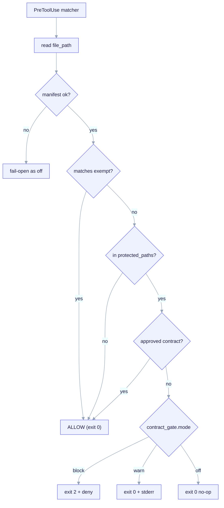

# Design-Contract Gate

The contract gate is an **optional** `PreToolUse` hook a forked CHILD project can
install to enforce *design-contract-first* editing: an edit to a protected path
is allowed only if an **approved** contract covers it. It is the CHILD-layer
expression of the kit's API-first / contract-first methodology.


*The `PreToolUse` matcher fires on `Edit | Write | MultiEdit | NotebookEdit`; the hook reads `tool_input.file_path` from stdin JSON, scopes the edit in-script against `exempt` / `scope` / `protected_paths`, consults the approved-contract oracle, then acts per `contract_gate.mode` — `block` exits 2 with `permissionDecision: deny`, `warn` exits 0 + stderr (does NOT block), `off` is a silent no-op. A missing or unparseable manifest fails open as `off` (+ stderr notice, exit 0).*

> **Status.** The **manifest contract and the gate's data shape are FROZEN and
> shipped** (`contract_gate.*` and `contracts[]` in the manifest schema, the
> `settings.json` matcher, the hook's location and fail-open behavior). The
> **deep runtime** — the in-script fnmatch scoping, the approved-oracle walk, and
> the three distinct mode mechanisms — is **P5 / roadmap**. The shipped hook is a
> coherent fail-open stub that exits `0`. Treat the rules below as the *contract
> P5 must implement*, not as behavior you get today.

## Master switch

The gate is gated by a single feature toggle in the manifest:

```yaml
features:
  sdd_gate: true   # MASTER SWITCH. false => /ack-init omits the gate hook entirely
```

When `features.sdd_gate: false`, `/ack-init` (P4) renders no hook and no
`PreToolUse` matcher; `contract_gate.mode` is then moot. When `true`, the hook is
rendered to `.claude/hooks/contract-gate` and registered in `.claude/settings.json`.

## How it is wired

The gate runs as a `PreToolUse` hook on the file-mutating tools. The matcher
(in the rendered `.claude/settings.json`) is **frozen**:

```json
{
  "hooks": {
    "PreToolUse": [
      {
        "matcher": "Edit|Write|MultiEdit|NotebookEdit",
        "hooks": [
          { "type": "command", "command": "python3 ${CLAUDE_PROJECT_DIR}/.claude/hooks/contract-gate" }
        ]
      }
    ]
  }
}
```

A `PreToolUse` matcher can only filter by **tool name**, never by file path. So
the hook receives every `Edit`/`Write`/`MultiEdit`/`NotebookEdit` call and reads
`tool_input.file_path` from stdin JSON to **scope in-script**. Runtime is pinned
`python3`; the glob dialect is `fnmatch` with `**`.

## The three modes

`contract_gate.mode` is a required enum: `block | warn | off`. These are **three
distinct mechanisms** — a load-bearing distinction (the wrong exit-code form
silently no-ops the guard, so `warn` must never accidentally block):

| Mode | Exit | Output | Effect |
|---|---|---|---|
| `block` | `2` | sets `hookSpecificOutput.permissionDecision: "deny"` | Stops the tool call. |
| `warn` | `0` | message on stderr / `additionalContext` | Logs and continues — does **not** block. |
| `off` | `0` | none; early-return **before** parsing the manifest body | No-op. |

The `block` form is the footgun: it requires **`exit 2` AND
`hookSpecificOutput.permissionDecision: "deny"`** — not a top-level `decision`
key, and not `exit 1`. The wrong form silently fails open and the guard never
fires. The full hook exit-code contract (0 = ok, 2 = block, other =
non-blocking) is summarized in the mode table above.

## In-script scoping and precedence

Three glob lists in `contract_gate` drive scoping. Precedence is fixed:

1. **`exempt`** wins over everything. An edit matching `exempt` is always allowed.
2. **`protected_paths`** (required, `minItems 1` — the gate can never be vacuous):
   edits here require an approved contract.
3. **`scope`** (optional; defaults to `protected_paths`): the subset that *also*
   requires an approved contract.
4. Any file matching **none** of the above is **ALLOWED**.

```yaml
contract_gate:
  mode: block
  glob_dialect: fnmatch
  protected_paths:        # required, minItems 1 — per-archetype defaults
    - "src/**"
    - "migrations/**"
    - "openapi/**"
  scope:                  # optional; defaults to protected_paths
    - "src/**"
  exempt:                 # exempt WINS over scope and protected_paths
    - "**/*.test.*"
    - "migrations/**"
    - "**/__snapshots__/**"
  require_approval_by:    # advisory review metadata; NOT enforced by the hook
    - "@acme/api-owners"
```

### Per-archetype protected-path defaults

`protected_paths`, `scope`, and `exempt` are **per-archetype**: `/ack-init`
resolves them from the chosen archetype's defaults, then **freezes** them into the
manifest. The hook reads *this* list, never a hardcoded default.

| Archetype | Default protected paths |
|---|---|
| `backend-api` | `src/**`, `migrations/**`, `openapi/**` |
| `fullstack` | `app/**`, `api/**`, `src/**` |
| `infra-iac` | unset hardcoded `src/**`; supplied via the manifest field (otherwise the gate would be vacuous for infra projects) |

The `infra-iac` case fixes a known finding: a hardcoded `src/**` default does not
apply to infrastructure projects, so per-archetype defaults are written from the
interview rather than baked into the hook.

## The approved-contract oracle

`contracts[]` is the gate's "approved?" oracle (consumed by the gate; also read by
the renderer to scaffold stub contract files). Each entry has an `id`, a `scope`
glob list, and a `status` (`draft | proposed | approved | rejected`):

```yaml
contracts:
  - id: C-001-order-intake          # pattern ^C-[0-9]{3}-[a-z0-9-]+$
    scope:
      - "src/orders/**"
      - "openapi/orders.yaml"
    status: approved                # edits under this scope are ALLOWED
    path: docs/contracts/C-001-order-intake.contract.md
  - id: C-002-fulfillment
    scope:
      - "src/fulfillment/**"
    status: draft                   # edits under src/fulfillment/** are GATED in block mode
```

The rule: an edit whose path matches `scope`/`protected_paths` is allowed **only
if** some `contracts[]` entry whose scope covers it has `status: approved`.
A `draft` contract does not unlock its scope.

`contracts[]` is **optional for all archetypes** (default `[]`) — requiring a
non-empty list from an interview that never asks for one would break round-tripping.
`/ack-init` seeds one stub entry for `backend-api` as a quality default, not a
schema requirement.

## Fail-open at runtime, fail-closed at author-time

- **Fail-open at runtime.** If the manifest is missing or unparseable when the
  hook runs, the gate behaves as `off` plus a stderr notice — it **never** exits
  `2` and never wedges the session.
- **Fail-closed at author-time.** `/ack-init` validates the manifest against the
  frozen schema **before** rendering. An invalid `contract_gate` block aborts the
  init; it never ships a broken gate.

## What is shipped vs. roadmap

| Piece | Status |
|---|---|
| `contract_gate.*` and `contracts[]` manifest fields (frozen schema) | **Shipped** |
| `settings.json` matcher + hook location + fail-open stub | **Shipped** |
| Per-archetype `protected_paths` defaults | **Shipped (in interview/schema)** |
| Deep runtime: fnmatch scoping, approved-oracle walk, 3 mode mechanisms | **P5 / roadmap** |

See also: [Manifest & Interview](/concepts/manifest-and-interview) for the
`contract_gate` and `contracts[]` manifest fields the gate reads.
