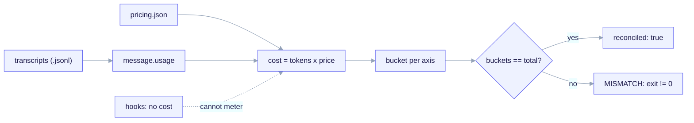

import TerminalCast from '../../../components/TerminalCast'

# Offline Cost Telemetry

<TerminalCast src="/demo/ack-telemetry.cast" />

ai-core-kit measures the USD cost of a Claude Code run by reading transcript
token-usage lines and multiplying them by a versioned pricing map. It attributes
spend by **model**, **feature**, **agent**, and **session**. This is a
**post-run, offline** tool — it is **SHIPPED** in both layers.


*Transcripts under `~/.claude/projects/**/*.jsonl` carry an `assistant message.usage` on every assistant turn; multiplied by the versioned `pricing.json` (USD per MTok, ÷ 1e6) and bucketed by model / feature / agent / session, then reconciled — sum of buckets must equal the grand total or it exits non-zero (MISMATCH). Hooks (`PreToolUse` / `PostToolUse`) carry NO token or cost fields (#11008), so live metering is impossible.*

> **The one hard constraint.** There is no live cost meter, and there never can
> be one for Claude Code spend. State this before promising any real-time number.

## Why offline only: issue #11008

Claude Code hooks (`PreToolUse`, `PostToolUse`, …) receive only `session_id`,
`transcript_path`, `cwd`, `permission_mode`, and `hook_event_name`. **They carry
no token or cost fields**
([anthropics/claude-code#11008](https://github.com/anthropics/claude-code/issues/11008),
open). Consequences:

- A hook **cannot** emit a live cost number; `PostToolUse` cannot meter spend.
- `PostToolUse` only fires on **tool** turns. In a representative transcript,
  61 of 98 assistant turns were text-only (no tool call) — invisible to
  `PostToolUse`. Apportioning cost by tool activity would silently drop the
  majority (~61%) of spend.

**The fix the kit implements:** compute *all* cost from the assistant
`message.usage` lines in the transcript — every assistant turn has one, tool or
not — multiplied by `pricing.json`. This captures 100% of spend and is fully
reproducible offline.

## The two files

| File | Role |
|---|---|
| `telemetry/aggregate.py` | stdlib-only offline aggregator (no third-party deps). |
| `telemetry/pricing.json` | versioned `model → USD/MTok` map with an `as_of` date. |

The **identical engine** lives in the META repo (`telemetry/`) to measure the
cost of building ai-core-kit itself, and ships to forked CHILD projects under
`templates/telemetry/`, wired by `/ack-init` when `telemetry.enabled: true`.

## How cost is computed

For each `assistant` line, `message.usage` provides the token counts and
`message.model` selects the price row:

| usage field | priced at `pricing.json` key |
|---|---|
| `input_tokens` | `input` |
| `output_tokens` | `output` |
| `cache_read_input_tokens` | `cache_read` |
| `cache_creation.ephemeral_5m_input_tokens` | `cache_write_5m` |
| `cache_creation.ephemeral_1h_input_tokens` | `cache_write_1h` |
| `cache_creation_input_tokens` (no split present) | `cache_write_5m` (default ephemeral) |

Prices are **USD per 1,000,000 tokens (MTok)**; the aggregator divides by 1e6.

## Attribution axes

`--by` selects one or more of `model,feature,agent,session` (default: all four).

- **model** — keyed on the exact `message.model` id. Always exact and reliable.
- **session** — keyed on `sessionId`. Always reliable.
- **agent** — transcripts have no agent *name*, so the tool uses the one
  agent-adjacent signal that exists: `isSidechain`. A non-sidechain turn buckets
  to `main`; a sidechain (subagent / `Task`) turn buckets to
  `subagent:<requestId>`. This separates main-session spend from delegated spend.
- **feature** — transcripts carry **no native feature field**, so a feature label
  comes from one of two explicit conventions (below). Anything matching no rule
  lands in the **default bucket** (`unattributed`) — never silently dropped.

### Feature attribution: `branch_prefix` vs `sidecar_map`

Two mutually exclusive ways to derive a feature label (set the default in the
manifest under `telemetry.attribution.mode`; CLI flags override):

**1. `branch_prefix` (default; zero extra tooling).** Work each feature on its own
branch named `<prefix><feature>`. With `--branch-prefix feat/`, the turn's
`gitBranch` after the prefix becomes the bucket:

```
gitBranch = "feat/order-intake"   --branch-prefix "feat/"   →  bucket "order-intake"
gitBranch = "main"                                            →  bucket "<default>"
```

**2. `sidecar_map` (precise; needs a tiny recorder).** A JSON file maps time
windows to bucket labels; a turn whose `timestamp` falls in `[from, to)` buckets
to that entry. A `SessionStart` hook *can* legitimately record a
`timestamp → contract_id` mapping (it just can't record cost). Pass it with
`--sidecar-map sidecar.json`; this overrides `branch_prefix`.

## Reconciliation guarantee

For **every** axis the aggregator proves that the sum of per-bucket costs equals
the grand total (within float epsilon). The human table prints a
`reconcile vs total … OK` line per axis; the JSON output carries
`"reconciled": true|false`; **a mismatch exits non-zero**. The default bucket
guarantees the identity holds even when nothing matches a feature/agent rule. If
an axis shows `MISMATCH`, the report is not trustworthy — do not quote the numbers.

## Fail-loud guarantees

- **Unknown model** → hard error naming the offending `message.model`, listing the
  known ids, exit `1` (`unknown_model_policy: error`). Cost is never silently
  under-counted because a new model slipped in. The fix is to add a row to
  `pricing.json` (copy a same-tier row, set USD/MTok values, bump `as_of`).
- **Missing / invalid `pricing.json`** → hard error, exit `1`.
- **Bucket sums don't reconcile** → hard error, exit `1`.
- **Bad `--by` axis / missing sidecar file** → usage error, exit `2`.
- A single malformed JSONL *line* is skipped (not fatal) so one bad line can't
  void an otherwise complete report.

## Running it

```bash
# whole machine, default ~/.claude/projects, all four axes, table + JSON:
python3 telemetry/aggregate.py

# this build only, since a date, feature + model + agent, JSON only:
python3 telemetry/aggregate.py \
  --project-dir ~/.claude/projects \
  --since 2026-06-01 \
  --by feature,model,agent \
  --branch-prefix feat/ \
  --format json

# precise feature attribution via a sidecar timestamp→contract map:
python3 telemetry/aggregate.py --sidecar-map telemetry/sidecar.local.json --by feature
```

Key flags: `--project-dir`, `--since YYYY-MM-DD` (UTC), `--pricing PATH`, `--by`,
`--branch-prefix`, `--default-bucket` (default `unattributed`), `--sidecar-map`,
`--manifest` (CHILD only — reads `telemetry.*` defaults; CLI flags win),
`--format table|json|both`.

## Budgets are advisory

`pricing.json` produces **actuals**. **Budgets** (advisory USD caps) live in the
CHILD manifest under `telemetry.budgets[]` (scope `project|feature|contract|agent`).
The aggregator's per-bucket totals are what you compare against the caps — caps
**flag** overage, they never enforce or block anything live.

## The two cost skills

Both ship as CHILD payload (MIT):

- **`cost-telemetry`** — runs `aggregate.py` and interprets its output. The single
  source of truth for *the numbers*. It confirms `telemetry.enabled: true`, picks
  scope, reads attribution defaults from the manifest, runs the aggregator,
  verifies `reconciled: YES`, and calls out a large `unattributed` bucket. Rendered
  when `features.cost_telemetry == true`.
- **`cost-audit`** — evidence-first investigation of *why* spend spiked (runaway
  job/PR creation, quota bypass, premium-model leakage, duplicate fanout, retry
  burn). It **delegates the numbers** to `cost-telemetry` — it never re-derives
  pricing math — and adds the dimensions telemetry cannot see: provider API spend
  outside Claude Code, infrastructure cost, and the behavioral root cause.

## Locality note

Transcripts live under `~/.claude/projects/<encoded-cwd>/…`, so the tool reads
**local** transcripts only. Aggregating across machines requires first staging the
JSONL into one `--project-dir`. There is no network/collection step by design.

See also: [Skills catalog](/features/skills-catalog).
