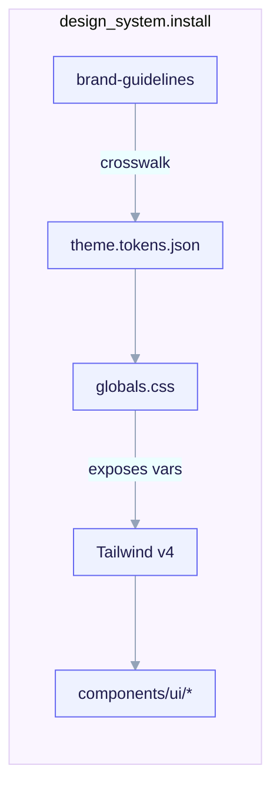

import TerminalCast from '../../../components/TerminalCast'

# Design System (shadcn/ui)

<TerminalCast src="/demo/ack-design.cast" />

The design system is a **fullstack-only**, conditionally-installed payload. It is
**SHIPPED**. When a fork picks the `fullstack` archetype and answers
`design_system.install: true`, `/ack-init` copies the subtree at
`templates/archetypes/fullstack/_when.design_system.install/design-system/` into
the child. It is **forbidden** for `backend-api` (schema-enforced) and absent for
the other archetypes.



<em>Brand snake_case tokens (<code>color_brand</code>, <code>radius_base</code>) crosswalk via the <code>theme.tokens.json</code> mapping doc into <code>globals.css</code> (<code>:root</code> / <code>.dark</code> OKLch CSS vars like <code>--primary</code>, <code>--radius</code>), which Tailwind v4 exposes via <code>@theme inline</code> to components (<code>bg-background</code>, <code>text-foreground</code>) — installed only when <code>design_system.install</code> is true on a fullstack fork.</em>

## What ships

```
design-system/
├── NOTICE                       # Apache-2.0 attribution + shadcn/ui MIT third-party
├── README.md.tpl
├── skills/
│   ├── shadcn-ui/               # SKILL.md + references/{cli,components,mcp,theming}.md
│   ├── brand-guidelines/        # SKILL.md + references/{logo,tokens,typography,voice}.md
│   └── frontend-design-guidelines/
│                                # SKILL.md + references/{accessibility,color,components,
│                                #   layout,responsive,spacing,typography}.md
├── mcp/
│   ├── shadcn.mcp.json          # the canonical shadcn MCP server fragment
│   └── README.md
└── theme/
    ├── components.json.tpl       # shadcn config
    ├── globals.css.tpl           # :root / .dark OKLch CSS variables + @theme inline
    ├── theme.tokens.json         # brand-token → CSS-variable mapping doc (static)
    └── README.md
```

## The three skills and how they compose

The three design skills have **distinct, non-overlapping** responsibilities and
are meant to be applied together:

- **`brand-guidelines`** (Apache-2.0) — the source of truth for brand *token
  values*: brand/neutral/status colors, the type scale, radius, spacing tokens,
  typography families, voice/tone, and logo usage. Token keys are **snake_case**
  (`^[a-z][a-z0-9_]*$`, decision O4) so the renderer's lowercase `${var}` regex
  never leaves a hyphenated key un-substituted. A fork overrides the defaults via
  `/ack-init`.
- **`frontend-design-guidelines`** (Apache-2.0) — *how* UI is composed: layout,
  spacing, type roles, semantic color roles, component anatomy/states, responsive
  behavior, and accessibility. Framework-agnostic. Core principle: "tokens, not
  magic numbers" — every spacing/radius/color/font-size resolves to a named token;
  a literal `13px` or `#3a7` in a component is a defect.
- **`shadcn-ui`** (MIT, re-authored) — using shadcn/ui in a React + Tailwind
  child: the copy-in component model, `init`/`add` CLI, OKLch CSS-variable theming
  and dark mode, registries, and the shadcn MCP.

The split: `brand-guidelines` defines the *values*, `frontend-design-guidelines`
defines *how to assemble* UI, and `shadcn-ui` gives you the *parts* and wires them
to the brand tokens.

## The shadcn/ui copy-in model

shadcn/ui is **not an npm dependency**. `npx shadcn@latest add button` copies the
component's source **into** the project's `components/ui/` directory — you own and
edit the code. Re-running `add` only touches a component if you pass `--overwrite`.
The registry is a *source*, not a runtime.

```bash
npx shadcn@latest init                      # detect framework, write components.json, set up Tailwind
npx shadcn@latest add button dialog input   # add several at once
npx shadcn@latest add --all                  # add everything
```

`components.json` ships with `cssVariables: true` and `style: new-york` (the old
`default` style is deprecated). Components land in `aliases.ui` (default
`@/components/ui`).

### React + Tailwind only

The skill is first-class for `next` and `remix`. The fullstack framework enum also
allows `sveltekit` and `nuxt`, but shadcn/ui's React components do **not** apply
directly there — community ports (`shadcn-svelte`, `shadcn-vue`) exist with
different CLIs and are out of scope for this skill.

## OKLch theming

With `cssVariables: true`, every color is a CSS variable in the **OKLch** color
space (not HSL), declared in `:root` (light) and overridden in `.dark` (dark).
Tailwind v4 exposes them via `@theme inline` (so `bg-background`,
`text-foreground`, `border-border` resolve to the variables).

`theme/theme.tokens.json` is a **mapping doc** (not a shadcn config) that crosswalks
the snake_case brand tokens onto the shadcn CSS variables, for example:

| brand token | shadcn CSS var | role |
|---|---|---|
| `color_brand` | `--primary` | primary action / brand accent |
| `color_on_brand` | `--primary-foreground` | text on primary |
| `color_ink_muted` | `--muted-foreground` | de-emphasized text |
| `color_danger` | `--destructive` | destructive action |
| `color_border` | `--border` | default border/divider |
| `radius_base` | `--radius` | base corner radius (sm/md/lg/xl derive via `calc()`) |

To re-brand: read your brand token value, convert hex to `oklch(L C H)`, and write
it into the `:root` / `.dark` blocks of `globals.css`. Every OKLch token value in
`globals.css.tpl` is a **static default** — an unbound `${...}` is a hard render
error, so only `${project.name}` in the leading comment is substituted.

## The shadcn MCP

The shadcn MCP server lets an agent browse, search, and install components without
hand-running the CLI. The canonical fragment is:

```json
{ "mcpServers": { "shadcn": { "command": "npx", "args": ["shadcn@latest", "mcp"] } } }
```

It is **double-gated**: the project `.mcp.json` is only rendered when
`features.mcp: true`, and within it the `shadcn` entry is wrapped in the renderer's
`#ack:if design_system.install` … `#ack:endif` directive. The effective predicate
is `features.mcp && design_system.install`. Project MCP servers require re-approval
on first use. Full detail: [MCP wiring](/features/mcp).

## License

The design-guideline skills are **Apache-2.0** with the `NOTICE` preserved; their
*structure* is modeled on Anthropic's Apache-2.0 example skills `frontend-design`
and `brand-guidelines`, and the content is independently authored. The subtree
ships **only** Apache-2.0 example content — never any `docx`/`pdf`/`pptx`/`xlsx`-
derived (proprietary) material. shadcn/ui itself is **MIT**; its components are
copied into the child, so you own them. See [License ledger](/reference/licensing).
