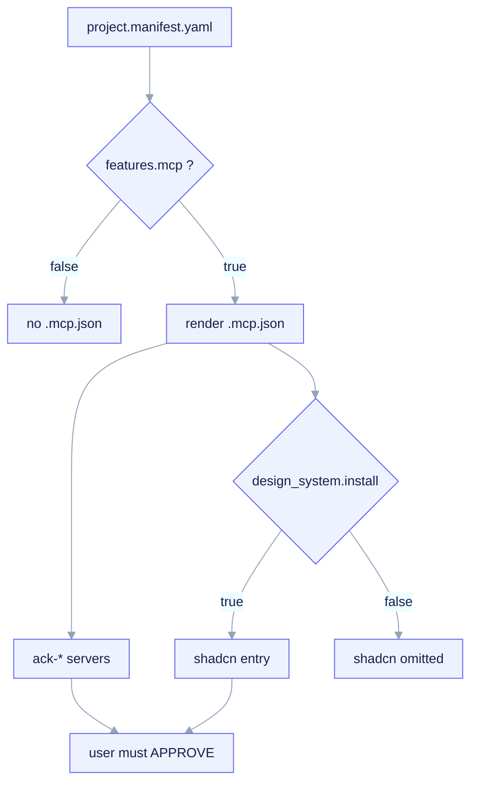

import TerminalCast from '../../../components/TerminalCast'

# MCP (Model Context Protocol) Wiring

<TerminalCast src="/demo/ack-mcp.cast" />

A forked CHILD project can opt into a project-scoped `.mcp.json` that declares MCP
servers an agent can use. This is **opt-in**: `/ack-init` renders `.mcp.json` only
when `features.mcp: true`.

**What MCP is.** The Model Context Protocol is the open standard Claude Code uses to
talk to external **servers** that expose tools, resources, and prompts — a database
browser, a component installer, an internal API gateway. A `.mcp.json` at the project
root declares which servers the agent may launch and how (`command` + `args`). MCP is
how you give an agent *capabilities the kit does not ship itself*.

**Why it is opt-in and project-scoped.** Most forks do not need a project MCP server,
and an unused `.mcp.json` is just noise plus an approval prompt. So the kit keeps it
behind `features.mcp` and renders nothing when the answer is `false`. When a fork does
opt in, the file is **project-scoped** (checked into the repo, shared by the team) —
which is exactly why every server requires explicit approval on first use (see the
[security boundary](#project-mcp-servers-require-approval-security-boundary) below).



<em><code>features.mcp</code> gates the whole <code>.mcp.json</code>: when true, <code>/ack-init</code> renders it at managed key <code>json:mcpServers</code> with the <code>ack-*</code> servers. The <code>shadcn</code> entry (<code>npx shadcn@latest mcp</code>) is double-gated by the <code>#ack:if design_system.install</code> directive — emitted only when true, otherwise the block is omitted and the JSON stays valid. Every project server needs explicit user approval on first use.</em>

> **Status.** The `.mcp.json` rendering, the `features.mcp` gate, the
> design-system double-gate, and the shadcn MCP fragment are **shipped**. The deep
> generic project server (`ack-example`) is a **P4 stub** — its real server wiring
> is roadmap. The shadcn MCP, by contrast, shells out to upstream tooling and works
> today.

## The feature toggle

```yaml
features:
  mcp: false   # bool. wire a project .mcp.json. Default OFF.
```

When `false`, no `.mcp.json` is rendered at all. When `true`, `/ack-init` renders
the archetype's `.mcp.json.tpl` to the project root.

### What gets rendered

The fullstack archetype's template makes the gating concrete. The `ack-example`
server is always present (a P4 stub so the conditional file is never empty), and the
`shadcn` block is wrapped in a renderer `#ack:if` directive:

```json
{
  "//": "ack:managed-keys json:mcpServers. Within mcpServers ack owns ONLY ack-* entries.",
  "mcpServers": {
    "ack-example": {
      "command": "python3",
      "args": ["${CLAUDE_PROJECT_DIR}/.claude/mcp/ack-example-server.py"]
    }
    #ack:if design_system.install
    ,
    "shadcn": {
      "command": "npx",
      "args": ["shadcn@latest", "mcp"]
    }
    #ack:endif
  }
}
```

The leading comma inside the `#ack:if` block is deliberate: when
`design_system.install` is false the whole block (comma included) is dropped, and the
remaining JSON stays valid. `${CLAUDE_PROJECT_DIR}` is the **literal** hook/path
variable Claude Code expands at runtime — it is not a render-time substitution, so it
survives into the rendered file unchanged.

## Ownership and re-run safety

`.mcp.json` is owned by `/ack-init` at the managed key `json:mcpServers`. Within
`mcpServers`, ack owns **only the entries it renders** (ack-prefixed `ack-*`
servers, plus the canonical `shadcn` entry for the design system). **User-added
servers under other keys are never touched.** On re-run, `/ack-init` re-merges via
a JSON-aware key merge (not line concatenation), so comma hygiene is handled by the
merge — never hand-edit the managed block.

## The shadcn MCP (fullstack design system)

The shadcn/ui MCP server lets an agent browse, search, and install shadcn/ui
components (and components from any configured registries) directly from the
project's `components.json`. The canonical fragment is exactly:

```json
{ "mcpServers": { "shadcn": { "command": "npx", "args": ["shadcn@latest", "mcp"] } } }
```

It is **double-gated**:

1. **`features.mcp`** — the whole `.mcp.json.tpl` only renders when the child opted
   into a project `.mcp.json`. If false, the shadcn entry never appears.
2. **`design_system.install`** — within that file the `shadcn` block is wrapped in
   the renderer's line directive `#ack:if design_system.install` … `#ack:endif`,
   so the entry is emitted **only when `design_system.install == true`**. When
   false (or absent, e.g. backend-api), the block is omitted and the remaining JSON
   stays valid.

So the effective predicate is **`features.mcp && design_system.install`**. The
shadcn MCP **composes with** the project's own `features.mcp` server — they are
independent entries under `mcpServers`; enabling shadcn does not replace or disable
any project server.

### One-time bootstrap (optional convenience)

The rendered `.mcp.json` is sufficient on its own. If you prefer to let the shadcn
CLI write/refresh the entry, run from the child project root:

```bash
npx shadcn@latest mcp init --client claude
```

A `components.json` must exist for the MCP to resolve aliases and registries —
create it with `npx shadcn@latest init` if you have not already.

## Project MCP servers require approval (security boundary)

`.mcp.json` is a **project-scoped** config. Claude Code does **not** trust project
servers automatically: on first use the user is prompted to **approve** each server
(and any change to its `command`/`args` re-prompts). This is a deliberate security
boundary — a checked-in `.mcp.json` cannot silently run a command on a teammate's
machine. Approve only after reviewing the entry.

### Cold-start timeout

The shadcn MCP shells out to `npx`, which may download the `shadcn` package on first
invocation. If the server is slow to start, raise the MCP startup timeout via the
`MCP_TIMEOUT` environment variable (milliseconds, e.g. `MCP_TIMEOUT=30000`) before
launching Claude Code. Pre-warming with `npx shadcn@latest mcp --help` once avoids
cold-start delays.

## Authoring MCP servers: the `mcp-builder` skill

For building or extending an MCP server — wrapping an external API or service as
well-designed MCP tools — the kit ships the **META** skill `mcp-builder`
(Apache-2.0, vendored + adapted from anthropics/skills). It covers research,
implementation in Python (FastMCP) or Node/TypeScript (MCP SDK), and evaluation,
and is the skill invoked when building a child's `features.mcp` server. It lives in
`.claude/skills/` (META) and is **not** rendered into forks.

## Boundaries

- MCP is **reference material for design**; the contract gate and telemetry do
  **not** depend on MCP.
- Skills may reference MCP tools but must fail gracefully if a server is absent.
- MCP permissions and provisioning workflows beyond the shipped wiring are TBD.

See also: [Design system](/features/design-system),
[Skills catalog](/features/skills-catalog).
