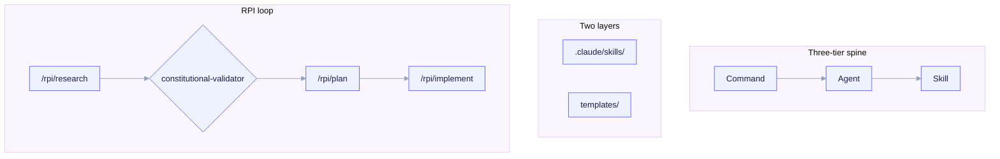

import TerminalCast from '../../../components/TerminalCast'

# Skills Catalog

<TerminalCast src="/demo/ack-catalog.cast" />

This is the authoritative summary of `templates/skills/INDEX.md`: every skill,
agent, and command ported into ai-core-kit, across both layers. For each item the
INDEX records its **layer**, the **source repo + license** it was vendored or
re-authored from, and the **trigger** that wires it into a fork (a
`project.manifest.yaml` value, an archetype, or "always").

> For the **complete capability list of every skill** (what each does + its
> trigger, grouped by meta-builders / engineering / language packs / design-system
> / telemetry), see the [Skills Reference](/reference/skills). Companion reference
> pages: [Agents](/reference/agents), [Commands](/reference/commands),
> [Hooks](/reference/hooks), [MCP](/reference/mcp), and
> [Observability](/reference/observability).

*Commands (e.g. `/rpi/research`) drive agents (`code-explorer`, `architect`) which invoke skills (`coding-standards`); the spine lives in two layers — META (`.claude/skills/`, builds the kit) and CHILD (`templates/skills` + `agents` + `commands`, rendered into a fork). The RPI loop research → plan → implement runs `requirement-parser` → `architect` → `code-reviewer` / `security-reviewer`, gated research → plan by `constitutional-validator`.*

## The two layers — never conflate them

- **META** = `.claude/skills/` — skills that help *build* the kit. **Not** rendered
  into forks; never gated by a child contract.
- **CHILD** = `templates/skills/`, `templates/agents/`, `templates/commands/` — the
  payload `/ack-init` (P4) renders into a fork, gated by the child manifest.

**License discipline.** Apache-2.0 items (anthropics/skills) are copied/adapted
with the NOTICE preserved; MIT items (ecc, claude-skills, claude-code-best-practice)
are **re-authored** in kit style with attribution. Proprietary Anthropic doc skills
(`docx`/`pdf`/`pptx`/`xlsx`) were never read, copied, or derived from. Full ledger:
[License ledger & references](/reference/licensing).

## META — build the kit (not rendered into forks)

| Skill | Source | License | Provenance | Trigger |
|---|---|---|---|---|
| `skill-creator` | anthropics/skills | Apache-2.0 | Vendored + adapted | META only — author/benchmark kit skills. |
| `mcp-builder` | anthropics/skills | Apache-2.0 | Vendored + adapted | META only — build/extend an MCP server (incl. a child's `features.mcp` server). |
| `skill-validator` | author-new (wraps `lint-frontmatter.py`) | Apache-2.0 (kit) | Original | META only — validate kit skills/agents/commands against frontmatter rules. |
| `cost-telemetry` (META) | author-new | kit (MIT) | Original | META only — interpret the offline aggregator over a *kit build* transcript. |

> `skill-creator/agents/{analyzer,comparator,grader}.md` are **internal sub-agent
> prompts** of the skill, not standalone kit agents — they carry no kit agent
> frontmatter and are not linted as agents.

## CHILD — engineering & product skills

Top-level `templates/skills/`, archetype/manifest-gated.

| Skill | Source | License | Trigger |
|---|---|---|---|
| `coding-standards` | author-new | MIT | **Always** — cross-language quality floor. |
| `error-handling` | author-new | MIT | **Always** for code archetypes (`backend-api`, `fullstack`, `cli`, `library`). |
| `code-tour` | author-new | MIT | **Always** — onboarding/PR/RCA walkthroughs; emits `.tours/`. |
| `architecture-decision-records` | author-new (Nygard ADR) | MIT | **Always** — records to `docs/adr/`. |
| `production-audit` | author-new | MIT | `backend-api`, `fullstack`, `cli`. Skip docs-only/library. |
| `cost-audit` | author-new | MIT | `features.cost_telemetry == true` OR archetype runs paid jobs/agents. |
| `cost-telemetry` (CHILD) | author-new | MIT | `features.cost_telemetry == true`. Runs `telemetry/aggregate.py`. |
| `agent-eval` | author-new | MIT | `features.agent_eval == true`. |
| `frontend-a11y` | author-new | MIT | `fullstack` with React/Next UI (`framework in [next, remix]`). |
| `ui-design-system` | alirezarezvani/claude-skills | MIT (re-authored) | `fullstack` / UI archetypes, or `features.design_system == true`. |
| `saas-scaffolder` | alirezarezvani/claude-skills | MIT (re-authored) | `saas` / `fullstack` with auth+billing. |
| `spec-to-repo` | alirezarezvani/claude-skills | MIT (re-authored) | Greenfield scaffolding / new-project flows. |

The fullstack **design-system** ships three additional skills (`shadcn-ui`,
`brand-guidelines`, `frontend-design-guidelines`) only when
`design_system.install: true` — see [Design system](/features/design-system).

## CHILD — reusable agents

`templates/agents/`. The RPI + review fleet. ECC supplies the engineering
reviewers; claude-code-best-practice supplies the RPI-flow agents.

| Agent | Source | License | Model | Trigger |
|---|---|---|---|---|
| `architect` | affaan-m/ecc | MIT | opus | **Always** — design/ADR/trade-offs; RPI plan phase. |
| `code-explorer` | affaan-m/ecc | MIT | sonnet | **Always** — discovery step of RPI. |
| `code-reviewer` | affaan-m/ecc | MIT | sonnet | **Always** for code archetypes — pre-PR review. |
| `security-reviewer` | affaan-m/ecc | MIT | sonnet | Code archetypes touching auth/input/payments; pre-release. |
| `silent-failure-hunter` | affaan-m/ecc | MIT | sonnet | Code archetypes doing I/O/DB/network/transactions. |
| `refactor-cleaner` | affaan-m/ecc | MIT | sonnet | **Always** for code archetypes — dedicated cleanup pass. |
| `requirement-parser` | claude-code-best-practice (`rpi/`) | MIT | sonnet | RPI research step 1; render when `features.rpi == true`. |
| `constitutional-validator` | claude-code-best-practice (`rpi/`) | MIT | opus | RPI research→plan gate; render when the child has a constitution/archetype. |

## CHILD — RPI & product commands

`templates/commands/`.

| Command | Source | License | Trigger |
|---|---|---|---|
| `/rpi/research` | claude-code-best-practice | MIT | `features.rpi == true`. RPI step 1 (GO/NO-GO). |
| `/rpi/plan` | claude-code-best-practice | MIT | `features.rpi == true`. RPI step 2 (planning docs). |
| `/rpi/implement` | claude-code-best-practice | MIT | `features.rpi == true`. RPI step 3 (phased exec + gate). |
| `/prd` | author-new | MIT | Product/SaaS archetypes or `features.product == true`. |
| `/rice` | author-new | MIT | Product/SaaS archetypes or `features.product == true`. |

## CHILD — language / framework / DB packs

`templates/skills/lang/`, a deterministic manifest-gated render set. The
authoritative trigger table is `templates/skills/lang/INDEX.md`.

| Pack | Source | License | Trigger (manifest condition) |
|---|---|---|---|
| `python-patterns` | affaan-m/ecc | MIT | `project.language == python` |
| `python-testing` | affaan-m/ecc | MIT | `project.language == python` |
| `typescript-patterns` | author-new | MIT | `project.language == typescript` |
| `go-patterns` | affaan-m/ecc | MIT | `project.language == go` |
| `rust-patterns` | affaan-m/ecc | MIT | `project.language == rust` |
| `node-api-patterns` | author-new (informed by ECC nestjs) | MIT | `project.framework in [express, nestjs]` |
| `react-patterns` | affaan-m/ecc | MIT | `project.framework in [next, remix]` (React fullstack only) |
| `postgres-patterns` | affaan-m/ecc | MIT | `persistence.db == postgres` |
| `prisma-patterns` | affaan-m/ecc | MIT | `persistence.orm == prisma` |
| `docker-patterns` | affaan-m/ecc | MIT | containerization — **no manifest key yet** (see gaps). |

## Deferred / not ported (no silent caps)

These were in the port plan or surfaced as gaps but are **not** present in the
current ported set. Listed so nothing disappears silently — see the
[Roadmap](/roadmap) for the full deferred / not-ported list.

**Language / framework / DB enum values not yet ported:**

| Manifest enum value | Disposition |
|---|---|
| `project.language == java` | `java-coding-standards` (+ testing) routed outside the G4 minimum; future pack. |
| `project.framework == fastapi` | `fastapi-patterns` (copy from ecc) planned. |
| `project.framework == gin` | `gin-patterns` author-new, planned. |
| `project.framework == axum` | `axum-patterns` author-new, planned. |
| `project.framework in [sveltekit, nuxt]` | `sveltekit-patterns` / `nuxt4-patterns` author-new. `react-patterns` must **NOT** render for these. |
| `persistence.db in [mysql, sqlite, mongodb]` | `mysql-patterns` (ecc), `sqlite`/`mongodb` author-new. |
| `persistence.orm in [sqlalchemy, drizzle, gorm]` | all three author-new in the port plan. |

**Schema/interview gap blocking clean `docker-patterns` wiring.**
`templates/interview/questions.yaml` never asks whether the child uses Docker, so
`docker-patterns` has no enum to gate on. Recommendation: add a
`project.containerized` boolean, OR always-render `docker-patterns` for
`backend-api`/`fullstack`.

**Anthropics example skills available but not vendored here:**
`algorithmic-art`, `brand-guidelines`, `canvas-design`, `claude-api`,
`frontend-design`, `internal-comms`, `slack-gif-creator`, `theme-factory`,
`web-artifacts-builder`, `webapp-testing`. (`doc-coauthoring` ships no LICENSE.txt
→ not vendorable.) Adopt later behind feature flags if needed.

**Proprietary — permanently excluded.** Anthropic document skills `docx`, `pdf`,
`pptx`, `xlsx` ("All rights reserved"). Never read, copied, or derived from.
