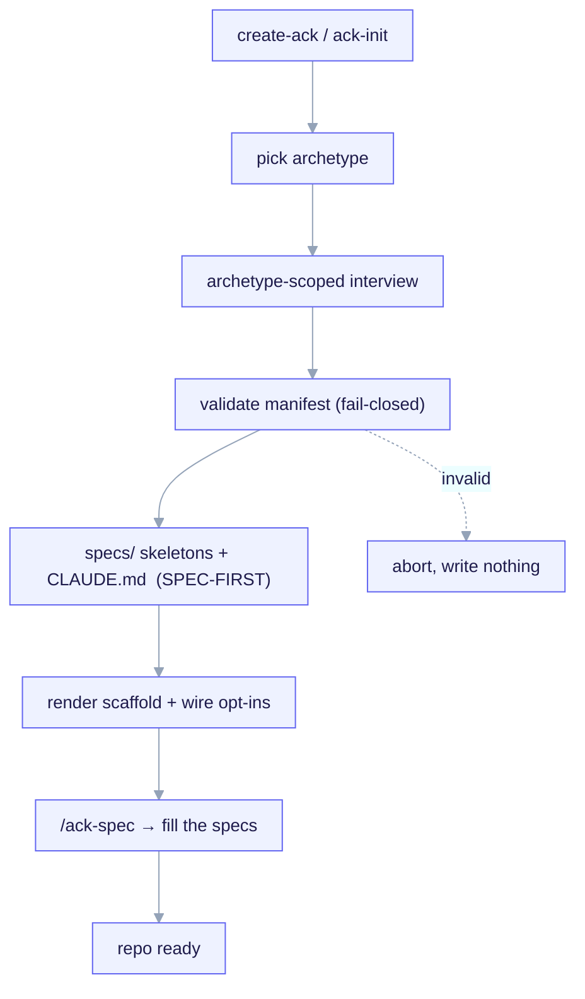

import TerminalCast from '../../../components/TerminalCast'

# Quickstart

Go from an empty directory to a **spec-first, fully wired** project in minutes. One
archetype-first interview drives everything; **no LLM in the render loop** means the same
answers always produce the same project.

This page assumes you have the [prerequisites](/getting-started/installation#prerequisites)
(Node ≥ 18; Claude Code and Python 3 are optional).

<TerminalCast src="/demo/ack-spec.cast" />

## What you get — and the order it arrives in

The kit's whole thesis: at moment-0 the highest-leverage output is **context, not code**.
So a fresh scaffold lands the **specs first**, then the wired scaffold around them:

1. **Complete tech specs** (skeletons, then model-authored prose via `/ack-spec`) —
   `PRD`, `ARCHITECTURE`, `DOMAIN`, `REQUIREMENTS`, `NON-GOALS`, `ROADMAP` under `specs/`.
2. **A best-in-class `CLAUDE.md`** — a lean, spec-first pointer Claude reads every turn
   (it points at `specs/` and the contracts; it does not dump knowledge).
3. **A clear design system + requirements** — for `fullstack`, the opt-in shadcn/ui
   skills, `shadcn.mcp.json`, and theme tokens.
4. **The right `.claude/` tooling** — conservative hooks, skills, and command/agent
   conventions for your archetype.
5. **An opt-in contract gate** — a 3-mode (`block`/`warn`/`off`) PreToolUse hook that
   keeps edits honest against an approved contract.
6. **Optional MCP** and **offline cost telemetry** — a project `.mcp.json` and the
   transcript-based cost aggregator + pricing map.



## 1. Run the interview

Pick **either** entry point — they run the same interview and write the same manifest
(see [Installation](/getting-started/installation#the-two-entry-points-pick-one)).

**Fork-free CLI (recommended):**

```bash
npx @arthurghz/create-ack@latest my-product --archetype fullstack
```

The `@latest` tag means every `npx` run pulls the newest published CLI without a
cached stale copy. Working on the kit a lot? Install it once
(`npm i -g @arthurghz/create-ack@latest`) and keep it current with `create-ack update`.
The CLI is the spine — scaffolding and the telemetry views (`cost`, `dora`, `report`,
`dashboard`, …) all live behind one binary; see
[Commands](/reference/commands#the-create-ack-cli--the-spine).

Omit `--archetype` to be prompted for it. Add `--yes` to take every default
non-interactively (great for a quick look or CI):

```bash
npx @arthurghz/create-ack@latest my-product --archetype backend-api --yes
```

**Or the in-Claude interview** — inside a forked repo, run:

```text
/ack-init
```

## 2. Pick an archetype (asked first, mandatory)

The very first question is the **archetype** — the branch axis (invariant **I3**). It
selects both the questions you are asked next and the template set that gets rendered.

| Archetype | v1 depth | What renders |
|---|---|---|
| `backend-api` | **Deep** | full scaffold, contract gate, OpenAPI seed, persistence |
| `fullstack` | **Deep** | full scaffold + optional design-system install (shadcn/ui) |
| `monorepo` | Minimal-core | safe core only (skills, `.claude/` conventions, manifest) |
| `library-sdk` | Minimal-core | safe core only |
| `infra-iac` | Minimal-core | safe core only |

Because the archetype is the branch axis, an `infra-iac` project is **never asked
database questions**, and the design-system install is **offered only for `fullstack`**.
That gating is deterministic, read from `templates/interview/questions.yaml` — not an LLM
guess.

> Planned archetypes include a **Vercel + Next.js + React + shadcn + Supabase** SaaS
> stack and a **fullstack + IaC** (AWS/GCP) shape. See the [roadmap](/roadmap).

## 3. Answer only the questions that apply

The interview walks `questions.yaml` in order, skipping any question whose `applies_to`
excludes your archetype or whose `ask_if`/`skip_if` is false given earlier answers. The
questions cover:

- **Identity + stack** — name, description, language, runtime, package manager, framework
  (an archetype-scoped enum), architecture.
- **Features** (opt-in toggles) — `hooks`, `mcp`, `agent_teams`, `sdd_gate` (the master
  switch for the contract gate).
- **Persistence** (`backend-api`/`fullstack` only) — DB engine, ORM, migrations.
- **Contract gate** — mode (`block`/`warn`/`off`), protected paths, scope, exempt globs.
- **Design system** (`fullstack` only) — install the bundled Apache-2.0 skills.
- **Telemetry** — offline attribution, attribution mode, pricing-map path.

The CLI prompts the few key answers interactively; everything else falls back to the
`questions.yaml` defaults. With `--yes`, *all* answers come from those defaults.

## 4. The manifest is written and validated (fail-closed)

Your answers are written wholesale into the `managed:` subtree of
`project.manifest.yaml` — the **single source of truth** — then validated against the
frozen JSON-Schema **before any file is rendered**.

- **Invalid manifest → abort, write nothing** (author-time fail-closed, invariant
  **I6**). A typo'd key is a hard error, not a silent drop (`additionalProperties:
  false`, invariant **I5**).
- **Same answers → byte-identical manifest.** The `managed:` subtree is canonicalized and
  hashed into `manifest_hash`. No LLM in the loop (invariant **I2**).

```yaml
# project.manifest.yaml  (excerpt — a backend-api result)
schema_version: 2
managed:
  manifest_hash: "sha256:..."          # written last, over the canonical managed: subtree
  project:
    name: acme-orders-api
    language: python
    framework: fastapi
  archetype: backend-api
  features: { hooks: true, mcp: false, agent_teams: false, sdd_gate: true }
  contract_gate:
    mode: block
    protected_paths: ["src/**", "migrations/**", "openapi/**"]
user:
  notes: ""
  overrides: {}
```

## 5. The scaffold lands — specs first

Now the renderer stamps out your project. For a **deep** archetype it lays, in order:

- the **`specs/` skeletons** (PRD/ARCHITECTURE/DOMAIN/REQUIREMENTS/ROADMAP/NON-GOALS +
  an `adr/` dir) — each section carries an inline author prompt;
- the **lean spec-first `CLAUDE.md`** pointer (it supersedes the archetype stub);
- the **archetype scaffold** with `${dotted.path}` variables substituted from `managed:`
  and `_when.*` directory guards including/omitting files;
- the **opt-ins you toggled on** — contract gate (`.claude/hooks/contract-gate`, omitted
  entirely when `sdd_gate` is false), MCP (`.mcp.json`), telemetry, and the `fullstack`
  design-system bundle;
- a **product-local docs site** under `docs/` (skip with `--no-docs`).

Every file is recorded in a `rendered_files[]` ownership ledger so re-runs are
idempotent. Child hooks reference child artifacts via the literal `${CLAUDE_PROJECT_DIR}`
— never an absolute or `templates/`-relative path (forkability, invariant **I7**).

> Minimal-core archetypes (`monorepo`/`library-sdk`/`infra-iac`) ship no deep template
> tree yet, so they get a valid manifest + safe core only; `/ack-spec` authors their
> specs and `CLAUDE.md` from scratch in the child.

## 6. Author the specs with `/ack-spec` — the headline next step

The scaffold gave you spec **skeletons**. The highest-leverage thing you can do next is
fill them with real intent. Open the project in Claude Code and run:

```text
/ack-spec
```

`/ack-spec` runs a deep, narrative discovery interview (vision → users → use-cases →
non-goals → domain → architecture → NFRs → milestones → risks) and **writes the filled
Markdown specs** — PRD, ARCHITECTURE, DOMAIN, REQUIREMENTS, ROADMAP, NON-GOALS — plus a
refreshed `CLAUDE.md`, and seeds a first draft contract (`docs/contracts/C-001-…`) when
the gate is on. It emits **prose, not code**: specs lead, code follows.

It is idempotent and re-runnable — `--review` reports what is still a skeleton or stale,
`--from <prd>` seeds it from an existing doc, `--only PRD,DOMAIN` scopes it to specific
docs.

## A complete first run (copy-paste)

```bash
# 1. scaffold a spec-first fullstack project
npx @arthurghz/create-ack@latest acme-app --archetype fullstack

# 2. step in and review what landed
cd acme-app
ls                       # CLAUDE.md  project.manifest.yaml  specs/  .claude/  docs/  ...
cat project.manifest.yaml   # managed: is machine-owned; edit user: only

# 3. open in Claude Code and author the specs
#    → run  /ack-spec   (fills specs/, refreshes CLAUDE.md, drafts C-001 if gate is on)

# 4. (optional) preview the product-local docs site
cd docs && npm install && npm run dev
```

## What to do next

- **Author the specs** — run `/ack-spec` (above). This is the point of the kit.
- **Review & approve the first contract** — if you enabled the gate, set
  `docs/contracts/C-001-….contract.md` to `status: approved` before editing protected
  paths. A human approves it; the model never flips it.
- **Implement against the spec** — specs lead, code follows. Build the first slice with
  the gate watching the protected paths.
- **Re-run when the stack changes** — `/ack-init` (or `create-ack` on a fresh dir)
  re-renders the manifest-derived scaffold; `/ack-spec` keeps the specs current. Both are
  **idempotent**: identical answers → a no-op with zero writes, and hand-edits *outside*
  ack-managed regions always survive.

## Your command toolkit

Once the specs land, these are the commands you'll live in — full list on the
[**Commands** cheat-sheet](/commands):

| Command | Does |
|---|---|
| `/ack-build` | Build the next slice from the specs — contract-first, multi-agent |
| `/ack-review` | Review your change with a team of agents before a PR |
| `/ack-tooling` | Lint / types / tests / CI for your stack |
| `/ack-cost` · `/ack-reports` | AI spend per feature + delivery (DORA) — offline |
| `/ack-list` · `/ack-features` | Inventory contracts/slices/skills · manage feature cost windows |
| `/ack-sync` · `/ack-update` | Pull (and check for) new kit commands/agents/skills |

> **Drive by teams:** `export CLAUDE_CODE_EXPERIMENTAL_AGENT_TEAMS=1` before you launch —
> the build commands always fan work out; teams make it concurrent.

## Learn the model

- [The META vs CHILD boundary](/concepts/two-layer-model) — the one thing never to
  conflate.
- [Interview → Manifest → Render](/concepts/manifest-and-interview) — the contracts the
  interview obeys.
- [Render engine](/concepts/render-engine) — variables, `_when.*` dirs, idempotency.
