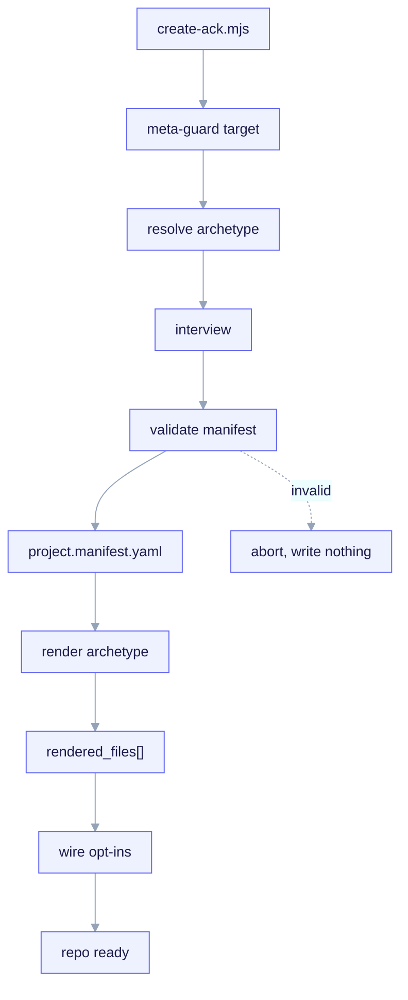

# Quickstart

This walks the full `/ack-init` flow end to end:
**fork → `/ack-init` → archetype-first interview → `project.manifest.yaml` → render →
opt-in wiring.** It assumes you have already forked the repo per
[Installation](/getting-started/installation).



<small>`node bin/create-ack.mjs my-product --archetype X` spins up a standalone child from the frozen templates — no fork, no META tree, no LLM in the loop. The meta-guard refuses to scaffold over the kit; the archetype is the branch axis; the interview falls back to `questions.yaml` defaults under `--yes`; the manifest is assembled and validated by `lib/manifest.mjs` against the JSON-Schema (fail-closed) before `scripts/render.mjs` renders `templates/archetypes/X/` and hashes the `rendered_files[]` ledger back into the manifest, then opt-ins (gate / telemetry / design-system) are wired.</small>

## The flow at a glance

```
/ack-init  (inside the fork)
   1. meta-repo guard         → refuse if run in ai-core-kit itself
   2. ask ARCHETYPE first     → the branch axis (narrows every later question)
   3. deterministic interview → answers written to managed: paths
   4. validate manifest       → against the frozen JSON-Schema (fail-closed)
   5. render archetype tree   → ${VAR} substitution + _when.* conditional dirs
   6. write rendered_files[]   → ownership ledger for idempotent re-runs
```

## 1. Run the command

From the root of your fork:

```text
/ack-init
```

`/ack-init` is the **only writer** of the manifest. It seeds `user:` once on the first
run and then never touches it again; on every run it regenerates the `managed:` subtree
wholesale from your answers.

## 2. Pick an archetype (asked first, mandatory)

The very first question is the **archetype** — the branch axis (invariant **I3**). Its
answer selects both the question subset you will be asked and the template set that gets
rendered.

| Archetype | v1 depth | What renders |
|---|---|---|
| `backend-api` | **Deep** | full scaffold, contract gate, OpenAPI seed, persistence |
| `fullstack` | **Deep** | full scaffold + optional design-system install (shadcn/ui) |
| `monorepo` | Minimal-core | safe core only (skills, `.claude/` conventions, manifest) |
| `library-sdk` | Minimal-core | safe core only |
| `infra-iac` | Minimal-core | safe core only |

Because the archetype is the branch axis, **an `infra-iac` project is never asked
database questions**, and the **design-system install is offered only for `fullstack`**.
This is deterministic gating from `templates/interview/questions.yaml` — not an LLM
guess.

## 3. Answer only the questions that apply

The interview walks `questions.yaml` in order, skipping any question whose `applies_to`
excludes your archetype or whose `ask_if`/`skip_if` evaluates false against earlier
answers. The 39 questions cover:

- **Project identity + stack**: name, description, language, runtime, package manager,
  framework (archetype-scoped enum), architecture.
- **Features** (opt-in toggles, default off except hooks/gate): `hooks`, `mcp`,
  `agent_teams`, `sdd_gate` (the master switch for the contract gate).
- **Persistence** (`backend-api`/`fullstack` only): DB engine, ORM, migrations.
- **Contract gate**: mode (`block`/`warn`/`off`), protected paths, scope, exempt globs.
- **Design system** (`fullstack` only): install the bundled Apache-2.0 skills.
- **Telemetry**: enable offline attribution, attribution mode, pricing-map path.
- **Discovery** and **CI/CD** target.

Each answer is written to a dotted `writes_to` path under `managed:`. The full bank is
documented in [Interview → Manifest → Render](/concepts/manifest-and-interview).

### Non-interactive runs

You can drive the interview from a prepared answers set instead of typing. The defaults
in `questions.yaml` are what non-interactive runs use, and `default` for a `select` is
always one of its declared `options`.

## 4. The manifest is written and validated

The collected answers are written wholesale into the `managed:` subtree of
`project.manifest.yaml` (the **single source of truth**), then validated against the
frozen JSON-Schema **before** any file is rendered.

- **Invalid manifest → abort, write nothing** (author-time fail-closed, invariant
  **I6**). A typo'd key is a hard validation error, not a silent drop
  (`additionalProperties: false`, invariant **I5**).
- **Same answers → byte-identical manifest.** Keys are emitted in schema-declaration
  order; the `managed:` subtree is canonicalized and hashed into `manifest_hash`. There
  is no LLM in the loop (invariant **I2**).

```yaml
# project.manifest.yaml  (excerpt — a backend-api result)
schema_version: 2
managed:
  manifest_hash: "sha256:..."          # written last, over the canonical managed: subtree
  project:
    name: acme-orders-api
    language: python
    framework: fastapi
  archetype: backend-api
  features: { hooks: true, mcp: false, agent_teams: false, sdd_gate: true }
  contract_gate:
    mode: block
    protected_paths: ["src/**", "migrations/**", "openapi/**"]
user:
  notes: ""
  overrides: {}
```

## 5. The archetype template set is rendered

The render engine walks `templates/archetypes/<archetype>/`, substitutes
`${dotted.path}` variables from `managed:`, and includes or omits files based on
`_when.*` directory guards and `render.map.yaml`. It writes back a `rendered_files[]`
ownership ledger so re-runs are idempotent. Details:
[Render engine contract](/concepts/render-engine).

## 6. Opt-in extras are wired

Whatever you toggled on is wired into the child:

- **Hooks** (`features.hooks`): conservative PreToolUse/PostToolUse hooks.
- **Contract gate** (`features.sdd_gate`): the 3-mode PreToolUse hook
  (`.claude/hooks/contract-gate`); omitted entirely when `sdd_gate` is false.
- **MCP** (`features.mcp`): a project `.mcp.json`.
- **Telemetry** (`telemetry.enabled`): the offline aggregator + pricing map.
- **Design system** (`fullstack` + `design_system.install`): the shadcn/ui skills,
  `shadcn.mcp.json`, and theme tokens.

Child hooks reference child artifacts via the literal `${CLAUDE_PROJECT_DIR}` — never an
absolute path and never a `templates/`-relative path (forkability, invariant **I7**).

## Re-running `/ack-init`

A second run with **identical answers** is a no-op: `manifest_hash` matches and every
`rendered_files[]` path is unchanged on disk, so the command exits 0 with zero writes.
Hand-edits **outside** ack-managed regions survive — the renderer owns only delimited
managed blocks in shared files (e.g. `CLAUDE.md`, `settings.json`) and never touches
files absent from the ledger. See
[Render engine — idempotency](/concepts/render-engine#idempotent-re-renders).

## Next

- Understand the boundary you are working inside:
  [The META vs CHILD boundary](/concepts/two-layer-model).
- See the contracts the interview obeys:
  [Interview → Manifest → Render](/concepts/manifest-and-interview).
