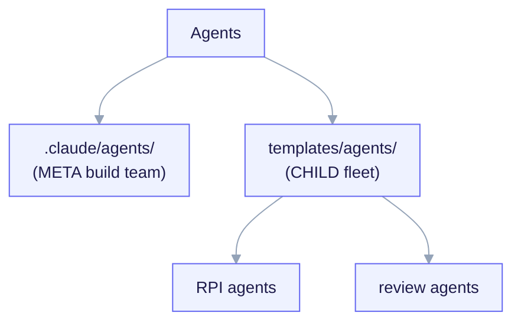

# Agents Reference

This is the complete, no-omissions list of every **agent** in ai-core-kit. An
agent is a specialized subagent Claude delegates to (via `Task`) when its
`description` trigger matches. Agents split along the
[META vs CHILD boundary](/concepts/two-layer-model):

- **META build team** — `.claude/agents/`. Phase specialists that
  [`/ack-build`](/reference/commands) spawns to author the kit itself. Never
  rendered into a fork.
- **CHILD reusable fleet** — `templates/agents/`. The everyday delivery and
  review agents that [`/ack-init`](/reference/commands) renders into a fork,
  including the RPI-flow agents.

<small>META agents (`.claude/agents/`) author the kit during `/ack-build`; CHILD agents (`templates/agents/`) are rendered into a fork by `/ack-init` — the RPI-flow agents plus the engineering review fleet.</small>

## META — build team (`.claude/agents/`)

`/ack-build` spawns these per phase in a ground-truth → author → adversarial-QA
team. They write only META artifacts; a worker that would write a concrete
`project.manifest.yaml` or contract instance at the META root is a layer
violation and is refused. Not rendered into forks.

| Agent | Layer | What it does | Trigger / when |
|---|---|---|---|
| `contract` | META | Authors the CHILD-payload methodology — the contract template and the 3-mode manifest-driven contract-gate hook. | Contract template, contract gate, gate modes, approved-oracle, design-contract-first scaffolding. |
| `design-system` | META | Authors the fullstack archetype's design-system payload — frontend-design and brand-guidelines-derived skills plus a design-tokens scaffold. | Design system, design tokens, frontend-design skill, brand-guidelines, fullstack UI scaffold. |
| `infra` | META | Authors META-layer platform plumbing — the `.claude/` tree, the project `.mcp.json`, the offline telemetry aggregator + `pricing.json`. | `settings.json`, `.claude` layout, MCP wiring, telemetry aggregator, `pricing.json`, budgets, linter/validator script. |
| `qa` | META | Validates phase artifacts against acceptance tests and adversarially verifies the two-layer boundary at the end of every phase. | Validate, verify against acceptance tests, QA this phase, test-fork the archetypes. |
| `research` | META | Extracts ground truth from reference repositories or the Anthropic docs — exact conventions and per-repo license. | Extract conventions, verify against docs, what does `<repo>` actually do, build the license ledger. |
| `template` | META | Authors or revises the CHILD-payload template sets — the archetype trees, interview `questions.yaml`, render map. | Archetype templates, scaffold the `<archetype>` tree, interview branching, `questions.yaml`, `render.map`. |

## CHILD — reusable fleet (`templates/agents/`)

The RPI + review fleet that `/ack-init` renders into a fork. The model column is
the agent's declared model tier.

### RPI-flow agents

The two agents that drive the [RPI loop](/reference/commands) (Research → Plan →
Implement).

| Agent | Layer | Model | What it does | Trigger / when |
|---|---|---|---|---|
| `requirement-parser` | CHILD | sonnet | Turns an unstructured feature request into structured requirements, goals, constraints, complexity, and clarifying questions. | Parse this request, what exactly are we building. RPI research step 1; rendered when `features.rpi == true`. |
| `constitutional-validator` | CHILD | opus | Validates roadmap items, features, and technical decisions against the project's constitution, principles, and chosen archetype. | Does this fit our principles, validate against the constitution, is this in scope. RPI research→plan gate. |

### Engineering & review agents

| Agent | Layer | Model | What it does | Trigger / when |
|---|---|---|---|---|
| `architect` | CHILD | opus | Software-architecture specialist for system design, scalability, and technical trade-off decisions — produces high-level designs, component responsibilities, data flows, API contracts, ADRs. | Design this, how should we structure, what are the trade-offs, write an ADR. RPI plan phase. |
| `code-explorer` | CHILD | sonnet | Codebase-analysis specialist that traces execution paths, maps architecture layers, and documents dependencies so new work starts grounded in code reality. | How does X work, trace this flow, map the architecture, what touches this module. Discovery step of RPI. |
| `code-reviewer` | CHILD | sonnet | Senior code-review specialist that reviews a diff for correctness, security, and maintainability and returns severity-ranked, evidence-backed findings. | Review this, check my changes, is this PR ready. |
| `refactor-cleaner` | CHILD | sonnet | Dead-code cleanup and consolidation specialist that finds unused code, exports, dependencies, and duplicates, then removes them safely in small verified batches. | Remove dead code, clean up unused imports/deps, consolidate duplicates, tidy the codebase. |
| `security-reviewer` | CHILD | sonnet | Security-vulnerability detection and remediation specialist that scans changed code for OWASP Top 10 issues, hardcoded secrets, injection, SSRF, and unsafe crypto. | Security review, is this safe, check for vulnerabilities. |
| `silent-failure-hunter` | CHILD | sonnet | Error-handling auditor that hunts silent failures — swallowed exceptions, empty catch blocks, dangerous fallbacks, lost stack traces, and missing error propagation. | Find swallowed errors, why is this failing silently, audit error handling. |

> **Subagents that are not kit agents.** `skill-creator/agents/{analyzer,
> comparator,grader}.md` are internal sub-agent prompts of the `skill-creator`
> skill — they carry no kit agent frontmatter and are not linted or rendered as
> standalone agents.

See also: [Skills Reference](/reference/skills),
[Commands Reference](/reference/commands),
[Skills Catalog](/features/skills-catalog) (provenance + license).
