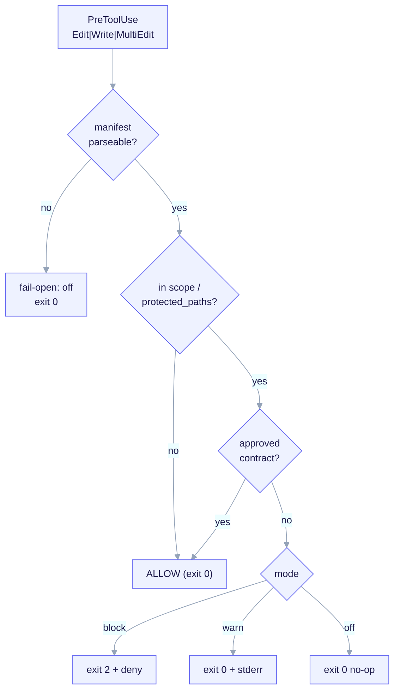

import TerminalCast from '../../../components/TerminalCast'

# Hooks Reference

<TerminalCast src="/demo/ack-gate.cast" />

A hook is a shell command Claude Code runs at a lifecycle event. ai-core-kit
ships exactly one hook, the **contract-gate**, as CHILD payload: a `PreToolUse`
guard rendered into a fork only when the archetype carries it and the master
switch is on. It is the CHILD-layer expression of the kit's
design-contract-first methodology. Full behavioral spec:
[Design-Contract Gate](/features/contract-gate).

<small>The gate filters by tool name in the matcher, then scopes by file path in-script against `contract_gate.protected_paths`/`scope`, consults the approved-contract oracle, and acts per `contract_gate.mode`. A missing/unparseable manifest fails open as `off`.</small>

## The one hook: `contract-gate`

| Field | Value |
|---|---|
| Kind | hook |
| Layer | CHILD |
| Event | `PreToolUse` |
| Matcher | `Edit\|Write\|MultiEdit\|NotebookEdit` |
| Command | `python3 ${CLAUDE_PROJECT_DIR}/.claude/hooks/contract-gate` |
| Rendered into | `backend-api` and `fullstack` archetypes |
| Master switch | `features.sdd_gate: true` (false → the hook and matcher are not rendered at all) |
| Path | `templates/archetypes/<archetype>/.claude/hooks/contract-gate` |

A `PreToolUse` matcher can filter only by **tool name**, never by file path. So
the hook receives every `Edit`/`Write`/`MultiEdit`/`NotebookEdit` call and reads
`tool_input.file_path` from stdin JSON to **scope in-script**. Runtime is pinned
to `python3`; the glob dialect is `fnmatch` with `**`.

## The three modes

`contract_gate.mode` is a required enum. The modes are **three distinct exit-code
mechanisms** — a load-bearing distinction, since the wrong exit form silently
no-ops the guard:

| Mode | Exit | Output | Effect |
|---|---|---|---|
| `block` | `2` | sets `hookSpecificOutput.permissionDecision: "deny"` | Stops the tool call. |
| `warn` | `0` | message on stderr / `additionalContext` | Logs and continues — does **not** block. |
| `off` | `0` | none; early-return before parsing the manifest body | No-op. |

> The `block` form is the footgun: it requires **`exit 2` AND
> `hookSpecificOutput.permissionDecision: "deny"`** — not a top-level `decision`
> key, and not `exit 1`. Get it wrong and the guard fails open.

## In-script scoping and precedence

Three glob lists in `contract_gate` drive scoping, with fixed precedence:

1. **`exempt`** wins over everything — an edit matching it is always allowed.
2. **`protected_paths`** (required, `minItems 1`, so the gate can never be
   vacuous): edits here require an approved contract.
3. **`scope`** (optional; defaults to `protected_paths`): the subset that *also*
   requires an approved contract.
4. A file matching none of the above is **ALLOWED**.

The "approved?" oracle is `contracts[]`: an edit under a protected path is
allowed only if some `contracts[]` entry whose `scope` covers it has
`status: approved` (a `draft` does not unlock its scope). Per-archetype
`protected_paths` defaults are resolved by `/ack-init` from the chosen archetype
and frozen into the manifest:

| Archetype | Default protected paths |
|---|---|
| `backend-api` | `src/**`, `migrations/**`, `openapi/**` |
| `fullstack` | `app/**`, `api/**`, `src/**` |
| `infra-iac` | supplied via the manifest field (no hardcoded `src/**`, which would be vacuous for infra) |

## Fail-open / fail-closed contract

- **Fail-open at runtime.** If the manifest is missing or unparseable when the
  hook runs, the gate behaves as `off` plus a stderr notice — it never exits `2`
  and never wedges the session.
- **Fail-closed at author-time.** `/ack-init` validates the manifest against the
  frozen schema before rendering; an invalid `contract_gate` block aborts init.

## Shipped vs. roadmap

| Piece | Status |
|---|---|
| `contract_gate.*` and `contracts[]` manifest fields (frozen schema) | **Shipped** |
| `settings.json` matcher + hook location + fail-open stub | **Shipped** |
| Per-archetype `protected_paths` defaults | **Shipped (interview/schema)** |
| Deep runtime: fnmatch scoping, approved-oracle walk, 3 mode mechanisms | **P5 / roadmap** |

See also: [Design-Contract Gate](/features/contract-gate) (full spec),
[Manifest & Interview](/concepts/manifest-and-interview) for the `contract_gate`
and `contracts[]` fields the hook reads.
