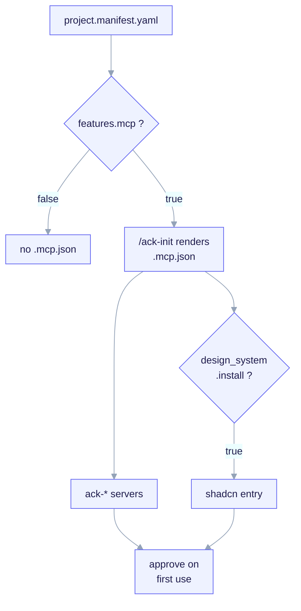

# MCP Reference

MCP (Model Context Protocol) lets an agent reach external services through
well-designed tools. ai-core-kit touches MCP in three places: a concrete
**server** it can render (shadcn), the `.mcp.json` **wiring** that declares
project-scoped servers, and the **`mcp-builder`** skill for authoring servers.
Full behavioral walkthrough: [MCP Wiring](/features/mcp).


<small>`features.mcp` gates the whole `.mcp.json`; the `shadcn` entry is double-gated by `#ack:if design_system.install`. Every project-scoped server must be explicitly approved on first use (a security boundary).</small>

## The shadcn MCP server

| Field | Value |
|---|---|
| Kind | mcp |
| Name | `shadcn` |
| Layer | CHILD |
| What it does | shadcn/ui component-library MCP server integration — lets an agent browse, search, and install shadcn/ui components from the project's `components.json`. |
| Trigger / when | `design_system.install == true` in a `fullstack` fork (double-gated: also requires `features.mcp`). |
| Path | `templates/archetypes/fullstack/_when.design_system.install/design-system/mcp/shadcn.mcp.json` |

The canonical fragment is exactly:

```json
{ "mcpServers": { "shadcn": { "command": "npx", "args": ["shadcn@latest", "mcp"] } } }
```

It is **double-gated** — the effective predicate is
`features.mcp && design_system.install`:

1. **`features.mcp`** — the whole `.mcp.json.tpl` renders only when the child
   opted into a project `.mcp.json`. If false, the shadcn entry never appears.
2. **`design_system.install`** — within that file the `shadcn` block is wrapped
   in the renderer directive `#ack:if design_system.install … #ack:endif`, so it
   is emitted only when `design_system.install == true`. When false (or absent,
   e.g. `backend-api`), the block is omitted and the remaining JSON stays valid.

## `.mcp.json` wiring and the `ack-*` servers

`/ack-init` renders `.mcp.json` only when `features.mcp: true`, owning it at the
managed key `json:mcpServers`. Within `mcpServers`, ack owns **only the entries
it renders** — the `ack-*` prefixed servers plus the canonical `shadcn` entry.
User-added servers under other keys are never touched; on re-run, `/ack-init`
re-merges via a JSON-aware key merge (not line concatenation).

> **Status.** `.mcp.json` rendering, the `features.mcp` gate, the design-system
> double-gate, and the shadcn fragment are **shipped**. The deep generic project
> server (`ack-example`) is a **P4 stub** — its real server wiring is roadmap.
> The shadcn MCP shells out to upstream tooling and works today.

## Project servers require approval (security boundary)

`.mcp.json` is project-scoped; Claude Code does **not** trust project servers
automatically. On first use the user must **approve** each server (and any change
to its `command`/`args` re-prompts). A checked-in `.mcp.json` cannot silently run
a command on a teammate's machine. The shadcn MCP shells out to `npx`, which may
download on first invocation — raise `MCP_TIMEOUT` (ms) if cold-start is slow.

## Authoring servers: the `mcp-builder` skill

| Field | Value |
|---|---|
| Kind | skill |
| Name | `mcp-builder` |
| Layer | META |
| What it does | Builds high-quality MCP servers — research, implementation in Python (FastMCP) or Node/TypeScript (MCP SDK), and evaluation. The skill invoked when building a child's `features.mcp` server. |
| Trigger / when | Build an MCP server, expose this API as MCP tools, FastMCP, wire up the project's `features.mcp` server. |
| Path | `.claude/skills/mcp-builder/SKILL.md` |

It lives in `.claude/skills/` (META) and is **not** rendered into forks. See the
[Skills Reference](/reference/skills) for its place in the meta-builder set.

## Boundaries

- MCP is reference material for design; the [contract gate](/reference/hooks) and
  [telemetry](/reference/observability) do **not** depend on MCP.
- Skills may reference MCP tools but must fail gracefully if a server is absent.

See also: [MCP Wiring](/features/mcp), [Design system](/features/design-system),
[Skills Reference](/reference/skills).
