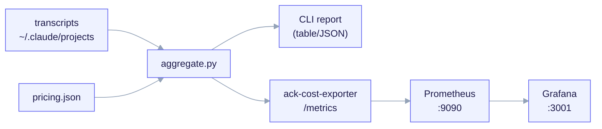

# Observability Reference

ai-core-kit measures the USD cost of a Claude Code run **offline** — there is no
live cost API for Claude Code spend (issue
[#11008](https://github.com/anthropics/claude-code/issues/11008)). This page is
the complete, no-omissions list of the telemetry primitives: the aggregator, the
pricing map, the Prometheus exporter, and the docker-compose stack. The
attribution model is detailed in [Offline Cost Telemetry](/features/cost-telemetry).


<small>`aggregate.py` x `pricing.json` is the single cost engine. It serves a CLI report directly, and the `ack-cost-exporter` re-uses it (no re-implementation) to expose Prometheus gauges that Prometheus scrapes and Grafana dashboards. All cost is OFFLINE-derived — near-real-time at best (TTL-bounded), never a live token meter.</small>

## The primitives at a glance

| Primitive | Kind | Layer | What it does | Trigger / when |
|---|---|---|---|---|
| `aggregate.py` | telemetry | META | Offline cost & token aggregator — stdlib-only post-run tool that reads Claude Code transcripts and multiplies token counts by the versioned pricing map. | `python3 aggregate.py [--project-dir DIR] [--since YYYY-MM-DD] [--pricing PATH]`. |
| `pricing.json` | telemetry | META | Versioned pricing map (USD per MTok) — model pricing for input/output/cache operations, `unknown_model_policy=error`. | `schema_version 1`, `as_of 2026-06-01`; unknown models make `aggregate.py` fail loud. |
| `ack-cost-exporter` | telemetry | META | Prometheus exporter for offline cost — a thin wrapper around `aggregate.py` that exposes cost buckets as Prometheus gauges on `/metrics`. | Near-real-time cost monitoring via Prometheus scrape (TTL-cached by `ACK_SCRAPE_TTL`, default 30s). |
| `observability-stack` | telemetry | META | Prometheus + Grafana + `ack_cost_exporter` stack — visualizes the offline cost of building ai-core-kit with near-real-time dashboards. | `docker compose up` to stand up the full stack. |

Paths:

| Primitive | Path |
|---|---|
| `aggregate.py` | `telemetry/aggregate.py` |
| `pricing.json` | `telemetry/pricing.json` |
| `ack-cost-exporter` | `telemetry/observability/exporter/ack_cost_exporter.py` |
| `observability-stack` | `telemetry/observability/docker-compose.yml` |

## `aggregate.py` — the offline aggregator

A stdlib-only post-run tool. For each `assistant` line it reads `message.usage`
(present on every assistant turn, tool or not, so it captures 100% of spend) and
prices it against `pricing.json`, bucketing by `model`, `feature`, `agent`, and
`session`. It is **fail-loud**: an unknown model, a missing/invalid `pricing.json`,
or a bucket-sum that does not reconcile to the grand total exits non-zero. A
single malformed JSONL line is skipped (not fatal).

```bash
# whole machine, all four axes, table + JSON:
python3 telemetry/aggregate.py

# this build only, since a date, feature + model + agent, JSON only:
python3 telemetry/aggregate.py --project-dir ~/.claude/projects \
  --since 2026-06-01 --by feature,model,agent --branch-prefix feat/ --format json
```

Key flags: `--project-dir`, `--since YYYY-MM-DD`, `--pricing PATH`, `--by`
(`model,feature,agent,session`), `--branch-prefix`, `--default-bucket` (default
`unattributed`), `--sidecar-map`, `--manifest` (CHILD only), `--format
table|json|both`. The same engine lives in the META `telemetry/` and ships to
forks under `templates/telemetry/`, wired by `/ack-init` when
`telemetry.enabled: true`.

## `pricing.json` — the versioned price map

A `model → USD/MTok` map with `schema_version: 1`, an `as_of` date, and
`unknown_model_policy: error`. Per-model keys: `input`, `output`,
`cache_write_5m`, `cache_write_1h`, `cache_read`. An `aliases` block maps
bare/aliased ids to a priced id (dated `-YYYYMMDD` suffixes are stripped
automatically); `skip_models` lists non-billable pseudo-models (e.g.
`<synthetic>`) skipped entirely. A `message.model` absent from the map is a hard
error naming the offending id — cost is never silently under-counted. The fix is
to add a row (copy a same-tier row, set USD/MTok values, bump `as_of`).

## `ack-cost-exporter` — Prometheus gauges

A thin Prometheus wrapper that **imports** `load_pricing`, `discover_jsonl`, and
`aggregate` from the sibling `aggregate.py` — it does **not** re-implement
pricing or attribution. On each scrape (subject to an `ACK_SCRAPE_TTL` cache,
default 30s) it re-parses the transcript JSONL and re-aggregates, so freshness is
"as of the last recompute", never a live token meter. It is **fail-soft at
scrape time**: on any error it keeps the last good gauges and sets
`ack_scrape_error=1` (an empty/missing transcript dir is not an error — it emits
clean zeros).

| Metric | Meaning |
|---|---|
| `ack_total_cost_usd` | Grand total across all assistant turns. |
| `ack_assistant_turns_total` | Number of assistant turns priced. |
| `ack_files_scanned` | Transcript files discovered. |
| `ack_cost_usd{model,feature,agent}` | Cost per axis bucket (1-D; inactive axes pinned to `*`). |
| `ack_tokens_total{kind,feature,agent}` | Tokens per kind per axis bucket. |
| `ack_budget_usd{feature}` | Advisory budget ceilings from the manifest (`scope=project` → `__project__`). |
| `ack_reconciled` | `1` if all axes reconcile, else `0`. |
| `ack_pricing_as_of{as_of,reconciled}` | Pricing-doc metadata (Info). |
| `ack_scrape_duration_seconds` | Wall time of the last recompute. |
| `ack_scrape_error` | `1` if the last scrape errored (stale, do not trust). |
| `ack_last_scrape_unixtime` | Unix ts of the last recompute. |

Config (env): `ACK_PROJECT_DIR`, `ACK_PRICING`, `ACK_MANIFEST` (optional;
supplies budgets), `ACK_BRANCH_PREFIX` (default `feat/`), `ACK_DEFAULT_BUCKET`,
`ACK_SINCE`, `ACK_PORT` (default `9418`), `ACK_SCRAPE_TTL` (default `30`).

## `observability-stack` — Prometheus + Grafana

`telemetry/observability/docker-compose.yml` stands up three services that watch
the offline cost of building ai-core-kit itself:

| Service | Image | Port | Role |
|---|---|---|---|
| `exporter` | `ack-cost-exporter:local` (built) | `9418` (internal) | Re-parses transcripts each scrape (TTL-cached) and exposes the gauges above. Mounts transcripts, `aggregate.py`, and `pricing.json` read-only. |
| `prometheus` | `prom/prometheus:v3.5.3` | `9090` | Scrapes the exporter every 30s; stores series for 30 days. |
| `grafana` | `grafana/grafana:12.4.3` | `3001` (→ 3000) | Dashboards; anonymous Viewer by default. Host port 3001 because 3000 is the docs site. |

```bash
docker compose up -d        # start (from telemetry/observability/)
open http://localhost:3001  # Grafana (anonymous Viewer)
docker compose down         # stop (add -v to wipe stored series)
```

Copy `.env.example` to `.env` to override ports, project dir, and Grafana creds.
The numbers are **near-real-time** (refreshed every scrape, bounded by
`ACK_SCRAPE_TTL`), not a live per-token meter.

## The hard constraint and the two cost skills

> There is no live cost meter for Claude Code spend, and there never can be —
> hooks carry no token or cost fields (#11008). State this before promising any
> real-time number.

Two CHILD payload skills sit on top of this engine (both MIT):

- **`cost-telemetry`** — runs `aggregate.py` and interprets its output; the
  single source of truth for *the numbers*. Rendered when
  `features.cost_telemetry == true`.
- **`cost-audit`** — evidence-first investigation of *why* spend spiked; it
  delegates the numbers to `cost-telemetry` and never re-derives pricing math.

See also: [Offline Cost Telemetry](/features/cost-telemetry) (attribution model,
reconciliation, budgets), [Skills Reference](/reference/skills).
