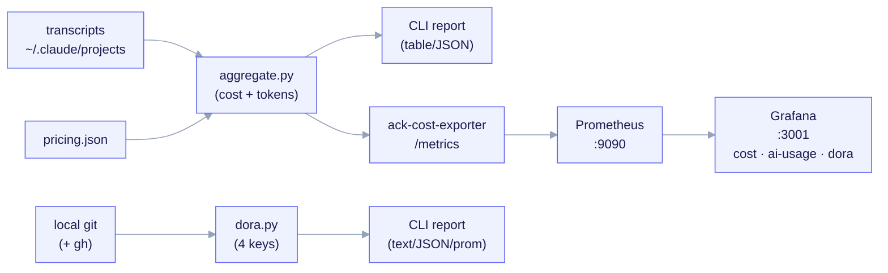

import TerminalCast from '../../../components/TerminalCast'

# Observability Reference

<TerminalCast src="/demo/ack-telemetry.cast" />

ai-core-kit gives you two honest, complementary views of a Claude Code build:

1. **AI usage** — the USD **and token** cost of the run, derived **offline** from
   the transcript. There is no live cost API for Claude Code spend (issue
   [#11008](https://github.com/anthropics/claude-code/issues/11008)), so this is
   accurate after-the-fact accounting, **never a live meter**.
2. **DORA** — the four delivery "keys" (deployment frequency, lead time, change
   failure rate, time to restore), computed from your **local git history** (and
   `gh` when present). This is **exact**, not a transcript estimate.

This page is the complete, no-omissions list of those primitives: the aggregator,
the pricing map, budgets, the DORA module, the report, the local monitor, the
Prometheus exporter, and the docker-compose stack with its three dashboards. The
cost attribution model is detailed in [Offline Cost Telemetry](/features/cost-telemetry).

## How you consume it — three tiers

Observability here is **offline-first and tiered**. You do not need Grafana — or
any infra at all — to get the full cost, token, and DORA picture. The tiers are
additive (each reads the same two engines, re-implementing no math):

| Tier | Infra | What you get |
|---|---|---|
| **Tier 0** — CLI + report (default) | **none** | `aggregate.py` / `dora.py` on the CLI, plus a self-contained HTML/Markdown **report** (`report.py`) you can open or attach to a PR |
| **Tier 1** — scheduled monitor | none new | DORA via a **GitHub Action** (git history is in the runner); cost/budget via a **local** `monitor.sh` |
| **Tier 2** — Grafana stack | Docker | live-ish dashboards over the same gauges — **opt-in, for teams already running Grafana** |

Start at Tier 0. Reach for Tier 2 only if a dashboard earns its keep.


<small>Two engines, one stack. <code>aggregate.py</code> × <code>pricing.json</code> prices transcript token-usage (OFFLINE — near-real-time at best, never a live meter). <code>dora.py</code> reads local git (+ <code>gh</code>) for the four keys (EXACT). Both surface in the same Prometheus + Grafana stack via three folder-provisioned dashboards.</small>

## The primitives at a glance

| Primitive | Kind | Layer | What it does |
|---|---|---|---|
| `aggregate.py` | telemetry | META | **Tier 0.** Offline **cost + token** aggregator — reads transcripts, multiplies token counts by the versioned pricing map, attributes by `model`/`feature`/`agent`/`session`/`day`, and compares totals to advisory budgets. |
| `pricing.json` | telemetry | META | Versioned `model → USD/MTok` map, `unknown_model_policy=error`. |
| `dora.py` | telemetry | META | **Tier 0.** The DORA **four keys** from local git history (+ optional `gh`), with a self-test. Text / JSON / Prometheus output. |
| `report.py` | telemetry | META | **Tier 0.** Self-contained HTML/Markdown report — imports the two engines into one standalone, no-network artifact. |
| `monitor.sh` | telemetry | META | **Tier 1.** Local cost/budget monitor — runs `aggregate.py` against local transcripts and ALERTs on a manifest-budget overage. |
| `ack-cost-exporter` | telemetry | META | **Tier 2.** Thin Prometheus wrapper that **imports** `aggregate.py` (no re-implementation) and exposes cost/token gauges on `/metrics`. |
| `observability-stack` | telemetry | META | **Tier 2 (opt-in).** Prometheus + Grafana + exporter docker-compose stack with three dashboards. |

Paths:

| Primitive | Path |
|---|---|
| `aggregate.py` | `telemetry/aggregate.py` |
| `pricing.json` | `telemetry/pricing.json` |
| `dora.py` | `telemetry/dora.py` |
| `report.py` | `telemetry/report.py` |
| `monitor.sh` | `telemetry/monitor.sh` |
| `ack-cost-exporter` | `telemetry/observability/exporter/ack_cost_exporter.py` |
| `observability-stack` | `telemetry/observability/docker-compose.yml` |
| dashboards | `telemetry/observability/grafana/dashboards/{ack-cost,ack-ai-usage,ack-dora}.json` |

Every one of these lives in the META `telemetry/` and is mirrored to the CHILD
payload under `templates/telemetry/`, wired by `/ack-init` when
`telemetry.enabled: true`.

---

## AI usage — `aggregate.py` (cost **and** tokens)

A stdlib-only post-run tool. For each `assistant` line it reads `message.usage`
(present on every assistant turn, tool or not, so it captures 100% of spend) and
prices it against `pricing.json`. **Every bucket carries token counts —
`input` / `output` / `cache_read` / `cache_write_5m` / `cache_write_1h` —
alongside its USD cost**, so this is true token-usage accounting, not just a
dollar figure. It is **fail-loud**: an unknown model, a missing/invalid
`pricing.json`, or a bucket-sum that does not reconcile to the grand total exits
non-zero. A single malformed JSONL line is skipped (not fatal).

```bash
# whole machine, all axes, the AI-usage table (cost + tokens) + JSON:
python3 telemetry/aggregate.py

# per-session usage, this build only:
python3 telemetry/aggregate.py --by session --since 2026-06-01
```

```
## by session                turns   cost USD    in+out tok    cache tok
e3b61498-3313-49..            3872    441.4824     3,546,105   446,558,196
a29e493f-f2aa-4d..            5496    340.2362     3,670,522   442,059,374
```

### Attribution axes — now including `day`

`--by` selects one or more of `model,feature,agent,session,day`:

- **model / session** — keyed on the exact `message.model` / `sessionId`. Always exact.
- **agent** — `isSidechain` splits `main` from `subagent:<requestId>` spend.
- **feature** — supplied by `--branch-prefix` (feature = branch after the prefix)
  or a `--sidecar-map` (timestamp → bucket); anything unmatched lands in the
  `--default-bucket` (never silently dropped).
- **day** — each turn buckets to its **UTC calendar day** (`YYYY-MM-DD`);
  timestamp-less turns land in an explicit `undated` bucket. This powers the
  per-day token + cost time series the `ack-ai-usage` dashboard charts.

Every axis **reconciles**: the per-bucket sum is proven equal to the grand total,
or the run exits non-zero.

### Budgets are advisory

`pricing.json` produces **actuals**. **Budgets** (advisory USD ceilings) flag
overage — they never enforce or block anything live. Two ways to set them:

- **CHILD manifest** — `telemetry.budgets[]` (scope `project|feature|contract|agent`),
  read by `aggregate.py --manifest` and by the exporter (`ACK_MANIFEST`).
- **Ad-hoc on the CLI** — `--budget USD` for the grand total, or
  `--budget-axis AXIS` + repeated `--bucket-budget NAME=USD` for per-bucket caps.
  Overage is **reported**; `--budget-strict` makes overage exit non-zero
  (reconciliation failure **always** exits non-zero, independent of budgets).

## `pricing.json` — the versioned price map

A `model → USD/MTok` map with `schema_version`, an `as_of` date, and
`unknown_model_policy: error`. Per-model keys: `input`, `output`,
`cache_write_5m`, `cache_write_1h`, `cache_read`. An `aliases` block maps
bare/aliased ids to a priced id (dated `-YYYYMMDD` suffixes are stripped
automatically); `skip_models` lists non-billable pseudo-models. A `message.model`
absent from the map is a hard error naming the offending id — cost is never
silently under-counted. The fix: add a row (copy a same-tier row, set the
USD/MTok values, bump `as_of`).

---

## Tier 0 — `report.py` (self-contained report)

<TerminalCast src="/demo/ack-report.cast" />

The default, zero-infra view. `report.py` **imports** `aggregate.py` and
`dora.py` and renders a single standalone artifact — no external CSS/JS, no
network — combining the cost+token breakdown and the DORA four keys into one
document you can open in a browser or paste into a PR. It is a *view*, not a
second source of truth: the numbers are still the reconciled, fail-loud output of
the two engines.

```bash
python3 telemetry/report.py --format html --out report.html   # open / attach to a PR
python3 telemetry/report.py --format md   --out report.md     # comment / commit body
```

---

## DORA — `dora.py` (the four keys, exact from git)

<TerminalCast src="/demo/ack-metrics.cast" />

A stdlib-only sibling of `aggregate.py` that reads **local git history** — no
servers, no pip — and computes the four DORA keys over a window
(`--since 30d|12w|6m|1y|YYYY-MM-DD`, default 30d). Unlike cost, this is **exact**,
not a transcript estimate.

```bash
python3 telemetry/dora.py                       # tag mode (release tags = deploys)
python3 telemetry/dora.py --deploy-mode merge   # trunk/CD repos (first-parent = deploy)
python3 telemetry/dora.py --selftest            # pin the math on a synthetic fixture
python3 telemetry/dora.py --prom                # Prometheus exposition text
```

| Key | Definition (in this tool) | Rating bands |
|---|---|---|
| **Deployment frequency** | deploys in the window ÷ days. | elite ≥1/day · high ≥weekly · medium ≥monthly · low |
| **Lead time for changes** | median(commit **authored** → first deploy that contains it). | elite &lt;1d · high &lt;1w · medium &lt;1m · low |
| **Change failure rate** | failed_deploys ÷ deploys. | elite/high ≤15% · medium ≤30% · low |
| **Mean time to restore** | median(failure marker → next deploy that resolves it). | elite &lt;1h · high &lt;1d · medium &lt;1w · low |

**Deploys and failures are PROXIES — `dora.py` is honest about it.** A git repo
has no real deployment stream, so a *deploy* is either a release **tag**
(`--deploy-tag-glob`, default `v*`; the default mode) or a **first-parent
commit** on the default branch (`--deploy-mode merge`, for trunk/CD repos). A
*failure* is a deploy that contains a **revert** (`Revert …` / `This reverts
commit …`) or **hotfix** commit (`--hotfix-glob`, default `*hotfix*`; also
`fix!:` / `[hotfix]`), or — only with `--use-gh` — a deploy whose commit SHA has
a failed CI run. Squash/rebase/force-push histories and tag-less flows will
mis-estimate; pick the `--deploy-mode` that matches how you ship and read the
heuristic note the report prints.

`gh` enrichment is **best-effort**: missing, unauthenticated, or offline `gh`
silently skips CI-based failure detection (revert/hotfix detection still runs);
the report states which path it took. The **`--selftest`** asserts the exact
four-key math on a synthetic, git-free fixture (and the edge cases: no deploys,
windowing, CI-only failure, the window grammar) — it is part of the test gate.

`--prom` emits these gauges (so the exporter can surface DORA without
re-implementing the math): `ack_dora_deploys_total`,
`ack_dora_deploy_frequency_per_day`, `ack_dora_deploy_frequency_per_week`,
`ack_dora_lead_time_seconds`, `ack_dora_change_failure_rate`,
`ack_dora_failed_deploys_total`, `ack_dora_mttr_seconds`,
`ack_dora_window_span_days`. A metric with no data is emitted as `NaN` (Prometheus
records "no sample" rather than a misleading `0`).

---

## Tier 1 — scheduled monitor (zero new infra)

<TerminalCast src="/demo/ack-monitor.cast" />

The same engine also drives a **live terminal session** — `telemetry/watch.py` redraws tokens + cost per feature in place, like `top`:

<TerminalCast src="/demo/ack-watch.cast" />

Same engines, now running **on a schedule** so a regression or an overage finds
you. The split follows the data:

- **DORA → GitHub Action.** Git history is already checked out in the runner, so
  a scheduled workflow runs `dora.py` (`--json` / `--prom`), writes the four keys
  to the **job summary**, and opens an **issue on a regression** (a key dropping
  a rating band). Nothing leaves CI; no transcripts are needed.
- **Cost/budget → local `monitor.sh`.** It runs `aggregate.py` against your
  **local** transcripts with the manifest's advisory budgets and **flags an
  overage as an ALERT**. This stays on the developer's machine *on purpose*:
  token transcripts are machine-local ([#11008](https://github.com/anthropics/claude-code/issues/11008)
  + the [locality note](/features/cost-telemetry)) and are **not** present in CI,
  so a CI job could not price them. Run it from cron, a `SessionStart`/`Stop`
  hook, or by hand: `telemetry/monitor.sh`.

> **Why the split:** DORA travels with the repo (CI can see it); AI cost is
> reconstructed from machine-local transcripts (CI cannot). Tier 1 puts each
> metric where its data already lives — no new infra, no shipping transcripts off
> the box.

---

## Tier 2 (opt-in) — `ack-cost-exporter` — Prometheus gauges

> **Tier 2 is optional** — worth it only for teams **already running Grafana**.
> It adds visualization over the *same* offline numbers, not accuracy, and not a
> live meter.

A thin Prometheus wrapper that **imports** `load_pricing`, `discover_jsonl`, and
`aggregate` from the sibling `aggregate.py` — it does **not** re-implement
pricing or attribution. On each scrape (subject to an `ACK_SCRAPE_TTL` cache,
default 30s) it re-parses the transcript JSONL and re-aggregates, so freshness is
"as of the last recompute", never a live token meter. It is **fail-soft at
scrape time**: on any error it keeps the last good gauges and sets
`ack_scrape_error=1` (an empty/missing transcript dir is not an error — it emits
clean zeros).

| Metric | Meaning |
|---|---|
| `ack_total_cost_usd` | Grand total across all assistant turns. |
| `ack_assistant_turns_total` | Number of assistant turns priced. |
| `ack_files_scanned` | Transcript files discovered. |
| `ack_cost_usd{model,feature,agent}` | Cost per axis bucket (1-D; inactive axes pinned to `*`). |
| `ack_tokens_total{kind,feature,agent}` | Tokens per kind per axis bucket. |
| `ack_budget_usd{feature}` | Advisory budget ceilings from the manifest (`scope=project` → `__project__`). |
| `ack_reconciled` | `1` if all axes reconcile, else `0`. |
| `ack_pricing_as_of{as_of,reconciled}` | Pricing-doc metadata (Info). |
| `ack_scrape_duration_seconds` | Wall time of the last recompute. |
| `ack_scrape_error` | `1` if the last scrape errored (stale, do not trust). |
| `ack_last_scrape_unixtime` | Unix ts of the last recompute. |

Config (env): `ACK_PROJECT_DIR`, `ACK_PRICING`, `ACK_MANIFEST` (optional;
supplies budgets), `ACK_BRANCH_PREFIX` (default `feat/`), `ACK_DEFAULT_BUCKET`,
`ACK_SINCE`, `ACK_PORT` (default `9418`), `ACK_SCRAPE_TTL` (default `30`).

## Tier 2 (opt-in) — `observability-stack` — Prometheus + Grafana

`telemetry/observability/docker-compose.yml` stands up three services:

| Service | Image | Port | Role |
|---|---|---|---|
| `exporter` | `ack-cost-exporter:local` (built) | `9418` (internal) | Re-parses transcripts each scrape (TTL-cached) and exposes the gauges above. Mounts transcripts, `aggregate.py`, and `pricing.json` read-only. |
| `prometheus` | `prom/prometheus:v3.5.3` | `9090` | Scrapes the exporter every 30s; stores series for 30 days. |
| `grafana` | `grafana/grafana:12.4.3` | `3001` (→ 3000) | Dashboards; anonymous Viewer by default. Host port 3001 because 3000 is the docs site. |

```bash
docker compose up -d        # start (from telemetry/observability/)
open http://localhost:3001  # Grafana (anonymous Viewer)
docker compose down         # stop (add -v to wipe stored series)
```

### Three dashboards (folder-provisioned)

Grafana auto-loads **every** `*.json` under `grafana/dashboards/` via the
`ack.yml` provider — a new dashboard needs no provisioning edit.

| Dashboard | UID | What it shows |
|---|---|---|
| **Cost Observability** (`ack-cost.json`) | `ack-cost-observability` | Total cost, turns, exporter health; cost by feature/model/agent; cost-share pie; top sessions; budget gauges. |
| **AI Usage** (`ack-ai-usage.json`) | `ack-ai-usage` | **Token** counts (not just USD) — tokens-over-time by kind, cache-read share, a feature×kind token ledger, tokens by feature/agent, per-session spend, budget gauges, and an OFFLINE recompute-age "Data Freshness" stat. |
| **DORA** (`ack-dora.json`) | `ack-dora-metrics` | The four keys as stat panels + trend timeseries (deploy frequency, lead time/MTTR, change-failure rate, failed-vs-total deploys), sourced from the `ack_dora_*` gauges. |

Copy `.env.example` to `.env` to override ports, project dir, and Grafana creds.
The cost/token numbers are **near-real-time** (refreshed every scrape, bounded by
`ACK_SCRAPE_TTL`), not a live per-token meter.

---

## The hard constraint, and what is exact

> There is no live cost meter for Claude Code spend, and there never can be —
> hooks carry no token or cost fields ([#11008](https://github.com/anthropics/claude-code/issues/11008)).
> State this before promising any real-time number.

So **AI cost is offline** (transcript × pricing, near-real-time at best). **DORA
is exact** (derived from git, not the transcript). None of this needs Grafana:
Tier 0 (CLI + report) is the default, Tier 1 (the scheduled monitor) adds no new
infra, and Tier 2 (Grafana) is purely opt-in. Two CHILD payload skills sit on top
of the cost engine (both MIT):

- **`cost-telemetry`** — runs `aggregate.py` and interprets its output; the
  single source of truth for *the numbers*. Rendered when
  `features.cost_telemetry == true`.
- **`cost-audit`** — evidence-first investigation of *why* spend spiked; it
  delegates the numbers to `cost-telemetry` and never re-derives pricing math.

See also: [Offline Cost Telemetry](/features/cost-telemetry) (attribution model,
reconciliation, budgets), [Skills Reference](/reference/skills).
