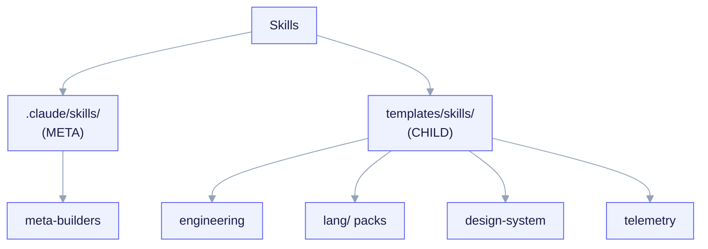

import TerminalCast from '../../../components/TerminalCast'

# Skills Reference

<TerminalCast src="/demo/ack-catalog.cast" />

This is the complete, no-omissions list of every **skill** in ai-core-kit. A
skill is a model-invoked capability: Claude loads it when its `description`
trigger matches the work at hand (a human can also invoke it by name). Skills
split along the [META vs CHILD boundary](/concepts/two-layer-model):

- **META** skills live in `.claude/skills/` and help **build the kit itself**.
  They are never rendered into a fork.
- **CHILD** skills live under `templates/skills/` and are **rendered into a
  fork** by [`/ack-init`](/reference/commands), gated by the project manifest.

For the source-repo + license provenance of each item see the
[Skills Catalog](/features/skills-catalog) and the
[License ledger](/reference/licensing). The tables below are the *capability*
reference: layer, what each does, and what fires it.

<small>META skills (`.claude/skills/`) build the kit; CHILD skills (`templates/skills/`) are rendered into a fork and gated by `project.manifest.yaml`. `cost-telemetry` exists in both layers.</small>

## META — meta-builder skills (`.claude/skills/`)

Author, validate, and instrument the kit's own primitives. Not rendered into
forks; never gated by a child contract.

| Skill | Layer | What it does | Trigger / when |
|---|---|---|---|
| `cost-telemetry` | META | Runs the offline ai-core-kit cost aggregator and interprets its output — computes USD spend for a Claude Code run from transcript token-usage lines times a versioned pricing map, attributed by model, feature, agent, and session. | How much a build/session/feature/agent cost, token or cost breakdown or report, mentions telemetry/`pricing.json`/`aggregate.py`. |
| `mcp-builder` | META | Builds high-quality MCP (Model Context Protocol) servers that let LLMs reach external services through well-designed tools — covers research, implementation in Python (FastMCP) or Node/TypeScript (MCP SDK), and evaluation. | Build an MCP server, expose this API as MCP tools, FastMCP, wire up the project's `features.mcp` server. |
| `skill-creator` | META | Authors, edits, and benchmarks ai-core-kit skills — drafts a new `SKILL.md`, runs with-skill vs baseline evals, grades them, and optimizes the description for reliable triggering. | Create/author/write a skill, make a `SKILL.md`, improve/optimize this skill, run evals on a skill, benchmark a skill. |
| `skill-validator` | META | Validates ai-core-kit skills, agents, and slash commands against the kit's canonical frontmatter and structure rules by running `scripts/lint-frontmatter.py` and interpreting every finding. | Validate/lint/check this skill, does this `SKILL.md` follow the kit conventions, why is `lint-frontmatter` failing, audit the skills. |

> `cost-telemetry` appears in **both** layers — the META copy interprets a *kit
> build* transcript; the CHILD copy (below) is rendered into a fork. Same engine,
> two homes.

## CHILD — engineering & product skills (`templates/skills/`)

The payload skills agents load during delivery. Each row's trigger is the
`project.manifest.yaml` condition (or archetype) that wires it into a fork.

| Skill | Layer | What it does | Trigger / when |
|---|---|---|---|
| `agent-eval` | CHILD | Head-to-head, reproducible comparison of coding agents (Claude Code, Aider, Codex, and others) on this project's own tasks — measuring pass rate, cost, wall-clock time, and consistency. | Which coding agent is best for us, benchmark these agents, did the new model regress. |
| `architecture-decision-records` | CHILD | Captures architectural decisions as structured ADR documents that live in `docs/adr/` alongside the code, recording context, alternatives considered, and rationale. | Record this decision, ADR this, choosing between significant alternatives, why did we choose X. |
| `code-tour` | CHILD | Creates CodeTour `.tour` files — persona-targeted, step-by-step codebase walkthroughs anchored to real files and line ranges, written to `.tours/`. | Give me a code tour, onboarding walkthrough, tour this PR, walk me through how X works. |
| `coding-standards` | CHILD | Baseline, cross-language coding conventions for naming, readability, immutability, type safety, and code-smell review — the shared quality floor for any module. | Clean this up, is this idiomatic, review for quality, what are our conventions. |
| `cost-audit` | CHILD | Evidence-first investigation of runaway or anomalous spend in an app or service — tracing the request path to a ranked, file-cited root cause and a burn-ordered fix list. | Cost spike, burn rate, we're over budget, duplicate jobs, free users hitting the paid model. |
| `cost-telemetry` | CHILD | Runs this project's offline cost aggregator and interprets its output — computes USD spend for a Claude Code run from transcript token-usage lines times a versioned pricing map. | How much a session/feature/agent/the project cost, token or cost breakdown, mentions telemetry/`pricing.json`/`aggregate.py`. Rendered when `features.cost_telemetry == true`. |
| `error-handling` | CHILD | Robust error-handling contract for this project — typed error hierarchies, the Result pattern, API error envelopes, error boundaries, retries with backoff. | How should this fail, add retries, error envelope, this catch block swallows the error. |
| `frontend-a11y` | CHILD | Accessibility patterns for React/Next.js UIs — semantic HTML, correct ARIA, form labeling and error association, keyboard navigation, focus management, reduced-motion, screen-reader support. | Make this accessible, a11y review, add aria labels, screen-reader support. |
| `production-audit` | CHILD | Local-evidence production-readiness audit for a shipped app — pre-launch reviews, post-merge risk passes, and what-breaks-in-prod questions. | Is this production-ready, what would break in prod, ready to ship. |
| `saas-scaffolder` | CHILD | Generates a production-shaped subscription-SaaS starter — authentication, a database schema, billing/checkout, protected routes, and a working dashboard. | Scaffold a new SaaS, scaffold a Next.js app with auth and payments, wire up Stripe billing. |
| `spec-to-repo` | CHILD | Turns a natural-language project specification into a complete, runnable starter repository — parsing the spec, designing the file tree and schema, generating real code. | Build me an app, create a project from this spec, scaffold a new repo, turn this idea/PRD into code. |
| `ui-design-system` | CHILD | Generates and exports a design-token system from a brand color — color scales, a modular type scale, an 8pt spacing grid, radii, shadows, breakpoints, z-index layers. | Generate design tokens, create a color palette / type scale / spacing system, export CSS variables or SCSS tokens. |

## CHILD — language / framework / DB packs (`templates/skills/lang/`)

A deterministic, manifest-gated render set. Each pack is rendered only when its
manifest condition holds; the authoritative trigger table is
`templates/skills/lang/INDEX.md`.

| Skill | Layer | What it does | Trigger / when (manifest condition) |
|---|---|---|---|
| `docker-patterns` | CHILD | Docker and Docker Compose patterns for this project — multi-stage Dockerfiles, dev/prod compose layering, healthchecks and service dependencies, networking, volume strategy. | Editing `Dockerfile`/`compose.yaml` or wiring local services. |
| `go-patterns` | CHILD | Idiomatic Go conventions for this project — error wrapping, the zero-value rule, accept-interfaces-return-structs, context propagation, concurrency, and package layout. | Editing `.go` files when `project.language == go`. |
| `node-api-patterns` | CHILD | Node.js backend API patterns for this project covering both Express and NestJS — layered structure, validated DTOs, centralized error handling, async-safe handlers. | Editing controllers/routes/services for Express or NestJS backends. |
| `postgres-patterns` | CHILD | PostgreSQL patterns for this project — index selection, schema/data-type choices, query optimization, pagination, locking, and security defaults. | Editing migrations or `.sql` when `persistence.db == postgres`. |
| `prisma-patterns` | CHILD | Prisma ORM patterns and non-obvious traps for this project — schema/ID strategy, select vs include, transactions, cursor pagination, `PrismaClient` singleton. | Editing `schema.prisma` or Prisma queries/migrations when `persistence.orm == prisma`. |
| `python-patterns` | CHILD | Idiomatic Python conventions for this project — PEP 8 layout, type hints, dataclasses, comprehensions, context managers, exceptions, and packaging. | Editing `.py` modules when `project.language == python`. |
| `python-testing` | CHILD | pytest testing strategy for this project — TDD cycle, fixtures and scopes, parametrization, mocking, async tests, and coverage gates. | Creating `test_*.py` when `project.language == python`. |
| `react-patterns` | CHILD | React 18/19 patterns for this project — hooks discipline, server/client component boundaries, Suspense + error boundaries, form actions, data-fetching choices. | Editing `.tsx`/`.jsx` components for React 18/19. |
| `rust-patterns` | CHILD | Idiomatic Rust conventions for this project — ownership and borrowing, `Result`/`?` error propagation, enums to make illegal states unrepresentable, traits, and safe concurrency. | Editing `.rs` files when `project.language == rust`. |
| `typescript-patterns` | CHILD | Idiomatic TypeScript conventions for this project — strict compiler settings, type narrowing, discriminated unions, generics, runtime validation at boundaries. | Editing `.ts`/`.tsx` when `project.language == typescript`. |

> Language enum values not yet ported (`java`, `fastapi`, `gin`, `axum`,
> `sveltekit`/`nuxt`, `mysql`/`sqlite`/`mongodb`,
> `sqlalchemy`/`drizzle`/`gorm`) are tracked, not hidden — see the deferred list
> in the [Skills Catalog](/features/skills-catalog) and the [Roadmap](/roadmap).

## CHILD — design-system skills (fullstack)

The `ui-design-system` skill (above) is always available to UI archetypes. When
`design_system.install: true` the fullstack archetype additionally installs a
dedicated design-system payload — `shadcn-ui`, `brand-guidelines`, and
`frontend-design-guidelines` — plus the **shadcn MCP** server (see
[MCP Reference](/reference/mcp) and [Design system](/features/design-system)).

| Skill | Layer | What it does | Trigger / when |
|---|---|---|---|
| `ui-design-system` | CHILD | Design-token system generator (see engineering table). | `fullstack` / UI archetypes, or `features.design_system == true`. |
| `shadcn-ui` + `brand-guidelines` + `frontend-design-guidelines` | CHILD | The fullstack design-system payload (component install via the shadcn MCP, brand tokens, frontend design guidelines). | Only when `design_system.install: true`. |

## Telemetry skills

The two cost skills are CHILD payload (both MIT) and are detailed in the
[Observability Reference](/reference/observability):

| Skill | Layer | What it does | Trigger / when |
|---|---|---|---|
| `cost-telemetry` | CHILD | Runs `telemetry/aggregate.py` and interprets its output — the single source of truth for *the numbers*. | `features.cost_telemetry == true`. |
| `cost-audit` | CHILD | Evidence-first investigation of *why* spend spiked; delegates the numbers to `cost-telemetry`. | Cost spike / burn-rate investigation. |

See also: [Skills Catalog](/features/skills-catalog) (provenance + license),
[Agents Reference](/reference/agents), [Commands Reference](/reference/commands).
