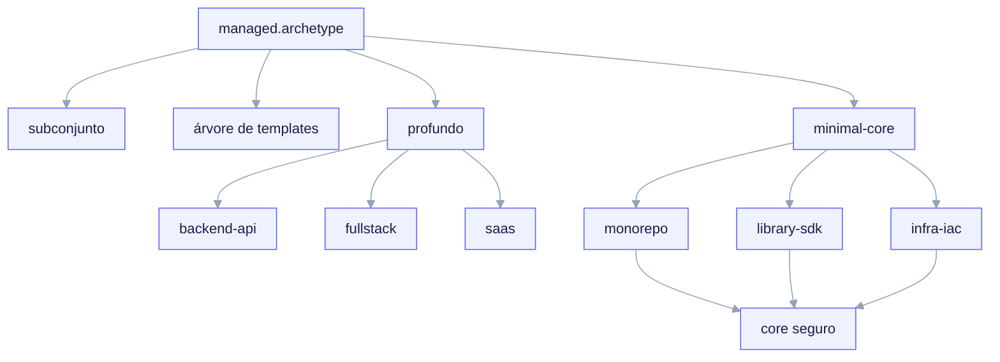
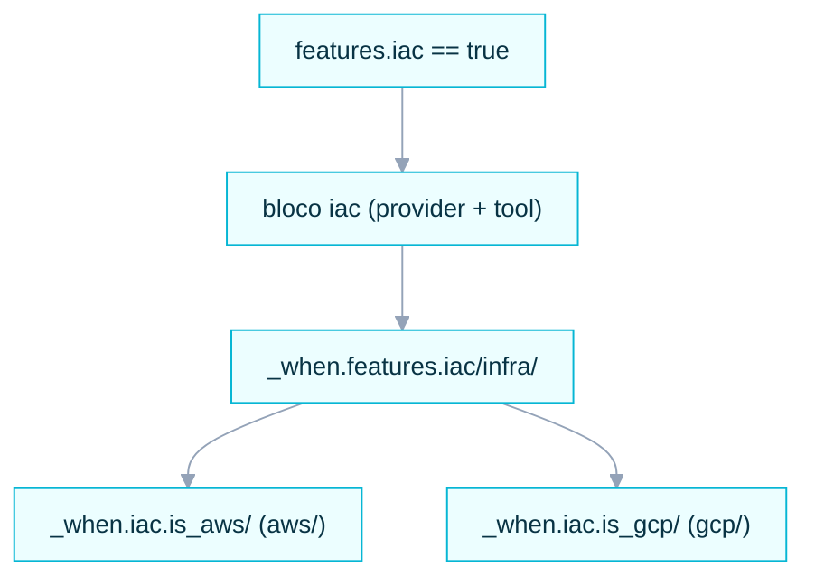

import TerminalCast from '../../../components/TerminalCast'

# Archetypes

O **archetype** é o eixo de ramificação do ai-core-kit. É a primeira pergunta,
obrigatória, que o `/ack-init` faz, e sua resposta restringe todas as perguntas
subsequentes da entrevista (via gating `applies_to`) e seleciona qual conjunto de
templates é renderizado no filho forkado. Uma única chave do manifest —
`managed.archetype` — conduz toda a árvore de ramificação (invariante **I3**).

Há **seis archetypes**, divididos em dois níveis de profundidade: **três
profundos** (`backend-api`, `fullstack`, `saas`) e **três minimal-core**
(`monorepo`, `library-sdk`, `infra-iac`).

<TerminalCast src="/demo/ack-saas.cast" />

<small>Uma única chave do manifest — `managed.archetype` (o eixo de ramificação, invariante I3) — seleciona tanto o subconjunto de perguntas (via `questions.yaml` `applies_to`) quanto o conjunto de templates (`templates/archetypes/&lt;archetype&gt;/`). Archetypes profundos (backend-api, fullstack, saas — os dois últimos adicionam design-system) trazem uma árvore dedicada; archetypes minimal-core renderizam apenas o core universal seguro. O toggle ortogonal `features.iac` é desenhado à parte mais abaixo — ele não é um archetype.</small>

## Os seis archetypes

| Archetype | Nível | Cobertura da entrevista | Árvore de templates |
|---|---|---|---|
| `backend-api` | **profundo** | completa (persistência, spec de API, contract gate, telemetria) | árvore dedicada em `templates/archetypes/backend-api/` |
| `fullstack` | **profundo** | completa (adiciona design-system; gate duplo app/api) | árvore dedicada em `templates/archetypes/fullstack/` |
| `saas` | **profundo** | completa (stack opinativo Vercel+Next+Supabase; adiciona auth/hosting/billing + design-system) | árvore dedicada em `templates/archetypes/saas/` |
| `monorepo` | minimal-core | apenas perguntas do core universal | sem árvore dedicada (renderiza o core seguro) |
| `library-sdk` | minimal-core | apenas perguntas do core universal | sem árvore dedicada (renderiza o core seguro) |
| `infra-iac` | minimal-core | apenas perguntas do core universal | sem árvore dedicada (renderiza o core seguro) |

> **Profundidade:** `backend-api`, `fullstack` e `saas` são especificados em
> **profundidade** e trazem uma árvore de templates dedicada. Os outros três são
> **conhecidos-pelo-schema**: o schema do manifest os aceita e a entrevista
> responde a um core universal seguro para eles, mas eles não têm uma árvore de
> templates de archetype dedicada — renderizam um core mínimo. Veja
> [Archetypes minimal-core](/archetypes/minimal-core). O novo archetype `saas`
> está documentado em [saas (profundo)](/archetypes/saas).

## Profundo vs minimal-core

A divisão é deliberada (invariante do manifest **I3** e a recomendação do
PLAN-REVIEW.md de "reduzir o escopo da v1 a dois archetypes profundos" — `saas`
foi adicionado depois como o terceiro archetype profundo, no schema_version 3).
Ir fundo em um archetype significa que três coisas aterrissam juntas:

1. **Um subconjunto de perguntas específico do ramo.** Archetypes profundos
   respondem a perguntas de persistência, framework, arquitetura e perguntas
   refinadas do gate (`scope`, `exempt`, `require_approval_by`). Archetypes
   minimal-core respondem apenas ao core universal (identidade do projeto,
   linguagem, features, gate `mode` + `protected_paths`, telemetria `enabled`,
   CI/CD).
2. **Uma árvore de templates dedicada.** `templates/archetypes/<archetype>/`
   existe apenas para os três archetypes profundos. Archetypes minimal-core não têm
   essa árvore — eles renderizam o core universal (skills, convenções de
   `.claude/`, o manifest e os hooks/MCP/telemetria opt-in) sem scaffolding
   específico de domínio.
3. **Defaults de gate por archetype.** `contract_gate.protected_paths`, `scope`
   e `exempt` carregam defaults apropriados ao archetype para que o gate nunca
   seja vazio (invariante **I4**, finding 44).

## Onde a ramificação é codificada

| Aspecto | Fonte da verdade |
|---|---|
| Quais perguntas são feitas por archetype | `templates/interview/questions.yaml` (`applies_to`) |
| Quais blocos do schema são exigidos/proibidos por archetype | `templates/manifest/project.manifest.schema.yaml` (`if/then` por archetype) |
| Quais arquivos renderizam por archetype | `templates/archetypes/render.map.yaml` + guardas de segmento de caminho `_when.<path>/` |

Algumas regras do manifest tornam a ramificação aplicável em vez de apenas
esperada:

- `archetype in [fullstack, saas]` ⟹ `design_system` é **obrigatório**.
- `archetype == backend-api` ⟹ `design_system` é **proibido**.
- o ramo de entrevista `saas` é o único que escreve `auth` / `hosting` /
  `billing` (essas perguntas têm gating `applies_to: [saas]`).

Como as perguntas de `design_system` têm gating `applies_to: [fullstack, saas]`,
nenhum outro archetype pode jamais escrever esse bloco — o ramo
proibido-para-backend do schema é satisfeito por construção, não porque um LLM
lembrou de pulá-lo.

## Infraestrutura como Código (IaC)

IaC é **ortogonal** ao eixo de archetype. Não é um archetype (exceto pelo repo
minimal-core puro `infra-iac`) — é um toggle booleano, `features.iac`, que
**qualquer archetype profundo** (`backend-api`, `fullstack`, `saas`) pode ligar
para adicionar um subtree de infraestrutura ao lado de seu scaffold normal. Então
você pode ter `saas + IaC`, `fullstack + IaC` ou `backend-api + IaC` sem mudar o
archetype.

Quando `features.iac == true`, o schema **exige** o bloco `iac`:

- `iac.provider` — `aws` | `gcp` | `none`
- `iac.tool` — `terraform` (default) | `pulumi` | `cloudformation` | `cdk` | `none`
- `iac.is_aws` / `iac.is_gcp` — booleanos **derivados** emitidos por
  `lib/manifest.mjs` a partir de `provider` (exatamente um é verdadeiro),
  declarados no schema para sobreviver a `additionalProperties:false`.

O subtree renderiza sob `_when.features.iac/infra/` e é então dividido por
provider via **guardas de segmento de caminho** `_when.iac.is_aws/` vs
`_when.iac.is_gcp/`. Usar os booleanos derivados mantém a seleção de provider
dentro da camada de inclusão-condicional determinística somente-booleana (decisão
O6) — sem operador de igualdade no render engine. O subtree IaC deliberadamente
**não** é mapeado por um glob `**/infra/**` no `render.map.yaml`: esse glob casaria
falsamente com o caminho de persistência fullstack `src/infra/db/**`, governado por
`_when.persistence.enabled/`.

Para um exemplo trabalhado, veja a instância inline `saas + IaC` no schema do
manifest v3 (`archetype: saas`, `features.iac: true`, `iac.provider: aws`).

## Situação hoje

O contrato do archetype (quais perguntas, quais blocos do schema, quais regras de
render) faz parte do **contrato congelado da P3** e está entregue. O archetype
`saas` e o toggle ortogonal `features.iac` foram entregues no **schema_version 3**:
`saas` renderiza um scaffold real e integrado Vercel + Next + Supabase e
`features.iac` adiciona um subtree Terraform dividido por provider a qualquer
archetype profundo. As árvores `backend-api` e `fullstack` ainda têm parte do
scaffolding completo no estilo da casa marcado como `TODO(P4)`. Leia a página de
cada archetype para ver exatamente o que é entregue hoje versus o que está adiado.
