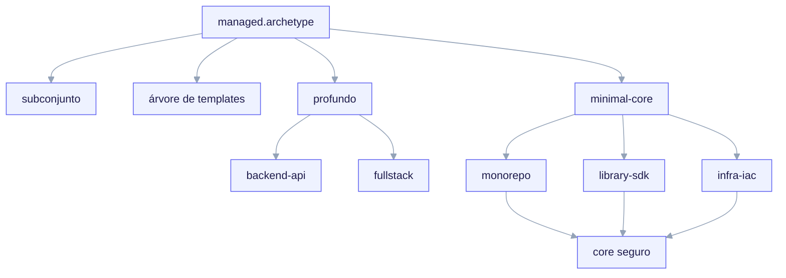

import TerminalCast from '../../../components/TerminalCast'

# Archetypes

O **archetype** é o eixo de ramificação do ai-core-kit. É a primeira pergunta,
obrigatória, que o `/ack-init` faz, e sua resposta restringe todas as perguntas
subsequentes da entrevista (via gating `applies_to`) e seleciona qual conjunto de
templates é renderizado no filho forkado. Uma única chave do manifest —
`managed.archetype` — conduz toda a árvore de ramificação (invariante **I3**).

Há **cinco archetypes na v1**, divididos em dois níveis de profundidade.

<TerminalCast src="/demo/ack-saas.cast" />

<small>Uma única chave do manifest — `managed.archetype` (o eixo de ramificação, invariante I3) — seleciona tanto o subconjunto de perguntas (via `questions.yaml` `applies_to`) quanto o conjunto de templates (`templates/archetypes/&lt;archetype&gt;/`). Archetypes profundos (backend-api, fullstack — este último adiciona design-system) trazem uma árvore dedicada; archetypes minimal-core renderizam apenas o core universal seguro.</small>

## Os cinco archetypes da v1

| Archetype | Nível | Cobertura da entrevista | Árvore de templates |
|---|---|---|---|
| `backend-api` | **profundo** | completa (persistência, spec de API, contract gate, telemetria) | árvore dedicada em `templates/archetypes/backend-api/` |
| `fullstack` | **profundo** | completa (adiciona design-system; gate duplo app/api) | árvore dedicada em `templates/archetypes/fullstack/` |
| `monorepo` | minimal-core | apenas perguntas do core universal | sem árvore dedicada (renderiza o core seguro) |
| `library-sdk` | minimal-core | apenas perguntas do core universal | sem árvore dedicada (renderiza o core seguro) |
| `infra-iac` | minimal-core | apenas perguntas do core universal | sem árvore dedicada (renderiza o core seguro) |

> **Escopo da v1:** apenas `backend-api` e `fullstack` são especificados em
> profundidade. Os outros três são **conhecidos-pelo-schema**: o schema do
> manifest os aceita, a entrevista responde a um core universal seguro para eles,
> mas eles ainda não têm uma árvore de templates de archetype dedicada. Eles
> renderizam um core mínimo e serão aprofundados na v2. Veja
> [Archetypes minimal-core](/archetypes/minimal-core).

## Profundo vs minimal-core

A divisão é deliberada (invariante do manifest **I3** e a recomendação do
PLAN-REVIEW.md de "reduzir o escopo da v1 a dois archetypes profundos"). Ir fundo
em um archetype significa que três coisas aterrissam juntas:

1. **Um subconjunto de perguntas específico do ramo.** Archetypes profundos
   respondem a perguntas de persistência, framework, arquitetura e perguntas
   refinadas do gate (`scope`, `exempt`, `require_approval_by`). Archetypes
   minimal-core respondem apenas ao core universal (identidade do projeto,
   linguagem, features, gate `mode` + `protected_paths`, telemetria `enabled`,
   CI/CD).
2. **Uma árvore de templates dedicada.** `templates/archetypes/<archetype>/`
   existe apenas para os archetypes profundos. Archetypes minimal-core não têm
   essa árvore — eles renderizam o core universal (skills, convenções de
   `.claude/`, o manifest e os hooks/MCP/telemetria opt-in) sem scaffolding
   específico de domínio.
3. **Defaults de gate por archetype.** `contract_gate.protected_paths`, `scope`
   e `exempt` carregam defaults apropriados ao archetype para que o gate nunca
   seja vazio (invariante **I4**, finding 44).

## Onde a ramificação é codificada

| Aspecto | Fonte da verdade |
|---|---|
| Quais perguntas são feitas por archetype | `templates/interview/questions.yaml` (`applies_to`) |
| Quais blocos do schema são exigidos/proibidos por archetype | `templates/manifest/project.manifest.schema.yaml` (`if/then` por archetype) |
| Quais arquivos renderizam por archetype | `templates/archetypes/render.map.yaml` + guardas de segmento de caminho `_when.<path>/` |

Duas regras do manifest tornam a ramificação aplicável em vez de apenas esperada:

- `archetype == fullstack` ⟹ `design_system` é **obrigatório**.
- `archetype == backend-api` ⟹ `design_system` é **proibido**.

Como as perguntas de `design_system` têm gating `applies_to: [fullstack]`, nenhum
outro archetype pode jamais escrever esse bloco — o ramo proibido-para-backend do
schema é satisfeito por construção, não porque um LLM lembrou de pulá-lo.

## Situação hoje

O contrato do archetype (quais perguntas, quais blocos do schema, quais regras de
render) faz parte do **contrato congelado da P3** e está entregue. O **conteúdo**
dos templates profundos está sendo aprofundado na **P4** (`done: false` em
`bootstrap/ack.bootstrap.yaml`): hoje as árvores `backend-api` e `fullstack`
existem como esqueletos estruturalmente corretos que renderizam e passam no teste
da matriz de ramos, com seu scaffolding completo no estilo da casa marcado como
`TODO(P4)`. Leia a página de cada archetype para ver exatamente o que é entregue
hoje versus o que está adiado.
