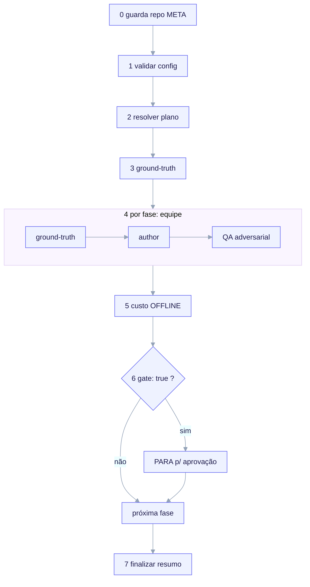

import TerminalCast from '../../../components/TerminalCast'

# Orquestrador /ack-build

<TerminalCast src="/demo/ack-build.cast" />


O `/ack-build` (`.claude/commands/ack-build.md`) é o comando que conduz o build
**próprio** do ai-core-kit. Ele lê a config data-driven
[`bootstrap/ack.bootstrap.yaml`](/build/bootstrap-config), valida-a contra seu
JSON-Schema, resolve um plano de execução e conduz o build **fase a fase** com uma
equipe multi-agente por fase — parando em cada gate para aprovação. É a evolução
config-driven do `docs/BOOTSTRAP.md §6` (o comando TEAMS de colar-e-rodar): o plano
de fases, o roster, os orçamentos e os testes de aceitação agora vivem como dados,
de modo que replanejar é uma edição de config, não uma reescrita de prompt.



<em>/ack-build executa sete passos: guarda de repo META (fail-closed) → carregar + validar config vs <code>bootstrap.schema.json</code> → resolver plano de execução (ordem, pular done, modelo/orçamento) → ground-truth obrigatório → conduzir cada fase elegível como uma equipe (ground-truth → author, um worker por deliverable → QA adversarial vs <code>acceptance_tests[]</code>) → custo OFFLINE cumulativo (<code>aggregate.py</code> ou "indisponível, P6 pendente") → PARA em cada gate para aprovação → finalizar.</em>

> **Disciplina das duas camadas.** O `/ack-build` constrói o repo **META** — a
> máquina que estampa o standard. Ele NÃO define nem roda um contract gate de
> filho e nunca escreve um `project.manifest.yaml` na raiz META (findings
> 12/35/54). O payload CHILD é apenas o que vive sob `templates/` e é renderizado
> por [`/ack-init`](/reference/commands). Construir o kit ≠ inicializar um filho —
> o `/ack-build` é o inverso do `/ack-init`.

## Argumentos

Todos opcionais:

| Flag | Efeito |
|---|---|
| `--phase <Pn>` | Roda exatamente uma fase (ainda honra seu `depends_on`; aborta se uma dependência não estiver `done`). |
| `--from <Pn>` | Inicia a varredura em `Pn` (pula fases anteriores já `done`, mas ainda verifica seus testes de aceitação como gate de regressão). |
| `--dry-run` | Imprime o plano resolvido (ordem das fases, equipe por fase, resolução de modelo + orçamento, gates) e PARA. Não autora nada. |
| `--no-stop` | Não pausa em fases com `gate: true` (varreduras de CI). O default é PARAR em cada gate. |
| `--rebuild` | Re-autora uma fase mesmo que ela esteja `done: true` (sobrepõe o pulo de retomar-do-checkpoint; ainda roda os testes de aceitação depois). |

### Invocações típicas

```bash
# Ver o plano resolvido sem autorar nada (primeiro passo seguro):
/ack-build --dry-run

# Retomar a varredura a partir da próxima fase não construída, parando em cada gate:
/ack-build --from P4

# Construir exatamente uma fase (seu depends_on já deve estar done):
/ack-build --phase P5

# Re-autorar uma fase concluída do zero (ex.: após editar seus deliverables):
/ack-build --phase P3 --rebuild

# Varredura de CI sem supervisão — nunca pausa em um gate (gates com testes falhando ainda param):
/ack-build --no-stop
```

As flags compõem: `--from P4 --no-stop` roda da P4 em diante sem pausar,
`--phase P5 --rebuild` força uma única fase. `--dry-run` sobrepõe todo o resto —
ele apenas imprime o plano.

## Como ele roda

O orquestrador executa uma sequência fixa de passos.

### PASSO 0 — Guarda de repo META (fail-closed, primeiro)

O `/ack-build` roda **apenas** dentro do repo META do ai-core-kit. Ele confirma
que AMBOS os sentinelas META estão presentes:

- `bootstrap/ack.bootstrap.yaml`
- `docs/BOOTSTRAP.md`

Se qualquer um estiver ausente, ele PARA e diz ao usuário para rodar o `/ack-init`
em vez disso. Este é o inverso exato da guarda do `/ack-init`, que se recusa
*dentro* do repo META.

### PASSO 1 — Carregar e validar a config (fail-closed)

Ele lê a config e a valida contra
`bootstrap/schema/bootstrap.schema.json` (draft 2020-12). Em `INVALID` ou na falta
de `pyyaml`/`jsonschema`, ele PARA e não autora nada. Além do schema, ele também
cruza a verificação de que todo arquivo `agent` referenciado existe uma vez que a
P2 esteja `done` (aviso, não uma parada dura) e que `depends_on` forma um DAG
livre de ciclos (um ciclo é uma parada dura).

### PASSO 2 — Resolver o plano de execução

- **Ordem** = a ordem do array `phases` (P1..P8), mas uma fase é *elegível* apenas
  quando todo id em seu `depends_on` está `done` (ou foi concluído mais cedo nesta
  varredura) — isso impõe o DAG de sequenciamento.
- **Regra de pulo:** uma fase `done: true` é pulada na autoria (retomar do
  checkpoint) a menos que haja `--rebuild` ou um alvo `--phase` explícito. Fases
  puladas ainda têm seus `acceptance_tests` rodados como gate de regressão, para
  que uma fase concluída não possa apodrecer em silêncio.
- **Resolução de modelo + orçamento por membro:** modelo efetivo = `team[].model`
  se definido, senão `models.<role>`, senão `models.default`. Orçamento efetivo =
  `team[].token_budget` se definido, senão `budgets.per_role.<role>`, senão
  `budgets.per_phase_tokens / Σcount`. Orçamentos são consultivos.

`--dry-run` imprime esse plano resolvido como uma tabela e para.

### PASSO 3 — Pré-condições: ground-truth é obrigatório por fase

Toda fase de autoria é fundamentada antes de escrever: clonar os
`meta.reference_repos` em um diretório scratch para extração **exata** (citações +
caminhos, não paráfrase), respeitar a postura de licença da config (apenas
arquivos `vendorable: true` podem ser copiados, apenas COM atribuição; doc skills
são somente-referência) e verificar cada primitiva de `.claude/` contra as specs ao
vivo de docs.claude.com antes de escrevê-la.

### PASSO 4 — Conduzir cada fase elegível (ground-truth → author → QA)

Cada fase roda como **uma equipe multi-agente** com três barreiras:

1. **Barreira de ground-truth** — o(s) membro(s) `research` clonam + extraem as
   convenções/licenças exatas e fazem WebFetch das specs relevantes de
   docs.claude.com. Retorna `facts`. A autoria não começa até que esta barreira se
   junte.
2. **Barreira de author** — um worker por caminho de `deliverables[]`, fundamentado
   em `facts`, escrevendo arquivos de qualidade de produção (sem stubs/TODOs). Os
   deliverables do payload de filho sob `templates/` DEVEM usar
   `${CLAUDE_PROJECT_DIR}` + caminhos relativos ao filho, nunca `templates/` ou
   caminhos absolutos do ack (forkabilidade, invariante I7).
3. **Barreira de QA adversarial** — o membro `qa` valida os artefatos autorados
   (ou, para uma fase `done` pulada, os existentes) contra os `acceptance_tests[]`
   desta fase, reportando cada id como PASS / FAIL / N-A com evidência. Um FAIL em
   qualquer teste de aceitação significa que a fase NÃO está completa.

Após o QA, ele imprime uma linha de status por fase: id + título da fase, os
resultados dos testes de aceitação, o modelo usado por membro e uma nota de
orçamento consultiva, e o custo OFFLINE cumulativo até aqui.

### PASSO 5 — Custo OFFLINE cumulativo

O custo é reportado via o agregador offline, **nunca** uma API ao vivo:

- Se `telemetry/aggregate.py` existir (P6 completa), ele é rodado somente-leitura
  sobre `~/.claude/projects/**/*.jsonl` × `telemetry/pricing.json` e o total (mais
  um detalhamento por feature/agente quando disponível) é reportado.
- Se ele ainda NÃO existir (P6 ainda pendente neste próprio build), ele reporta
  `cost: unavailable (P6 pending — offline aggregator not yet built)` e continua. A
  feature de custo é intencionalmente desacoplada da orquestração ao vivo (finding
  8 / issue #11008): ela é computada pós-execução a partir dos transcripts, então
  sua ausência nunca bloqueia fases anteriores.
- Ele NUNCA fabrica um número e NUNCA lê um endpoint `/usage` ao vivo.

### PASSO 6 — Parada no gate (comportamento default)

Após completar uma fase `gate: true`, a menos que `--no-stop` esteja definido, o
`/ack-build` **PARA e pede aprovação** (via AskUserQuestion), apresentando os
resultados dos testes de aceitação, os deliverables escritos e o custo OFFLINE
cumulativo. Opções: aprovar → continuar, parar aqui, rerodar esta fase. Uma fase de
gate com testes de aceitação **falhando** é ela mesma uma parada — o build não pode
prosseguir além de um gate não atendido, mesmo com `--no-stop`. As fases de gate
são P1, P3, P4, P5, P8.

### PASSO 7 — Finalizar

Quando a lista de execução se esgota (ou ela parou em um gate / em uma falha), ele
imprime um resumo do build: quais fases foram concluídas nesta execução, quais
foram puladas como já-`done`, quais estão bloqueadas (com os ids dos testes de
aceitação bloqueadores), a próxima fase elegível e o custo OFFLINE cumulativo final
(ou `unavailable`). Ele lembra o operador de que replanejar o build é uma edição em
`bootstrap/ack.bootstrap.yaml` (revalidada via PASSO 1), não neste comando, e NÃO
altera os flags `done:` por conta própria — `done` é uma decisão de checkpoint
gerenciada pelo operador após revisar o QA.

## Relação com o BOOTSTRAP.md

| Fonte | Papel |
|---|---|
| `docs/BOOTSTRAP.md` | A narrativa humana (enquadramento, referências, correções, o esqueleto TEAMS do §6). |
| `bootstrap/ack.bootstrap.yaml` | O plano de máquina que este comando consome. |
| `.claude/commands/ack-build.md` | Este orquestrador: lê → valida → conduz. |

O `BOOTSTRAP.md` permanece a narrativa canônica (o "porquê"); a config é o plano
executável canônico (o "o quê/como/quando"). Quando eles discordam, a config vence
para a execução.

## Situação

O comando orquestrador e sua config + schema estão **entregues**. O que o
`/ack-build` *conduz* reflete o estado atual do checkpoint: P1 e P3 estão `done`;
P2, P4–P8 estão `done: false`. O reporte de custo é OFFLINE apenas e lerá
`unavailable (P6 pending)` até que a fase do agregador P6 esteja completa.

## Veja também

- [Config de bootstrap (ack.bootstrap.yaml)](/build/bootstrap-config) — os dados
  que este comando lê: o plano de oito fases, o roster, os modelos, os orçamentos
  e os testes de aceitação.
- [Telemetria de Custo Offline](/features/cost-telemetry) — como o custo
  cumulativo do PASSO 5 é computado, e por que é apenas offline.
- [A fronteira META vs CHILD](/concepts/two-layer-model) — por que o `/ack-build`
  (constrói o kit) é o inverso do [`/ack-init`](/reference/commands)
  (renderiza um filho).
- [Roadmap](/roadmap) — o status honesto entregue / parcial / roadmap de cada
  fase que este comando conduz.
