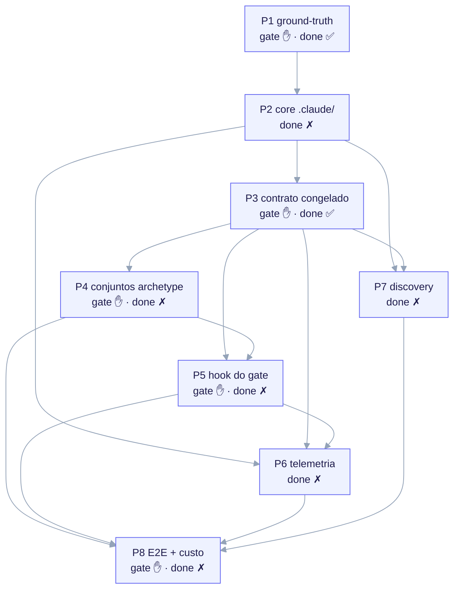

# Config de bootstrap (ack.bootstrap.yaml)

`bootstrap/ack.bootstrap.yaml` é a **config de build data-driven** do repositório
META do ai-core-kit — a única fonte da verdade legível por máquina sobre *como o
kit se constrói*. É a evolução config-driven do plano em prosa em
`docs/BOOTSTRAP.md`: o plano de 8 fases, o roster da equipe, as atribuições de
modelo, os orçamentos consultivos e os testes de aceitação por fase vivem todos
aqui como dados, de modo que replanejar o build é uma edição em um único arquivo
YAML validado em vez de uma reescrita de prompt.



<em>As oito fases como um DAG de `depends_on`: P1 ground-truth + árvore do repo + license ledger; P2 core `.claude/` + agentes + linter de frontmatter; P3 contrato congelado (schema + perguntas + render + `/ack-init`); P4 conjuntos de templates de archetype; P5 template de contrato + hook do gate de 3 modos; P6 agregador de telemetria offline; P7 discovery + Action de PR agendado; P8 E2E + custo por feature. Fases de gate (P1, P3, P4, P5, P8) PARAM o /ack-build para aprovação; apenas P1 e P3 estão done hoje.</em>

> **Disciplina das camadas (nunca confundir).** Esta config governa apenas o build
> **META**. Ela NÃO define um contrato, manifest ou contract gate de filho — esses
> são artefatos da camada CHILD autorados sob `templates/` e renderizados pelo
> `/ack-init`. Edite este arquivo para replanejar o build META; edite `templates/`
> para mudar o que um filho forkado recebe. Há intencionalmente **nenhuma** chave
> `contract`, `manifest` ou `contract_gate` aqui (findings 12/35/54): o repo META
> não possui um manifest nem se gateia.

## Os três arquivos

| Arquivo | Papel |
|---|---|
| `bootstrap/ack.bootstrap.yaml` | A config de build: `meta`, `models`, `budgets`, `teams`, `phases[]`. |
| `bootstrap/schema/bootstrap.schema.json` | JSON-Schema (draft 2020-12, `additionalProperties:false` em todo lugar) que valida a config. Fail-closed: o `/ack-build` se recusa a rodar com uma config inválida. |
| `.claude/commands/ack-build.md` | O orquestrador. Lê a config, valida-a, resolve um plano de execução e conduz cada fase como uma equipe multi-agente. Veja [/ack-build](/build/ack-build). |

Isso espelha a mesma disciplina produtor/consumidor que a camada CHILD usa (um
schema congelado, uma instância validada, um comando consumidor) — mas na camada
META, para o próprio build do kit.

## Anatomia da config

A config tem cinco chaves de topo, todas em `snake_case`.

### meta

Identidade do kit mais os repos de referência clonados com sua postura de licença.

- `kit_name` — constante `ai-core-kit`.
- `version_source` — `git-describe` (default) | `package_json` | `manual` (com
  `manual`, um `version_override` é exigido). Usado para proveniência da execução.
- `reference_repos[]` — cada `{name, url, license, vendorable, notes?}`. O schema
  **impõe** que repos `source-available`/`proprietary` tenham `vendorable: false`.
  Isso codifica a regra de licenciamento dura: as doc skills da anthropics
  (`docx/pdf/pptx/xlsx`) são somente-referência e nunca devem ser copiadas ou
  derivadas, enquanto arquivos Apache-2.0 / MIT podem ser vendorados COM
  atribuição.

Os quatro repos de referência entregues: `anthropics/skills` (Apache-2.0, skills de
exemplo vendoráveis; doc skills source-available), `alirezarezvani/claude-skills`
(MIT), `shanraisshan/claude-code-best-practice` (MIT), `affaan-m/ecc` (MIT).

### models

Modelo default por papel, mais um `default` global. Os valores são
`haiku | sonnet | opus | inherit`. A justificativa embutida nos defaults:

```yaml
models:
  default: sonnet
  research: sonnet      # extração de referência + auditoria de licença (deve ser exata)
  template: sonnet      # payload de archetype + ramificação da entrevista (load-bearing)
  contract: sonnet      # semântica do hook do gate de 3 modos (propenso a footgun, finding 2)
  infra: haiku          # árvore .claude/, settings.json, em sua maioria mecânico
  discovery: haiku      # apenas-propõe; baixo risco
  design_system: haiku  # tokens/skills de fullstack do filho
  qa: sonnet            # verificação adversarial contra testes de aceitação
```

O trabalho load-bearing (extração de ground-truth, o contrato congelado, semântica
do gate, QA adversarial) é **Sonnet**; a autoria mecânica é **Haiku**; **Opus** é
reservado para o orquestrador e escalações explícitas. O `team[].model` de uma fase
sobrepõe o default do papel para aquele papel naquela fase.

### budgets

`per_phase_tokens` mais um mapa opcional `per_role`. Estes são alvos **consultivos**
de consciência de custo expostos na linha de status — nunca limites duros. Eles
nunca bloqueiam a autoria.

```yaml
budgets:
  per_phase_tokens: 180000
  per_role:
    research: 90000
    template: 90000
    contract: 70000
    infra: 60000
    discovery: 40000
    design_system: 40000
    qa: 70000
```

### teams

O roster como dados. Cada entrada vincula um `role` a um `agent` (resolvendo para
`.claude/agents/<agent>.md`, autorado na P2), registra a `layer` (`meta` vs
`child-payload`) e uma `responsibility`. O campo `layer` é como o orquestrador
mantém a fronteira das duas camadas honesta: papéis `child-payload` (`template`,
`contract`, `design_system`) produzem conteúdo de `templates/`; papéis `meta`
(`research`, `discovery`, `infra`, `qa`) constroem o kit.

### phases[]

Exatamente **oito** fases, **P1..P8**, na ordem revisada do PLAN-REVIEW.md. Cada
fase carrega:

| Chave | Significado |
|---|---|
| `id` | Estável `P1`..`P8`. |
| `title`, `goal` | Título de uma linha + o objetivo da fase. |
| `gate` | `true` ⟹ o `/ack-build` PARA para aprovação após a fase. |
| `done` | `true` ⟹ completa em disco; o `/ack-build` pula a autoria e roda apenas os testes de aceitação como verificação de regressão. |
| `depends_on[]` | Pré-requisitos duros (outros ids de fase); codifica o sequenciamento como um DAG. |
| `team[]` | `{role, agent, count, model?, token_budget?}`. |
| `deliverables[]` | Caminhos relativos ao repo que a fase produz. |
| `acceptance_tests[]` | `{id, desc}` asserções testáveis de definição-de-pronto. |

## As 8 fases (P1–P8)

A config codifica este DAG de dependências. **O estado do checkpoint importa:**
apenas `P1` e `P3` estão `done: true` hoje; o resto está `done: false`.

| Fase | Título | gate | done | depends_on |
|---|---|---|---|---|
| **P1** | Ground-truth + árvore do repo + ledger de licenças | ✋ | ✅ | — |
| **P2** | Core `.claude/` + agentes da equipe + settings.json + linter de frontmatter | | | P1 |
| **P3** | Contrato congelado — schema do manifest + questions.yaml + render engine + `/ack-init` | ✋ | ✅ | P2 |
| **P4** | Conjuntos de templates de archetype (profundos) + rubrica de completude + NOTICEs de licença | ✋ | | P3 |
| **P5** | Template de contrato + hook do gate de 3 modos conduzido por manifest | ✋ | | P3, P4 |
| **P6** | Agregador de telemetria offline + pricing.json + README | | | P2, P3, P5 |
| **P7** | Discovery — sources.yaml + propostas + Action de PR agendado + `/discover` | | | P2, P3 |
| **P8** | E2E + higiene META + idempotência + custo por feature (gate final) | ✋ | | P4, P5, P6, P7 |

> **O que está entregue vs em andamento.** A P3 (o contrato CHILD congelado: schema
> do manifest, `questions.yaml`, render engine, `/ack-init`) está `done`. A P4
> (conteúdo dos templates de archetype profundos), a P5 (o hook do gate de 3
> modos), a P6 (o agregador offline), a P7 (discovery) e a P8 (E2E) estão
> `done: false` — roadmap/parcial. A própria config, seu schema e o orquestrador
> `/ack-build` estão entregues.

Os `acceptance_tests[]` de cada fase são a definição de pronto. Por exemplo, os
testes da P3 afirmam que o schema do manifest é draft 2020-12 com
`additionalProperties: false` em todo lugar, que todo `writes_to` do
`questions.yaml` resolve para uma propriedade do schema (invariante I1), e que o
`/ack-init` carrega uma guarda fail-closed de repo META. Os testes da P5 afirmam
que o modo `block` usa `exit 2 + permissionDecision: deny` (o footgun load-bearing,
finding 2) e que o gate falha-aberto em um manifest ausente.

## Custo é OFFLINE, nunca ao vivo (finding 8)

Não há **nenhuma API de token/custo ao vivo** exposta aos hooks ou ao orquestrador
(issue #11008 / linha 28 do PLAN-REVIEW.md). O custo é computado **pós-execução**
pelo agregador offline `telemetry/aggregate.py` sobre
`~/.claude/projects/**/*.jsonl` × um `telemetry/pricing.json` versionado. Duas
consequências são codificadas na config:

- O agregador é construído na **P6**, que tem `depends_on: [P2, P3, P5]`. Até a P6
  estar `done`, o `/ack-build` reporta o custo como `unavailable (P6 pending)` e
  prossegue — a feature de custo é deliberadamente desacoplada para que sua
  ausência nunca bloqueie o build.
- O teste de aceitação de telemetria da P8 (`P8-A4`) roda o agregador contra um
  **transcript capturado**, não orquestração ao vivo.

## Editando a config

Replanejar o build significa editar `ack.bootstrap.yaml` e então revalidar contra o
schema (fail-closed):

```bash
python3 - <<'PY'
import json, yaml
from jsonschema import Draft202012Validator
cfg = yaml.safe_load(open("bootstrap/ack.bootstrap.yaml"))
schema = json.load(open("bootstrap/schema/bootstrap.schema.json"))
errs = sorted(Draft202012Validator(schema).iter_errors(cfg), key=lambda e: list(e.path))
print("VALID" if not errs else f"{len(errs)} error(s)")
for e in errs:
    print(" -", "/".join(map(str, e.path)) or "<root>", ":", e.message)
PY
```

Edições comuns: ressequenciar via `phases[].depends_on`; reatribuir um modelo
(`models.<role>` para um default, ou `team[].model` para sobrepor um papel em uma
fase); ajustar os `budgets` consultivos; adicionar um teste de aceitação
(`{id: "Pn-A<k>", desc}`); marcar uma fase como `done` (uma decisão de checkpoint do
operador — o `/ack-build` nunca a altera por você); ou adicionar um repo de
referência (o schema rejeita um repo `source-available`/`proprietary` marcado como
`vendorable: true`).

> **Não** adicione conceitos da camada de filho a esta config. O comportamento do
> filho é configurado pelo `project.manifest.yaml` em um fork (veja o schema do
> manifest e o render engine), nunca aqui.
