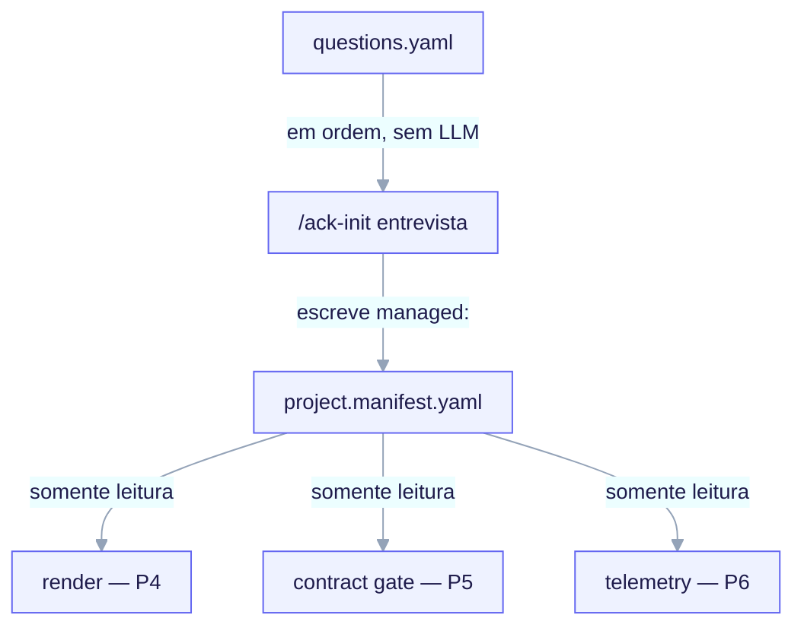

import TerminalCast from '../../../components/TerminalCast'

# Entrevista → Manifesto → Render

<TerminalCast src="/demo/ack-manifest.cast" />


O coração do `ai-core-kit` é um pipeline pequeno e **congelado**: uma entrevista guiada
por archetype escreve um `project.manifest.yaml`, que um renderizador consome para gerar
seu projeto. Tudo aqui é o **contrato P3** — a interface estável contra a qual vários
consumidores a jusante são construídos.



<small>Um produtor, três consumidores somente-leitura. `templates/interview/questions.yaml` é o banco de perguntas determinístico; a entrevista `/ack-init` é a única escritora de `managed:` (propriedade da máquina), percorrendo o banco em ordem sem LLM e validando antes do render. O render (P4) substitui `${VAR}`, o gate (P5) lê `contract_gate.*` + `contracts[]` e a telemetry (P6) agrupa custo OFFLINE via `telemetry.*` — tudo somente leitura, então a fonte única da verdade nunca diverge no meio de uma execução.</small>

```
questions.yaml  ──(entrevista, sem LLM)──▶  project.manifest.yaml  ──(validar)──▶  RENDER
 (o banco de perguntas)                     (fonte única da verdade)               (P4)
```

## Um produtor, muitos consumidores

```
PRODUTOR
  /ack-init entrevista    → o ÚNICO escritor do manifesto
      • escreve managed: por completo a partir de templates/interview/questions.yaml
      • semeia user: uma vez na primeira execução, depois nunca mais o toca
      • valida contra o JSON-Schema ANTES de qualquer render

CONSUMIDORES (somente leitura; nenhum deles escreve o manifesto)
  motor de render         → substitui ${VAR} no scaffold do archetype
  hook do contract gate   → impõe contract_gate.* + contracts[]
  agregador de telemetry  → agrupa custo OFFLINE via telemetry.*
```

A regra de escritor único é o que torna o manifesto uma fonte única da verdade
confiável: nenhum consumidor jamais o reescreve, então ele não pode divergir no meio de
uma execução.

## Os quatro artefatos congelados

| Artefato | Arquivo | Papel |
|---|---|---|
| Schema do manifesto (humano) | `templates/manifest/project.manifest.schema.yaml` | Contrato autoritativo e anotado (`schema_version: 3`); funciona também como uma instância de exemplo. |
| Schema do manifesto (máquina) | `templates/manifest/project.manifest.schema.json` | JSON-Schema draft 2020-12 — o validador que a entrevista executa. |
| Banco de perguntas | `templates/interview/questions.yaml` | As perguntas determinísticas que a entrevista percorre em ordem. |
| Contrato de render | `docs/RENDER-ENGINE.md` | Sintaxe `${VAR}`, diretórios condicionais `_when.*`, `render.map.yaml`, idempotência. |

## O banco de perguntas é determinístico

`/ack-init` percorre `questions.yaml` **em ordem**, com **nenhum LLM no loop**: as mesmas
respostas de entrada sempre produzem um manifesto de saída byte-idêntico (invariante
**I2**). Cada pergunta declara:

| Campo | Significado |
|---|---|
| `id` | único, estável, kebab-case; referenciado por `ask_if`/`skip_if`. |
| `prompt` | o texto da pergunta voltado ao humano. |
| `type` | `select` \| `multiselect` \| `text` \| `bool`. |
| `options` | para `select`/`multiselect`: lista de `{value, label?}`. |
| `default` | valor pré-preenchido; para `select` deve ser um de `options.value`. |
| `applies_to` | os archetypes para os quais esta pergunta é feita, ou `all`. |
| `ask_if` / `skip_if` | expressão de condição opcional sobre respostas **anteriores**. |
| `writes_to` | caminho pontilhado sob `managed:` onde a resposta é escrita. |

### Archetype é a primeira pergunta obrigatória (o eixo de ramificação)

A primeiríssima pergunta é `archetype` (invariante **I3**). Sua resposta restringe cada
pergunta subsequente através da condição `applies_to` — avaliada **antes** de
`ask_if`/`skip_if`. É assim que, por exemplo, as perguntas de persistência
(DB/ORM/migração) só disparam para os archetypes profundos, e a pergunta de design system
só dispara para `fullstack` e `saas`.

O banco entrega seis archetypes. Três são **profundos** — `backend-api`, `fullstack` e
`saas` (a stack opinativa Vercel + Next.js App Router + shadcn/ui + Supabase + Clerk +
Drizzle + Stripe adicionada no schema v3) — e três são **core mínimo**: `monorepo`,
`library-sdk` e `infra-iac`. Os archetypes de core mínimo respondem apenas às perguntas
universais (identidade, features, `contract_gate.mode` + `protected_paths`,
`telemetry.enabled`, `ci_cd`); as perguntas de DB e design nunca disparam para eles — um
resultado determinístico de `applies_to`, não um palpite de LLM.

Infraestrutura-como-código é **ortogonal** ao eixo de archetype: o toggle `feat_iac` e as
perguntas `iac_provider`/`iac_tool` permitem que *qualquer* archetype adicione um bloco
`iac` (com booleanos derivados `is_aws`/`is_gcp`), então IaC é uma feature, não um sétimo
ramo.

### A pequena gramática de expressões

`ask_if`/`skip_if` usam uma gramática intencionalmente pequena e determinística —
operadores `==`, `!=`, `in`, `not_in`, sem parênteses ou cadeias booleanas — e podem
referenciar **apenas perguntas anteriores**. Um id referenciado que foi ele próprio
pulado avalia para um sentinela *unknown*, o que torna `==`/`in` falso e `!=`/`not_in`
verdadeiro (à prova de falha: pular em vez de perguntar). Exemplo: `migrations_tool`
carrega `ask_if: "migrations_enabled == true"`, então nunca dispara quando as migrações
estão desabilitadas.

O banco completo — todas as 45 perguntas e a matriz de ramificação — está enumerado na
documentação de referência; o contrato acima é a parte que você precisa para raciocinar
sobre o fluxo.

## O envelope do manifesto

```yaml
schema_version: 3          # const 3; a versão maior do FORMATO
generator:                 # apenas proveniência; FORA do hash (re-execuções permanecem byte-estáveis)
  tool: ai-core-kit
  tool_version: "0.4.0"
  rendered_at: "..."       # o único valor de relógio; informativo
managed:                   # PROPRIEDADE DA MÁQUINA. Regenerado por completo a cada execução.
  manifest_hash: "sha256:..."   # escrito POR ÚLTIMO, sobre a subárvore canônica managed:
  project: { name, language, ... }
  archetype: backend-api
  features: { hooks, mcp, agent_teams, sdd_gate, iac }  # iac é o toggle ortogonal do v3
  persistence: { ... }     # db agora inclui supabase (v3)
  auth: { provider }       # v3; saas tem padrão clerk
  hosting: { target }      # v3; saas tem padrão vercel
  billing: { provider }    # v3; saas tem padrão stripe
  iac: { provider, tool, is_aws, is_gcp }   # v3; presente só quando features.iac
  contract_gate: { mode, protected_paths, scope, exempt }
  contracts: [ ... ]
  telemetry: { ... }
  ci_cd: { target }
  rendered_files: [ ... ]   # registro de propriedade; escrito pelo renderizador
user:                       # PROPRIEDADE DO HUMANO. Semeado uma vez, depois nunca sobrescrito.
  notes: ""
  overrides: {}
```

O schema v3 é o FORMATO maior atual. Ele adiciona o archetype `saas`, torna
`design_system` obrigatório tanto para `fullstack` quanto para `saas`, introduz os objetos
`auth`, `hosting` e `billing`, adiciona `supabase` ao enum `persistence.db`, e adiciona o
toggle ortogonal `features.iac` mais o bloco `iac` (cujos `is_aws`/`is_gcp` são
*derivados*, não perguntados). Toda chave nova tem padrão "off", então uma migração v2 →
v3 é neutra para o render — mas é de sentido único e opcional: `/ack-init --migrate`
reescreve `managed:` para o formato v3 e recomputa o hash, e um child v2 é recusado (não
atualizado automaticamente) sem isso. Os consumidores recusam um **maior** incompatível: o
gate degrada para `off` + stderr, o agregador dá erro.

A divisão é toda a história da idempotência: **`managed:`** é propriedade da máquina e
regenerado a cada execução; **`user:`** é propriedade do humano e semeado exatamente uma
vez. Nenhum consumidor lê `user:` comportamentalmente — é o espaço de rascunho do usuário
(o renderizador pode consultar `user.overrides.*` para variáveis de render, mas nunca o
exige).

## As invariantes globais

Estas são as garantias congeladas sobre as quais todo o pipeline se apoia:

- **I1 — verificação cruzada de `writes_to`.** O `writes_to` de toda pergunta deve
  resolver para uma propriedade real declarada no schema. `/ack-init` faz essa verificação
  cruzada na inicialização e recusa terminantemente qualquer chave órfã. A entrevista e o
  manifesto nunca podem divergir silenciosamente.
- **I2 — idempotência estrutural.** A divisão `managed:`/`user:` mais um `manifest_hash`
  canônico mais o registro `rendered_files[]` produzem saída byte-idêntica com respostas
  idênticas. Não há motor de merge de 3 vias.
- **I3 — ramificação por archetype.** `archetype` é a primeira pergunta obrigatória e
  restringe todas as perguntas subsequentes.
- **I4 — o gate nunca é vazio.** `contract_gate.protected_paths` é obrigatório e
  não-vazio por archetype, então até mesmo `infra-iac` (sem `src/**`) nunca pode entregar
  um gate vazio.
- **I5 — `additionalProperties: false`.** Uma chave com erro de digitação é um erro de
  validação terminante, não um descarte silencioso.
- **I6 — fail-closed no tempo de autoria, fail-open no tempo de execução.** Um manifesto
  inválido no momento da escrita aborta o `/ack-init`; um manifesto corrompido/ausente no
  momento do consumo degrada o gate para `off` mais stderr, nunca travando uma sessão.
- **I7 — forkabilidade.** O motor de discovery da META e o ferramental de `.claude/` nunca
  são copiados para um child; os caminhos renderizados no child usam
  `${CLAUDE_PROJECT_DIR}` e `${dotted.path}`.

## A validação faz o gate do render

A ordem é determinante: **respostas → escrever manifesto → validar → renderizar.** O
renderizador pode assumir uma subárvore `managed:` válida pelo schema, porque um manifesto
inválido aborta antes que qualquer arquivo seja tocado (fail-closed no tempo de autoria). O
que acontece em seguida é o [Contrato do motor de render](/concepts/render-engine).

> **Veja também:** [Contrato do motor de render](/concepts/render-engine) ·
> [A fronteira META vs CHILD](/concepts/two-layer-model) ·
> a referência completa de perguntas e a matriz de ramificação na
> [documentação de referência](/reference/commands).
