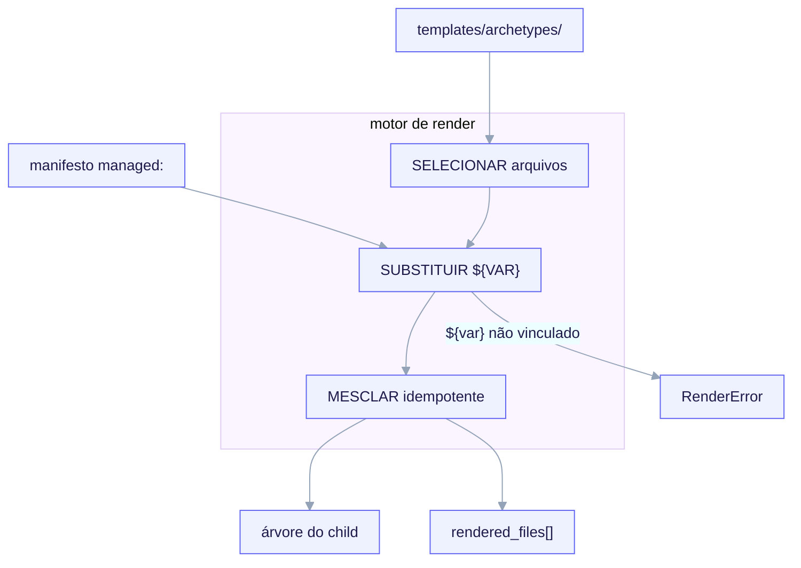

import TerminalCast from '../../../components/TerminalCast'

# Contrato do motor de render

<TerminalCast src="/demo/ack-render.cast" />


Depois que `/ack-init` escreveu e validou o `project.manifest.yaml`, o **motor de render**
transforma o manifesto mais a árvore `templates/archetypes/<archetype>/` em um projeto
child funcional. Esta página é o contrato conceitual; a fonte autoritativa é
`docs/RENDER-ENGINE.md`.



<small>O render são três tarefas separadas: SELECIONAR arquivos (guardas de caminho `_when.*` E globs de `render.map.yaml`), SUBSTITUIR `${VAR}` a partir de `managed:` (apenas escalares), depois MESCLAR idempotentemente (blocos gerenciados + o registro `rendered_files[]`) — emitindo a árvore de trabalho do child mais um registro de propriedade `managed.rendered_files[]`. Um `${var}` não vinculado, ausente em `managed:`, lança `RenderError` e é FAIL-CLOSED: um erro terminante que não escreve nada, nunca um espaço em branco.</small>

O design mantém três responsabilidades **estritamente separadas**:

| Camada | Responsabilidade | Onde a lógica reside |
|---|---|---|
| 1. Substituição | substituir `${VAR}` a partir do manifesto | um pequeno regex do renderizador (§ abaixo) |
| 2. Inclusão condicional | decidir **quais** arquivos renderizar | o manifesto + diretórios `_when.*` + `render.map.yaml` — nunca lógica `if` dentro do template |
| 3. Idempotência | nunca sobrescrever edições manuais em re-execução | a divisão `managed:`/`user:` + registro `rendered_files[]` + blocos gerenciados |

Os condicionais ficam fora dos templates por construção: um arquivo de template ou é
incluído ou não, decidido pelo manifesto. Não há loops, filtros ou herança dentro de um
template, então o motor permanece uma substituição pura de strings e é trivialmente
auditável.

## Substituição: `${VAR}` a partir do manifesto

- **Forma do placeholder:** `${dotted.path}` referenciando uma chave sob `managed:` — por
  exemplo `${project.name}`, `${persistence.db}`, `${contract_gate.mode}`.
- **Remoção do sufixo `.tpl`:** arquivos de template carregam um sufixo `.tpl.<ext>`. O
  renderizador remove `.tpl` na saída, então `CLAUDE.md.tpl` vira `CLAUDE.md` e
  `settings.json.tpl` vira `.claude/settings.json`. Um arquivo **sem** `.tpl` é copiado
  byte a byte sem varredura de substituição, então um `${...}` literal em scripts
  entregues sobrevive.

O resolvedor central tem cerca de uma dúzia de linhas de `python3`:

```python
VAR = re.compile(r"\$\{([a-z0-9_]+(?:\.[a-z0-9_]+)*)\}")

def render(text, managed, user):
    def sub(m):
        path = m.group(1)
        val = lookup(path, managed, user)        # dotted-path walk
        if val is MISSING:
            raise RenderError(f"unbound {path} (not in managed:)")   # FAIL-CLOSED
        if isinstance(val, (dict, list)):
            raise RenderError(f"{path} resolves to a container, not a scalar")
        return scalar_to_str(val)                # bool -> "true"/"false", num as-is
    return VAR.sub(sub, text)
```

As regras que importam:

- **Variável não vinculada é um erro terminante**, nunca uma string vazia silenciosa — o
  espelho em tempo de render do `additionalProperties: false` (invariante **I5**). Um
  `${...}` com erro de digitação faz o render falhar em vez de emitir texto em branco.
- **Apenas escalares.** Um `${...}` deve resolver para uma string, número ou bool. Para
  injetar uma lista (por exemplo `protected_paths`) o template usa uma diretiva de render
  (abaixo), não um `${...}` cru.
- **Sem re-varredura.** A saída substituída não é re-varrida, então dados do manifesto
  nunca podem ser reinterpretados como um placeholder.
- **Variante JSON-segura.** Para arquivos `*.json.tpl` o renderizador substitui, depois
  `json.loads` e `json.dumps` com chaves ordenadas e indentação de 2 espaços, garantindo
  JSON válido e determinístico independentemente da ordem das chaves do manifesto.

### Listas e blocos inline: duas diretivas de render

Duas diretivas explícitas e orientadas a linha cobrem os únicos casos não-escalares. Elas
não são uma linguagem de templating — cada uma é uma única linha que o renderizador
reconhece:

| Diretiva | Expande para |
|---|---|
| `#ack:each <list.path> as "<fmt-com-$item>"` | uma linha renderizada por elemento da lista, com `$item` vinculado ao elemento |
| `#ack:if <bool.path>` … `#ack:endif` | as linhas contidas, apenas se o bool for verdadeiro |

`#ack:if` é uma conveniência *dentro de um arquivo já incluído*; ele não substitui a
inclusão condicional em nível de arquivo, que permanece o mecanismo primário.

### Por que `${CLAUDE_PROJECT_DIR}` sobrevive

O regex de substituição casa **apenas** caminhos pontilhados em **minúsculas**. A variável
de shell `${CLAUDE_PROJECT_DIR}` está em maiúsculas, então nunca é casada e passa
verbatim. Essa única escolha de design é o que permite que um `${...}` do manifesto e um
`${CLAUDE_PROJECT_DIR}` de shell coexistam no mesmo arquivo — e é por isso que hooks
renderizados no child podem referenciar
`python3 ${CLAUDE_PROJECT_DIR}/.claude/hooks/contract-gate` de forma portável
(forkabilidade, invariante **I7**).

## Inclusão condicional, decidida pelo manifesto

Quais arquivos renderizam é decidido **pelo manifesto**, expresso de duas formas que se
combinam com AND.

### 1. Guardas de segmento de caminho (`_when.<bool.path>/`) — avaliadas primeiro

Um segmento de diretório na forma `_when.<bool.path>/` no caminho de saída de um template é
uma guarda de inclusão. Se o booleano que ele nomeia for verdadeiro, o segmento é
**removido** do caminho de saída; se falso, o arquivo é **omitido** (curto-circuito). O
exemplo canônico é a árvore do design system fullstack:

```
templates/archetypes/fullstack/_when.design_system.install/design-system/...
```

Toda aquela subárvore só renderiza quando `design_system.install` é verdadeiro, e o
segmento `_when.design_system.install/` desaparece do caminho de saída. O mesmo mecanismo
faz o gate do scaffolding de persistência sob `_when.persistence.enabled/` e do aninhado
`_when.persistence.migrations.enabled/`.

### 2. Guardas de glob do `render.map.yaml`

O `templates/archetypes/render.map.yaml` entregue pelo kit é a metade de guarda por glob,
aplicada ao caminho de saída pós-remoção para arquivos transversais não expressos
naturalmente como um segmento de caminho. As regras v1:

```yaml
version: 1
rules:
  - glob: "**/.mcp.json.tpl"
    archetype: "*"
    when: features.mcp                  # MCP só quando o child opta por isso
  - glob: "**/.claude/hooks/contract-gate"
    archetype: "*"
    when: features.sdd_gate             # chave-mestra; false => omite o hook do gate por completo
  - glob: "**/design-system/**"
    archetype: "*"
    when: design_system.install
    requires_archetype: [fullstack, saas]   # ASSERÇÃO (lista desde o v3), não um seletor
```

As regras de combinação (espelhadas de `RENDER-ENGINE.md`):

1. **As guardas de segmento de caminho rodam primeiro.** Um segmento falso faz
   curto-circuito para omitir antes mesmo que o mapa seja consultado.
2. **O mapa então se aplica por glob** contra o caminho pós-remoção. Um arquivo protegido
   tanto por um segmento de caminho quanto por um `when` do mapa só é incluído se **ambos**
   forem verdadeiros (AND lógico).
3. **`requires_archetype` é uma asserção, não um seletor.** Se o glob de uma regra casa e
   seu `when` é verdadeiro mas `managed.archetype` não está entre `requires_archetype`
   (uma **lista** desde o v3, por exemplo `[fullstack, saas]`), o render **aborta
   ruidosamente** (um bug de autoria). Ele nunca omite silenciosamente.
4. **Uma chave `managed:` ausente referenciada por qualquer `when` avalia como falso →
   omite.** É assim que *o design system renderiza apenas para fullstack e saas* sai de
   graça: o schema proíbe `design_system` sob `backend-api`, então a busca está ausente →
   falso → omitido, sem nenhum tratamento especial.

Algumas subárvores do v3 **não** precisam de regra de glob nenhuma porque uma guarda de
segmento de caminho as expressa por completo. O scaffold de IaC sob
`templates/archetypes/{fullstack,saas}/_when.features.iac/` é protegido por
`_when.features.iac/` para toda a árvore `infra/`, depois dividido por provedor com
`_when.iac.is_aws/` vs `_when.iac.is_gcp/` (os booleanos *derivados*, exatamente um dos
quais é verdadeiro). Ele é deliberadamente deixado de fora do `render.map.yaml`: uma guarda
de segmento de caminho pura é tanto o controle de inclusão quanto a própria documentação,
então adicionar um glob redundante só criaria um segundo lugar para manter em sincronia.

## Re-renders idempotentes

A idempotência é **estrutural** (invariante **I2**) — não há motor de merge de 3 vias.
Três mecanismos cooperam.

### O registro de propriedade (`managed.rendered_files[]`)

Após um render bem-sucedido, o renderizador escreve de volta a lista de caminhos que ele
possui. Em re-execução esse registro é autoritativo: **qualquer coisa que não esteja em
`rendered_files[]` é território do usuário e nunca é tocada.** Um caminho que foi
renderizado mas cujo `when` agora é falso é deixado no lugar e sinalizado — o renderizador
não apaga nada que não possa provar que possui sozinho.

```yaml
rendered_files:
  - path: .claude/settings.json
    managed_block: "json:hooks,env"   # JSON key-set ownership
  - path: CLAUDE.md
    managed_block: "ack:managed"      # text file: a delimited comment region
  - path: .claude/hooks/contract-gate
    managed_block: null               # whole file is ack-owned
```

### Blocos gerenciados — nunca sobrescrever um arquivo alheio

Para arquivos compartilhados com o humano, o renderizador possui apenas uma fatia
delimitada:

- **Arquivos de texto** (`CLAUDE.md`): uma região de comentário delimitada entre os
  marcadores `ack:managed`. O re-render reescreve apenas os bytes entre os marcadores;
  conteúdo fora é preservado verbatim. Se o arquivo existir sem marcadores na primeira
  execução, o renderizador adiciona o bloco gerenciado ao final e nunca reordena conteúdo
  humano.
- **Arquivos JSON** (`settings.json`, `.mcp.json`): não há comentários para delimitar,
  então a propriedade é por **conjunto de chaves**. Para `settings.json`, o ack possui
  `hooks` (apenas quando `features.sdd_gate` é verdadeiro) e, dentro de `env`, apenas a
  única chave `CLAUDE_CODE_EXPERIMENTAL_AGENT_TEAMS` (quando `features.agent_teams` é
  verdadeiro). Toda outra chave — `permissions`, chaves `env` do usuário, servidores MCP
  adicionados pelo usuário — é propriedade do humano e nunca é escrita.

### Propriedade de arquivo inteiro e o atalho rápido de no-op

Arquivos que o renderizador possui integralmente (`managed_block: null`, por exemplo o
script do hook contract-gate) são sobrescritos por completo em re-execução; eles não devem
ser editados manualmente. Remover o caminho de `rendered_files[]` diz ao renderizador para
parar de gerenciá-lo.

O atalho rápido: `/ack-init` computa `manifest_hash` sobre a subárvore canônica
`managed:`. Em re-execução, se o hash recomputado for igual ao armazenado **e** todo
`rendered_files[].path` estiver inalterado em disco, o resultado é *nada a fazer* — exit
0, zero escritas.

## Garantias de determinismo e higiene de caminhos

- **Determinismo.** `managed:` idêntico mais templates idênticos produzem bytes
  idênticos. O renderizador não emite timestamps próprios nos arquivos do child; o único
  valor de relógio, `generator.rendered_at`, fica no manifesto e está fora do
  `manifest_hash`.
- **Renderizar apenas a partir de `templates/`.** A árvore `.claude/` da META nunca é
  copiada — agentes meta-only, o orquestrador e o MCP de telemetry nunca podem vazar para
  um fork.
- **Asserção de caminho de saída (fail-closed).** Antes de escrever qualquer arquivo do
  child, o renderizador afirma que o conteúdo não contém nenhuma substring
  `templates/archetypes/` e nenhum caminho absoluto do kit. Uma violação aborta o render.

## Por que não copier ou cookiecutter

Tanto o copier quanto o cookiecutter impõem uma pré-condição rígida de runtime Python mais
dependências (jinja2, pyyaml e companhia) em todo child forkado. O kit é entregue em
projetos JS/Claude-Code via fork; uma pré-condição de toolchain Python mataria a história
de distribuição sem-Python. A única funcionalidade que o copier dá de graça — re-render
contra um arquivo de respostas versionado — é desnecessária aqui, porque a idempotência é
**estrutural** (a divisão `managed:`/`user:` mais um registro de propriedade), não um merge
de 3 vias. O resultado é um renderizador com **zero dependências npm/pip** que é auditável
por inspeção.

> **Veja também:** [Entrevista → Manifesto → Render](/concepts/manifest-and-interview) (o
> produtor que escreve a subárvore `managed:` que este motor consome) ·
> [A fronteira META vs CHILD](/concepts/two-layer-model) ·
> a fonte autoritativa, `docs/RENDER-ENGINE.md`.
