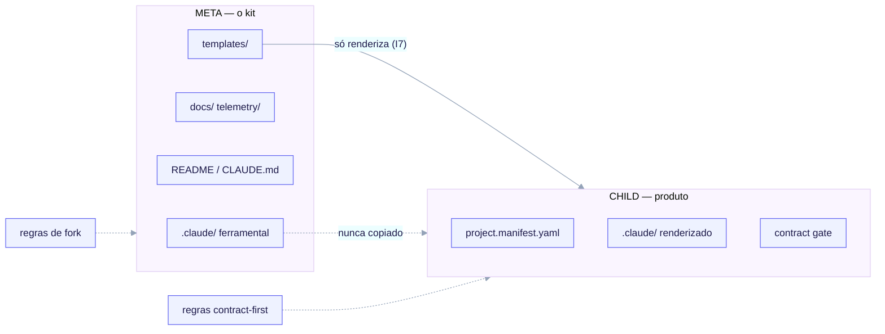

# A fronteira META vs CHILD

A ideia mais importante de todas no `ai-core-kit` é que ele vive em **duas camadas que
nunca devem ser confundidas**. Acerte essa fronteira e todo o resto — idempotência,
higiene de template, o contract gate, telemetry — se encaixa. Erre-a e você vaza
ferramental meta-only para projetos child ou tenta aplicar regras de child ao próprio kit.

<small>A META autora o payload do CHILD sob `templates/` e é governada por forkabilidade, idempotência e higiene de template; o CHILD é o produto renderizado (manifesto, `.claude/` renderizado, contract gate opcional) governado por regras contract-first, de entrevista e de contract gate. A dependência corre em um único sentido: META → CHILD.</small>

## As duas camadas

| Camada | O que é | Onde vive | O que a governa |
|---|---|---|---|
| **META** — construindo o próprio kit | o repositório de scaffold e seu maquinário de build | `README.md`, `CLAUDE.md`, `docs/`, ferramental `.claude/`, autoria de `templates/`, `telemetry/`, `discovery/` | forkabilidade, idempotência, higiene de template |
| **CHILD** — o que o `/ack-init` renderiza em um fork | o novo projeto de fato | **apenas** o que vive sob `templates/` | design-contract-first, a entrevista de bootstrap, o scaffolding de archetype, o contract gate |

> META = *construir a máquina que estampa o padrão.*
> CHILD = *o que a máquina estampa.*

Design-contract-first, API-first e o contract gate são **regras da camada CHILD**. Eles
são autorados aqui como templates e hooks que **embarcam no child** — eles **não** governam
como o próprio meta-repo é construído.

## Por que o repo META parece "incompleto"

Como contract-first é uma regra de child, o repo META deliberadamente:

- não carrega **nenhum** `project.manifest.yaml` e **nenhuma** instância de contrato
  (esses são artefatos de child produzidos pela entrevista); e
- não conecta **nenhum** hook de contract-gate próprio (ele passaria vaziamente — não há
  manifesto de child para ele ler).

Isso é intencional, não uma lacuna. O payload de contrato vive **apenas** sob `templates/`
e é exatamente o que o `/ack-init` renderiza em um fork.

## A dependência de sentido único

A dependência corre estritamente **META → CHILD**, nunca de volta:

- O renderizador lê **de** `templates/` e escreve **na** árvore de trabalho do child.
- Um child nunca lê de volta para o ferramental `.claude/` do kit, o motor de discovery ou
  o orquestrador.
- O renderizador copia **apenas** arquivos sob `templates/`. A árvore `.claude/` da META
  (skills de ferramental de build como `skill-creator`, `mcp-builder`, o orquestrador) é
  **nunca** copiada para um child (invariante **I7**, imposta como regra de render:
  *renderizar apenas A PARTIR de `templates/`*).

É isso que permite ao kit carregar maquinário meta-only poderoso sem nenhum risco de ele
vazar para os projetos que gera.

## Invariantes de forkabilidade

Três regras concretas tornam um child renderizado um repo limpo e autocontido:

1. **A árvore `.claude/` da META nunca é copiada para um child.** Apenas `templates/` é
   renderizado. Agentes meta-only (Research, Discovery), o MCP de telemetry e o
   orquestrador nunca podem aparecer em um fork.
2. **Os hooks do child usam o literal `${CLAUDE_PROJECT_DIR}`.** Um comando de hook
   renderizado é `python3 ${CLAUDE_PROJECT_DIR}/.claude/hooks/contract-gate` — nunca um
   caminho absoluto e nunca um caminho relativo a `templates/`. O motor de render até
   afirma, antes de escrever qualquer arquivo do child, que o conteúdo não contém nenhuma
   substring `templates/archetypes/` e nenhum caminho absoluto do kit; uma violação aborta
   o render.
3. **As variáveis de template do child são `${dotted.path}` em snake_case**, resolvidas a
   partir de `managed:` no manifesto do child. O regex de render casa apenas caminhos
   pontilhados em minúsculas, que é precisamente por que a variável de shell em maiúsculas
   `${CLAUDE_PROJECT_DIR}` sobrevive à substituição intocada.

## Segurança de dois lados: fail-closed no tempo de autoria, fail-open no tempo de execução

A fronteira é imposta assimetricamente de propósito (invariante **I6**):

- **Fail-closed no tempo de autoria.** `/ack-init` valida o manifesto contra o JSON-Schema
  congelado **antes** de renderizar. Um manifesto inválido aborta e não escreve nada. A
  guarda do meta-repo é o mesmo princípio: rodar `/ack-init` no próprio kit recusa
  terminantemente.
- **Fail-open no tempo de execução.** Um manifesto corrompido ou ausente no momento do
  *consumo* (por exemplo, o contract gate lendo-o) degrada o gate para o modo `off` mais um
  aviso no stderr — ele **nunca** sai com 2 e nunca trava uma sessão.

## Por que essa fronteira importa

- **Isolamento** — ferramental meta-only e payload do child podem evoluir
  independentemente; nenhum contamina o outro.
- **Idempotência** — como apenas `managed:` é regenerado e apenas `rendered_files[]` é
  possuído, as re-execuções são byte-estáveis e nunca sobrescrevem edições manuais. Veja
  [Motor de render — idempotência](/concepts/render-engine#idempotent-re-renders).
- **Higiene de template** — os condicionais vivem no manifesto e em diretórios `_when.*`,
  não como fluxo de controle dentro dos templates, então o payload permanece auditável.
- **Dependência de sentido único** — um child é um snapshot limpo que não deve nada de
  volta ao kit.

## Onde os contratos vivem

Os contratos P3 congelados que cruzam essa fronteira — o schema do manifesto, o banco de
perguntas e o contrato de render — são documentados a seguir em
[Entrevista → Manifesto → Render](/concepts/manifest-and-interview) e
[Contrato do motor de render](/concepts/render-engine).
