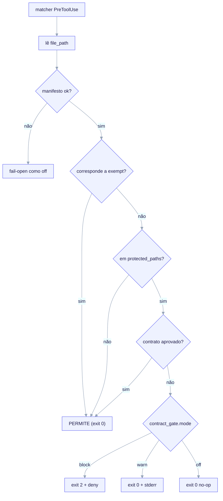

# Gate de Contrato de Design

O gate de contrato é um hook **opcional** `PreToolUse` que um projeto FILHO
forkado pode instalar para impor edição *design-contract-first*: uma edição em um
caminho protegido só é permitida se um contrato **aprovado** a cobrir. É a
expressão na camada FILHO da metodologia API-first / contract-first do kit.


*O matcher `PreToolUse` dispara em `Edit | Write | MultiEdit | NotebookEdit`; o hook lê `tool_input.file_path` do JSON em stdin, escopa a edição no próprio script contra `exempt` / `scope` / `protected_paths`, consulta o oráculo de contratos aprovados e age conforme `contract_gate.mode` — `block` faz exit 2 com `permissionDecision: deny`, `warn` faz exit 0 + stderr (NÃO bloqueia), `off` é um no-op silencioso. Um manifesto ausente ou não analisável faz fail-open como `off` (+ aviso em stderr, exit 0).*

> **Status.** O **contrato do manifesto e o formato de dados do gate estão
> CONGELADOS e entregues** (`contract_gate.*` e `contracts[]` no schema do
> manifesto, o matcher do `settings.json`, a localização do hook e o comportamento
> fail-open). O **runtime profundo** — o escopo via fnmatch no próprio script, o
> percurso do oráculo de aprovados e os três mecanismos de modo distintos — é
> **P5 / roadmap**. O hook entregue é um stub fail-open coerente que sai com `0`.
> Trate as regras abaixo como o *contrato que o P5 deve implementar*, não como o
> comportamento que você obtém hoje.

## Chave-mestra

O gate é controlado por um único toggle de feature no manifesto:

```yaml
features:
  sdd_gate: true   # CHAVE-MESTRA. false => /ack-init omite o hook do gate por completo
```

Quando `features.sdd_gate: false`, o `/ack-init` (P4) não renderiza hook nem
matcher `PreToolUse`; o `contract_gate.mode` torna-se irrelevante. Quando `true`,
o hook é renderizado em `.claude/hooks/contract-gate` e registrado em
`.claude/settings.json`.

## Como é integrado

O gate roda como um hook `PreToolUse` nas ferramentas que mutam arquivos. O
matcher (no `.claude/settings.json` renderizado) está **congelado**:

```json
{
  "hooks": {
    "PreToolUse": [
      {
        "matcher": "Edit|Write|MultiEdit|NotebookEdit",
        "hooks": [
          { "type": "command", "command": "python3 ${CLAUDE_PROJECT_DIR}/.claude/hooks/contract-gate" }
        ]
      }
    ]
  }
}
```

Um matcher `PreToolUse` só pode filtrar por **nome de ferramenta**, nunca por
caminho de arquivo. Então o hook recebe toda chamada
`Edit`/`Write`/`MultiEdit`/`NotebookEdit` e lê o `tool_input.file_path` do JSON em
stdin para **escopar no próprio script**. O runtime é fixado em `python3`; o
dialeto de glob é `fnmatch` com `**`.

## Os três modos

`contract_gate.mode` é um enum obrigatório: `block | warn | off`. São **três
mecanismos distintos** — uma distinção load-bearing (o formato errado de
exit-code transforma silenciosamente o guarda em no-op, então `warn` nunca pode
bloquear por acidente):

| Modo | Exit | Saída | Efeito |
|---|---|---|---|
| `block` | `2` | define `hookSpecificOutput.permissionDecision: "deny"` | Para a chamada da ferramenta. |
| `warn` | `0` | mensagem em stderr / `additionalContext` | Registra e continua — **não** bloqueia. |
| `off` | `0` | nenhuma; retorno antecipado **antes** de parsear o corpo do manifesto | No-op. |

O formato `block` é a armadilha: ele exige **`exit 2` E
`hookSpecificOutput.permissionDecision: "deny"`** — não uma chave `decision` de
nível superior, e não `exit 1`. O formato errado faz fail-open silenciosamente e
o guarda nunca dispara. O contrato completo de exit-code do hook (0 = ok, 2 =
block, outro = não bloqueante) está resumido na tabela de modos acima.

## Escopo no próprio script e precedência

Três listas de glob em `contract_gate` dirigem o escopo. A precedência é fixa:

1. **`exempt`** vence tudo. Uma edição que corresponde a `exempt` é sempre permitida.
2. **`protected_paths`** (obrigatório, `minItems 1` — o gate nunca pode ser vazio):
   edições aqui exigem um contrato aprovado.
3. **`scope`** (opcional; padrão é `protected_paths`): o subconjunto que *também*
   exige um contrato aprovado.
4. Qualquer arquivo que **não** corresponda a nenhum dos acima é **PERMITIDO**.

```yaml
contract_gate:
  mode: block
  glob_dialect: fnmatch
  protected_paths:        # obrigatório, minItems 1 — padrões por arquétipo
    - "src/**"
    - "migrations/**"
    - "openapi/**"
  scope:                  # opcional; padrão é protected_paths
    - "src/**"
  exempt:                 # exempt VENCE scope e protected_paths
    - "**/*.test.*"
    - "migrations/**"
    - "**/__snapshots__/**"
  require_approval_by:    # metadado de revisão consultivo; NÃO imposto pelo hook
    - "@acme/api-owners"
```

### Padrões de caminhos protegidos por arquétipo

`protected_paths`, `scope` e `exempt` são **por arquétipo**: o `/ack-init`
resolve-os a partir dos padrões do arquétipo escolhido e então os **congela** no
manifesto. O hook lê *esta* lista, nunca um padrão hardcoded.

| Arquétipo | Caminhos protegidos padrão |
|---|---|
| `backend-api` | `src/**`, `migrations/**`, `openapi/**` |
| `fullstack` | `app/**`, `api/**`, `src/**` |
| `infra-iac` | sem `src/**` hardcoded; fornecido via o campo do manifesto (caso contrário o gate seria vazio para projetos de infra) |

O caso `infra-iac` corrige um achado conhecido: um padrão hardcoded `src/**` não
se aplica a projetos de infraestrutura, então os padrões por arquétipo são
escritos a partir da entrevista em vez de embutidos no hook.

## O oráculo de contratos aprovados

`contracts[]` é o oráculo de "aprovado?" do gate (consumido pelo gate; também
lido pelo renderer para gerar arquivos stub de contrato). Cada entrada tem um
`id`, uma lista de glob `scope` e um `status` (`draft | proposed | approved |
rejected`):

```yaml
contracts:
  - id: C-001-order-intake          # padrão ^C-[0-9]{3}-[a-z0-9-]+$
    scope:
      - "src/orders/**"
      - "openapi/orders.yaml"
    status: approved                # edições sob este escopo são PERMITIDAS
    path: docs/contracts/C-001-order-intake.contract.md
  - id: C-002-fulfillment
    scope:
      - "src/fulfillment/**"
    status: draft                   # edições sob src/fulfillment/** são BLOQUEADAS no modo block
```

A regra: uma edição cujo caminho corresponde a `scope`/`protected_paths` é
permitida **somente se** alguma entrada de `contracts[]` cujo escopo a cobre tiver
`status: approved`. Um contrato `draft` não desbloqueia seu escopo.

`contracts[]` é **opcional para todos os arquétipos** (padrão `[]`) — exigir uma
lista não vazia de uma entrevista que nunca a pede quebraria o round-tripping. O
`/ack-init` semeia uma entrada stub para `backend-api` como padrão de qualidade,
não como requisito de schema.

## Fail-open em runtime, fail-closed em author-time

- **Fail-open em runtime.** Se o manifesto estiver ausente ou não-analisável
  quando o hook roda, o gate se comporta como `off` mais um aviso em stderr — ele
  **nunca** sai com `2` e nunca trava a sessão.
- **Fail-closed em author-time.** O `/ack-init` valida o manifesto contra o schema
  congelado **antes** de renderizar. Um bloco `contract_gate` inválido aborta o
  init; ele nunca entrega um gate quebrado.

## O que está entregue vs. roadmap

| Peça | Status |
|---|---|
| Campos de manifesto `contract_gate.*` e `contracts[]` (schema congelado) | **Entregue** |
| Matcher do `settings.json` + localização do hook + stub fail-open | **Entregue** |
| Padrões de `protected_paths` por arquétipo | **Entregue (na entrevista/schema)** |
| Runtime profundo: escopo fnmatch, percurso do oráculo de aprovados, 3 mecanismos de modo | **P5 / roadmap** |

Veja também: [Manifesto e Entrevista](/concepts/manifest-and-interview) para os
campos de manifesto `contract_gate` e `contracts[]` que o gate lê.
