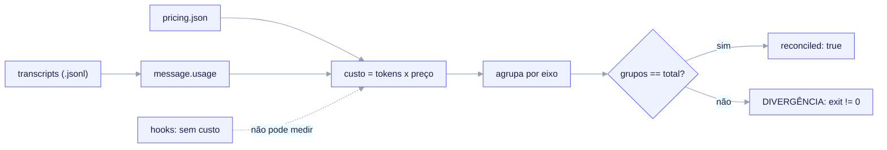

import TerminalCast from '../../../components/TerminalCast'

# Telemetria de Custo Offline

<TerminalCast src="/demo/ack-telemetry.cast" />


O ai-core-kit mede o custo em USD de uma execução do Claude Code lendo as linhas
de uso de tokens do transcript e multiplicando-as por um mapa de preços
versionado. Ele atribui o gasto por **modelo**, **feature**, **agente** e
**sessão**. Esta é uma ferramenta **pós-execução, offline** — está **ENTREGUE**
em ambas as camadas.


*Transcripts em `~/.claude/projects/**/*.jsonl` carregam um `assistant message.usage` em todo turno do assistente; multiplicado pelo `pricing.json` versionado (USD por MTok, ÷ 1e6) e agrupado por modelo / feature / agente / sessão, e então reconciliado — a soma dos grupos deve igualar o total geral ou faz exit diferente de zero (DIVERGÊNCIA). Hooks (`PreToolUse` / `PostToolUse`) NÃO carregam campos de token ou custo (#11008), então a medição ao vivo é impossível.*

> **A única restrição rígida.** Não existe um medidor de custo ao vivo, e nunca
> poderá existir para o gasto do Claude Code. Declare isto antes de prometer
> qualquer número em tempo real.

## Por que apenas offline: issue #11008

Os hooks do Claude Code (`PreToolUse`, `PostToolUse`, …) recebem apenas
`session_id`, `transcript_path`, `cwd`, `permission_mode` e `hook_event_name`.
**Eles não carregam campos de token ou custo**
([anthropics/claude-code#11008](https://github.com/anthropics/claude-code/issues/11008),
aberta). Consequências:

- Um hook **não consegue** emitir um número de custo ao vivo; o `PostToolUse` não
  consegue medir gasto.
- O `PostToolUse` só dispara em turnos de **ferramenta**. Em um transcript
  representativo, 61 de 98 turnos do assistente foram apenas texto (sem chamada de
  ferramenta) — invisíveis ao `PostToolUse`. Ratear o custo por atividade de
  ferramenta descartaria silenciosamente a maioria (~61%) do gasto.

**A correção que o kit implementa:** calcular *todo* o custo a partir das linhas
`message.usage` do assistente no transcript — todo turno do assistente tem uma,
com ferramenta ou não — multiplicado por `pricing.json`. Isso captura 100% do
gasto e é totalmente reproduzível offline.

## Os dois arquivos

| Arquivo | Papel |
|---|---|
| `telemetry/aggregate.py` | agregador offline apenas com stdlib (sem dependências de terceiros). |
| `telemetry/pricing.json` | mapa versionado `modelo → USD/MTok` com uma data `as_of`. |

O **motor idêntico** vive no repositório META (`telemetry/`) para medir o custo de
construir o próprio ai-core-kit, e é entregue a projetos FILHO forkados sob
`templates/telemetry/`, integrado pelo `/ack-init` quando `telemetry.enabled:
true`.

## Como o custo é calculado

Para cada linha `assistant`, `message.usage` fornece as contagens de tokens e
`message.model` seleciona a linha de preço:

| campo de usage | precificado pela chave `pricing.json` |
|---|---|
| `input_tokens` | `input` |
| `output_tokens` | `output` |
| `cache_read_input_tokens` | `cache_read` |
| `cache_creation.ephemeral_5m_input_tokens` | `cache_write_5m` |
| `cache_creation.ephemeral_1h_input_tokens` | `cache_write_1h` |
| `cache_creation_input_tokens` (sem divisão presente) | `cache_write_5m` (efêmero padrão) |

Os preços são em **USD por 1.000.000 tokens (MTok)**; o agregador divide por 1e6.

## Eixos de atribuição

`--by` seleciona um ou mais de `model,feature,agent,session` (padrão: os quatro).

- **model** — chaveado pelo id exato `message.model`. Sempre exato e confiável.
- **session** — chaveado por `sessionId`. Sempre confiável.
- **agent** — transcripts não têm *nome* de agente, então a ferramenta usa o único
  sinal adjacente a agente que existe: `isSidechain`. Um turno não-sidechain é
  agrupado em `main`; um turno sidechain (subagente / `Task`) é agrupado em
  `subagent:<requestId>`. Isso separa o gasto da sessão principal do gasto
  delegado.
- **feature** — transcripts não carregam **nenhum campo nativo de feature**, então
  um rótulo de feature vem de uma de duas convenções explícitas (abaixo). Qualquer
  coisa que não corresponda a nenhuma regra cai no **grupo padrão**
  (`unattributed`) — nunca é descartada silenciosamente.

### Atribuição de feature: `branch_prefix` vs `sidecar_map`

Duas formas mutuamente exclusivas de derivar um rótulo de feature (defina o padrão
no manifesto em `telemetry.attribution.mode`; flags de CLI têm prioridade):

**1. `branch_prefix` (padrão; zero ferramentas extras).** Trabalhe cada feature em
seu próprio branch nomeado `<prefix><feature>`. Com `--branch-prefix feat/`, o
`gitBranch` do turno após o prefixo torna-se o grupo:

```
gitBranch = "feat/order-intake"   --branch-prefix "feat/"   →  grupo "order-intake"
gitBranch = "main"                                            →  grupo "<padrão>"
```

**2. `sidecar_map` (preciso; requer um gravador minúsculo).** Um arquivo JSON
mapeia janelas de tempo para rótulos de grupo; um turno cujo `timestamp` cai em
`[from, to)` é agrupado naquela entrada. Um hook `SessionStart` *pode*
legitimamente gravar um mapeamento `timestamp → contract_id` (ele apenas não
consegue gravar custo). Passe-o com `--sidecar-map sidecar.json`; isso sobrepõe o
`branch_prefix`.

## Garantia de reconciliação

Para **cada** eixo, o agregador prova que a soma dos custos por grupo é igual ao
total geral (dentro do épsilon de float). A tabela humana imprime uma linha
`reconcile vs total … OK` por eixo; a saída JSON carrega `"reconciled":
true|false`; **uma divergência sai com código diferente de zero**. O grupo padrão
garante que a identidade se mantenha mesmo quando nada corresponde a uma regra de
feature/agente. Se um eixo mostra `MISMATCH`, o relatório não é confiável — não
cite os números.

## Garantias de falha-barulhenta

- **Modelo desconhecido** → erro fatal nomeando o `message.model` ofensor,
  listando os ids conhecidos, exit `1` (`unknown_model_policy: error`). O custo
  nunca é subcontado silenciosamente porque um modelo novo apareceu. A correção é
  adicionar uma linha ao `pricing.json` (copie uma linha do mesmo tier, defina os
  valores USD/MTok, atualize o `as_of`).
- **`pricing.json` ausente / inválido** → erro fatal, exit `1`.
- **Somas de grupo não reconciliam** → erro fatal, exit `1`.
- **Eixo `--by` inválido / arquivo sidecar ausente** → erro de uso, exit `2`.
- Uma única *linha* JSONL malformada é pulada (não é fatal) para que uma linha ruim
  não invalide um relatório de resto completo.

## Executando

```bash
# máquina inteira, padrão ~/.claude/projects, os quatro eixos, tabela + JSON:
python3 telemetry/aggregate.py

# apenas este build, desde uma data, feature + modelo + agente, apenas JSON:
python3 telemetry/aggregate.py \
  --project-dir ~/.claude/projects \
  --since 2026-06-01 \
  --by feature,model,agent \
  --branch-prefix feat/ \
  --format json

# atribuição precisa de feature via um mapa sidecar timestamp→contract:
python3 telemetry/aggregate.py --sidecar-map telemetry/sidecar.local.json --by feature
```

Flags principais: `--project-dir`, `--since YYYY-MM-DD` (UTC), `--pricing PATH`,
`--by`, `--branch-prefix`, `--default-bucket` (padrão `unattributed`),
`--sidecar-map`, `--manifest` (apenas FILHO — lê os padrões `telemetry.*`; flags
de CLI vencem), `--format table|json|both`.

## Orçamentos são consultivos

`pricing.json` produz **valores reais**. **Orçamentos** (limites de USD
consultivos) vivem no manifesto FILHO em `telemetry.budgets[]` (escopo
`project|feature|contract|agent`). Os totais por grupo do agregador são o que você
compara contra os limites — os limites **sinalizam** o excesso, eles nunca impõem
ou bloqueiam nada ao vivo.

## As duas skills de custo

Ambas são entregues como payload FILHO (MIT):

- **`cost-telemetry`** — roda `aggregate.py` e interpreta sua saída. A única fonte
  da verdade para *os números*. Ela confirma `telemetry.enabled: true`, escolhe o
  escopo, lê os padrões de atribuição do manifesto, roda o agregador, verifica
  `reconciled: YES` e aponta um grupo `unattributed` grande. Renderizada quando
  `features.cost_telemetry == true`.
- **`cost-audit`** — investigação evidência-primeiro de *por que* o gasto disparou
  (job/criação de PR descontrolado, bypass de quota, vazamento de modelo premium,
  fanout duplicado, queima de retry). Ela **delega os números** à `cost-telemetry`
  — nunca re-deriva a matemática de preços — e adiciona as dimensões que a
  telemetria não consegue ver: gasto de API de provedor fora do Claude Code, custo
  de infraestrutura e a causa-raiz comportamental.

## Nota de localidade

Os transcripts vivem sob `~/.claude/projects/<cwd-codificado>/…`, então a
ferramenta lê apenas transcripts **locais**. Agregar entre máquinas exige primeiro
preparar os JSONL em um único `--project-dir`. Não há etapa de rede/coleta por
design.

Veja também: [Catálogo de skills](/features/skills-catalog).
