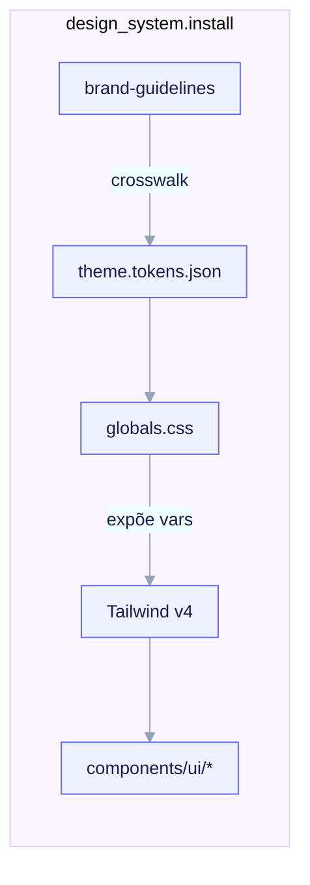

# Design System (shadcn/ui)

O design system é um payload **exclusivo do fullstack**, instalado
condicionalmente. Está **ENTREGUE**. Quando um fork escolhe o arquétipo
`fullstack` e responde `design_system.install: true`, o `/ack-init` copia a
subárvore em
`templates/archetypes/fullstack/_when.design_system.install/design-system/` para o
filho. É **proibido** para `backend-api` (imposto por schema) e ausente para os
outros arquétipos.



<em>Os tokens snake_case da marca (<code>color_brand</code>, <code>radius_base</code>) fazem crosswalk via o doc de mapeamento <code>theme.tokens.json</code> para o <code>globals.css</code> (vars CSS OKLch em <code>:root</code> / <code>.dark</code> como <code>--primary</code>, <code>--radius</code>), que o Tailwind v4 expõe via <code>@theme inline</code> aos componentes (<code>bg-background</code>, <code>text-foreground</code>) — instalado apenas quando <code>design_system.install</code> é true em um fork fullstack.</em>

## O que é entregue

```
design-system/
├── NOTICE                       # atribuição Apache-2.0 + shadcn/ui MIT third-party
├── README.md.tpl
├── skills/
│   ├── shadcn-ui/               # SKILL.md + references/{cli,components,mcp,theming}.md
│   ├── brand-guidelines/        # SKILL.md + references/{logo,tokens,typography,voice}.md
│   └── frontend-design-guidelines/
│                                # SKILL.md + references/{accessibility,color,components,
│                                #   layout,responsive,spacing,typography}.md
├── mcp/
│   ├── shadcn.mcp.json          # o fragmento canônico do servidor MCP do shadcn
│   └── README.md
└── theme/
    ├── components.json.tpl       # config do shadcn
    ├── globals.css.tpl           # variáveis CSS OKLch :root / .dark + @theme inline
    ├── theme.tokens.json         # doc de mapeamento token-da-marca → variável-CSS (estático)
    └── README.md
```

## As três skills e como se compõem

As três skills de design têm responsabilidades **distintas e não-sobrepostas** e
são feitas para serem aplicadas em conjunto:

- **`brand-guidelines`** (Apache-2.0) — a fonte da verdade para os *valores de
  token* da marca: cores de marca/neutras/status, a escala tipográfica, raio,
  tokens de espaçamento, famílias tipográficas, voz/tom e uso do logo. As chaves de
  token são **snake_case** (`^[a-z][a-z0-9_]*$`, decisão O4) para que a regex
  `${var}` minúscula do renderer nunca deixe uma chave hifenizada sem substituir.
  Um fork sobrescreve os padrões via `/ack-init`.
- **`frontend-design-guidelines`** (Apache-2.0) — *como* a UI é composta: layout,
  espaçamento, papéis tipográficos, papéis semânticos de cor, anatomia/estados de
  componente, comportamento responsivo e acessibilidade. Agnóstica de framework.
  Princípio central: "tokens, não números mágicos" — todo
  espaçamento/raio/cor/tamanho-de-fonte resolve para um token nomeado; um literal
  `13px` ou `#3a7` em um componente é um defeito.
- **`shadcn-ui`** (MIT, re-autorada) — usar shadcn/ui em um filho React + Tailwind:
  o modelo de componente copy-in, a CLI `init`/`add`, o theming de variáveis CSS
  OKLch e dark mode, registries e o MCP do shadcn.

A divisão: `brand-guidelines` define os *valores*, `frontend-design-guidelines`
define *como montar* a UI, e `shadcn-ui` te dá as *peças* e as conecta aos tokens
da marca.

## O modelo copy-in do shadcn/ui

shadcn/ui **não é uma dependência npm**. `npx shadcn@latest add button` copia o
código-fonte do componente **para dentro** do diretório `components/ui/` do projeto
— você é dono e edita o código. Re-executar `add` só toca um componente se você
passar `--overwrite`. O registry é uma *fonte*, não um runtime.

```bash
npx shadcn@latest init                      # detecta framework, escreve components.json, configura Tailwind
npx shadcn@latest add button dialog input   # adiciona vários de uma vez
npx shadcn@latest add --all                  # adiciona tudo
```

O `components.json` é entregue com `cssVariables: true` e `style: new-york` (o
antigo style `default` está depreciado). Os componentes caem em `aliases.ui`
(padrão `@/components/ui`).

### Apenas React + Tailwind

A skill é de primeira classe para `next` e `remix`. O enum de framework do
fullstack também permite `sveltekit` e `nuxt`, mas os componentes React do
shadcn/ui **não** se aplicam diretamente lá — ports da comunidade
(`shadcn-svelte`, `shadcn-vue`) existem com CLIs diferentes e estão fora do escopo
desta skill.

## Theming OKLch

Com `cssVariables: true`, toda cor é uma variável CSS no espaço de cor **OKLch**
(não HSL), declarada em `:root` (claro) e sobrescrita em `.dark` (escuro). O
Tailwind v4 as expõe via `@theme inline` (para que `bg-background`,
`text-foreground`, `border-border` resolvam para as variáveis).

`theme/theme.tokens.json` é um **doc de mapeamento** (não uma config do shadcn) que
faz crosswalk dos tokens snake_case da marca para as variáveis CSS do shadcn, por
exemplo:

| token da marca | var CSS do shadcn | papel |
|---|---|---|
| `color_brand` | `--primary` | ação primária / acento da marca |
| `color_on_brand` | `--primary-foreground` | texto sobre primária |
| `color_ink_muted` | `--muted-foreground` | texto de-enfatizado |
| `color_danger` | `--destructive` | ação destrutiva |
| `color_border` | `--border` | borda/divisor padrão |
| `radius_base` | `--radius` | raio de canto base (sm/md/lg/xl derivam via `calc()`) |

Para re-brandear: leia o valor do token da sua marca, converta hex para `oklch(L C
H)` e escreva-o nos blocos `:root` / `.dark` do `globals.css`. Todo valor de token
OKLch em `globals.css.tpl` é um **padrão estático** — um `${...}` não-vinculado é
um erro de render fatal, então apenas `${project.name}` no comentário inicial é
substituído.

## O MCP do shadcn

O servidor MCP do shadcn deixa um agente navegar, buscar e instalar componentes sem
rodar a CLI à mão. O fragmento canônico é:

```json
{ "mcpServers": { "shadcn": { "command": "npx", "args": ["shadcn@latest", "mcp"] } } }
```

Ele é **duplamente protegido**: o `.mcp.json` do projeto só é renderizado quando
`features.mcp: true`, e dentro dele a entrada `shadcn` é envolvida na diretiva
`#ack:if design_system.install` … `#ack:endif` do renderer. O predicado efetivo é
`features.mcp && design_system.install`. Servidores MCP de projeto exigem
re-aprovação no primeiro uso. Detalhe completo: [Integração de
MCP](/features/mcp).

## Licença

As skills de guideline de design são **Apache-2.0** com o `NOTICE` preservado; sua
*estrutura* é modelada nas skills de exemplo Apache-2.0 da Anthropic
`frontend-design` e `brand-guidelines`, e o conteúdo é autorado de forma
independente. A subárvore entrega **apenas** conteúdo de exemplo Apache-2.0 — nunca
qualquer material derivado de `docx`/`pdf`/`pptx`/`xlsx` (proprietário). O
shadcn/ui em si é **MIT**; seus componentes são copiados para o filho, então você é
dono deles. Veja [Registro de licenças](/reference/licensing).
