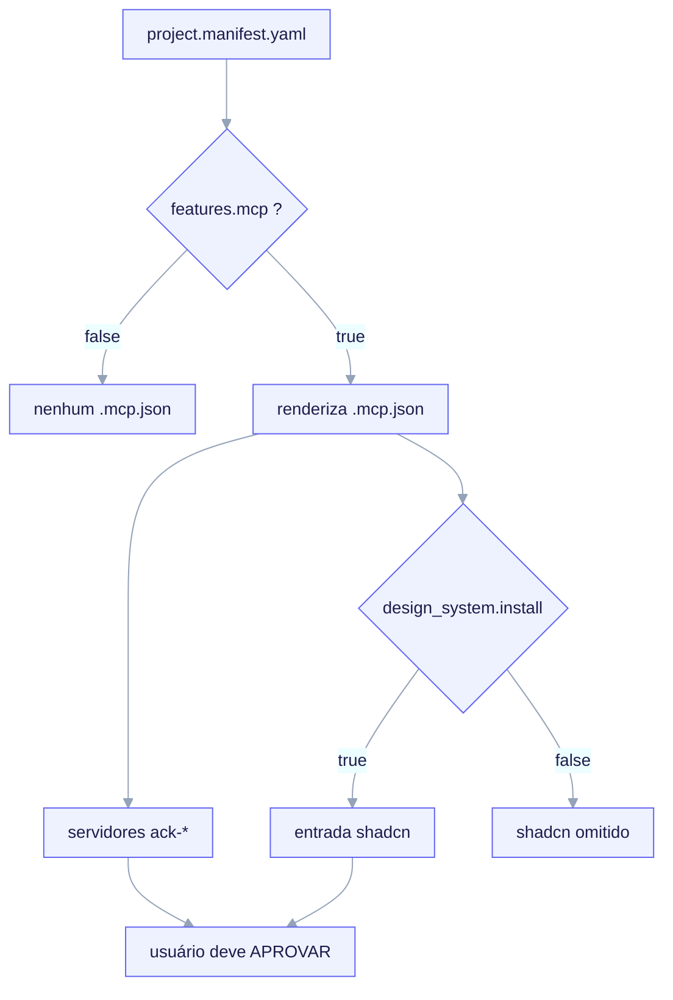

# Integração de MCP (Model Context Protocol)

Um projeto FILHO forkado pode optar por um `.mcp.json` com escopo de projeto que
declara servidores MCP que um agente pode usar. Isto é **opt-in**: o `/ack-init`
renderiza `.mcp.json` apenas quando `features.mcp: true`.



<em><code>features.mcp</code> protege todo o <code>.mcp.json</code>: quando true, o <code>/ack-init</code> o renderiza na chave gerenciada <code>json:mcpServers</code> com os servidores <code>ack-*</code>. A entrada <code>shadcn</code> (<code>npx shadcn@latest mcp</code>) é duplamente protegida pela diretiva <code>#ack:if design_system.install</code> — emitida só quando true, senão o bloco é omitido e o JSON permanece válido. Todo servidor de projeto precisa de aprovação explícita do usuário no primeiro uso.</em>

> **Status.** A renderização do `.mcp.json`, o gate `features.mcp`, o
> duplo-gate do design-system e o fragmento do MCP shadcn estão **entregues**. O
> servidor de projeto genérico profundo (`ack-example`) é um **stub P4** — sua
> integração real de servidor é roadmap. O MCP shadcn, por outro lado, faz shell
> out para ferramentas upstream e funciona hoje.

## O toggle de feature

```yaml
features:
  mcp: false   # bool. integra um .mcp.json de projeto. Padrão DESLIGADO.
```

Quando `false`, nenhum `.mcp.json` é renderizado. Quando `true`, o `/ack-init`
renderiza o `.mcp.json.tpl` do arquétipo na raiz do projeto.

## Propriedade e segurança em re-execução

O `.mcp.json` é de propriedade do `/ack-init` na chave gerenciada
`json:mcpServers`. Dentro de `mcpServers`, o ack é dono **apenas das entradas que
renderiza** (servidores prefixados com `ack-*`, mais a entrada canônica `shadcn`
para o design system). **Servidores adicionados pelo usuário sob outras chaves
nunca são tocados.** Em re-execução, o `/ack-init` re-mescla via um merge de chaves
ciente de JSON (não concatenação de linhas), então a higiene de vírgulas é tratada
pelo merge — nunca edite o bloco gerenciado à mão.

## O MCP do shadcn (design system fullstack)

O servidor MCP do shadcn/ui deixa um agente navegar, buscar e instalar componentes
shadcn/ui (e componentes de quaisquer registries configurados) diretamente do
`components.json` do projeto. O fragmento canônico é exatamente:

```json
{ "mcpServers": { "shadcn": { "command": "npx", "args": ["shadcn@latest", "mcp"] } } }
```

Ele é **duplamente protegido**:

1. **`features.mcp`** — o `.mcp.json.tpl` inteiro só renderiza quando o filho optou
   por um `.mcp.json` de projeto. Se false, a entrada shadcn nunca aparece.
2. **`design_system.install`** — dentro desse arquivo o bloco `shadcn` é envolvido
   na diretiva de linha `#ack:if design_system.install` … `#ack:endif` do renderer,
   então a entrada é emitida **apenas quando `design_system.install == true`**.
   Quando false (ou ausente, ex. backend-api), o bloco é omitido e o JSON restante
   permanece válido.

Então o predicado efetivo é **`features.mcp && design_system.install`**. O MCP
shadcn **compõe com** o próprio servidor `features.mcp` do projeto — eles são
entradas independentes sob `mcpServers`; habilitar o shadcn não substitui nem
desabilita nenhum servidor de projeto.

### Bootstrap único (conveniência opcional)

O `.mcp.json` renderizado é suficiente por si só. Se você prefere deixar a CLI do
shadcn escrever/atualizar a entrada, rode da raiz do projeto filho:

```bash
npx shadcn@latest mcp init --client claude
```

Um `components.json` deve existir para que o MCP resolva aliases e registries —
crie-o com `npx shadcn@latest init` se ainda não o fez.

## Servidores MCP de projeto exigem aprovação (fronteira de segurança)

O `.mcp.json` é uma config com **escopo de projeto**. O Claude Code **não** confia
em servidores de projeto automaticamente: no primeiro uso o usuário é solicitado a
**aprovar** cada servidor (e qualquer mudança em seu `command`/`args` re-solicita).
Esta é uma fronteira de segurança deliberada — um `.mcp.json` versionado não pode
rodar silenciosamente um comando na máquina de um colega de equipe. Aprove apenas
após revisar a entrada.

### Timeout de cold-start

O MCP shadcn faz shell out para o `npx`, que pode baixar o pacote `shadcn` na
primeira invocação. Se o servidor for lento para iniciar, aumente o timeout de
inicialização do MCP via a variável de ambiente `MCP_TIMEOUT` (milissegundos, ex.
`MCP_TIMEOUT=30000`) antes de lançar o Claude Code. Pré-aquecer com `npx
shadcn@latest mcp --help` uma vez evita atrasos de cold-start.

## Autorando servidores MCP: a skill `mcp-builder`

Para construir ou estender um servidor MCP — envolvendo uma API ou serviço externo
como ferramentas MCP bem-projetadas — o kit entrega a skill **META** `mcp-builder`
(Apache-2.0, vendorada + adaptada de anthropics/skills). Ela cobre pesquisa,
implementação em Python (FastMCP) ou Node/TypeScript (MCP SDK) e avaliação, e é a
skill invocada ao construir o servidor `features.mcp` de um filho. Ela vive em
`.claude/skills/` (META) e **não** é renderizada em forks.

## Fronteiras

- MCP é **material de referência para design**; o gate de contrato e a telemetria
  **não** dependem de MCP.
- Skills podem referenciar ferramentas MCP mas devem falhar graciosamente se um
  servidor estiver ausente.
- Permissões de MCP e workflows de provisionamento além da integração entregue
  estão A DEFINIR.

Veja também: [Design system](/features/design-system),
[Catálogo de skills](/features/skills-catalog).
