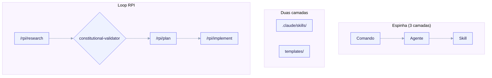

# Catálogo de Skills

Este é o resumo autoritativo de `templates/skills/INDEX.md`: toda skill, agente e
comando portado para o ai-core-kit, em ambas as camadas. Para cada item o INDEX
registra sua **camada**, o **repositório de origem + licença** de onde foi
vendorado ou re-autorado, e o **gatilho** que o integra em um fork (um valor de
`project.manifest.yaml`, um arquétipo, ou "sempre").

> Para a referência item a item de cada skill com seu propósito e gatilho, veja a
> [Referência de Skills](/reference/skills).

*Comandos (ex. `/rpi/research`) dirigem agentes (`code-explorer`, `architect`) que invocam skills (`coding-standards`); a espinha vive em duas camadas — META (`.claude/skills/`, constrói o kit) e FILHO (`templates/skills` + `agents` + `commands`, renderizado em um fork). O loop RPI research → plan → implement roda `requirement-parser` → `architect` → `code-reviewer` / `security-reviewer`, com o gate research → plan por `constitutional-validator`.*

## As duas camadas — nunca as confunda

- **META** = `.claude/skills/` — skills que ajudam a *construir* o kit. **Não** são
  renderizadas em forks; nunca protegidas por um contrato filho.
- **FILHO** = `templates/skills/`, `templates/agents/`, `templates/commands/` — o
  payload que o `/ack-init` (P4) renderiza em um fork, protegido pelo manifesto
  filho.

**Disciplina de licença.** Itens Apache-2.0 (anthropics/skills) são
copiados/adaptados com o NOTICE preservado; itens MIT (ecc, claude-skills,
claude-code-best-practice) são **re-autorados** no estilo do kit com atribuição.
Skills de documentos proprietárias da Anthropic (`docx`/`pdf`/`pptx`/`xlsx`) nunca
foram lidas, copiadas ou derivadas. Registro completo: [Registro de licenças e
referências](/reference/licensing).

## META — construir o kit (não renderizado em forks)

| Skill | Origem | Licença | Procedência | Gatilho |
|---|---|---|---|---|
| `skill-creator` | anthropics/skills | Apache-2.0 | Vendorada + adaptada | Apenas META — autorar/benchmarkar skills do kit. |
| `mcp-builder` | anthropics/skills | Apache-2.0 | Vendorada + adaptada | Apenas META — construir/estender um servidor MCP (incl. o servidor `features.mcp` de um filho). |
| `skill-validator` | autorada-nova (envolve `lint-frontmatter.py`) | Apache-2.0 (kit) | Original | Apenas META — validar skills/agentes/comandos do kit contra regras de frontmatter. |
| `cost-telemetry` (META) | autorada-nova | kit (MIT) | Original | Apenas META — interpretar o agregador offline sobre um transcript de *build do kit*. |

> `skill-creator/agents/{analyzer,comparator,grader}.md` são **prompts de
> sub-agente internos** da skill, não agentes autônomos do kit — eles não carregam
> frontmatter de agente do kit e não são lintados como agentes.

## FILHO — skills de engenharia e produto

`templates/skills/` de nível superior, protegidas por arquétipo/manifesto.

| Skill | Origem | Licença | Gatilho |
|---|---|---|---|
| `coding-standards` | autorada-nova | MIT | **Sempre** — piso de qualidade cross-language. |
| `error-handling` | autorada-nova | MIT | **Sempre** para arquétipos de código (`backend-api`, `fullstack`, `cli`, `library`). |
| `code-tour` | autorada-nova | MIT | **Sempre** — walkthroughs de onboarding/PR/RCA; emite `.tours/`. |
| `architecture-decision-records` | autorada-nova (ADR de Nygard) | MIT | **Sempre** — registros em `docs/adr/`. |
| `production-audit` | autorada-nova | MIT | `backend-api`, `fullstack`, `cli`. Pula docs-only/library. |
| `cost-audit` | autorada-nova | MIT | `features.cost_telemetry == true` OU arquétipo roda jobs/agentes pagos. |
| `cost-telemetry` (FILHO) | autorada-nova | MIT | `features.cost_telemetry == true`. Roda `telemetry/aggregate.py`. |
| `agent-eval` | autorada-nova | MIT | `features.agent_eval == true`. |
| `frontend-a11y` | autorada-nova | MIT | `fullstack` com UI React/Next (`framework in [next, remix]`). |
| `ui-design-system` | alirezarezvani/claude-skills | MIT (re-autorada) | `fullstack` / arquétipos de UI, ou `features.design_system == true`. |
| `saas-scaffolder` | alirezarezvani/claude-skills | MIT (re-autorada) | `saas` / `fullstack` com auth+billing. |
| `spec-to-repo` | alirezarezvani/claude-skills | MIT (re-autorada) | Scaffolding greenfield / fluxos de novo projeto. |

O **design-system** fullstack entrega três skills adicionais (`shadcn-ui`,
`brand-guidelines`, `frontend-design-guidelines`) apenas quando
`design_system.install: true` — veja [Design system](/features/design-system).

## FILHO — agentes reutilizáveis

`templates/agents/`. A frota RPI + revisão. O ECC fornece os revisores de
engenharia; o claude-code-best-practice fornece os agentes do fluxo RPI.

| Agente | Origem | Licença | Modelo | Gatilho |
|---|---|---|---|---|
| `architect` | affaan-m/ecc | MIT | opus | **Sempre** — design/ADR/trade-offs; fase plan do RPI. |
| `code-explorer` | affaan-m/ecc | MIT | sonnet | **Sempre** — etapa de descoberta do RPI. |
| `code-reviewer` | affaan-m/ecc | MIT | sonnet | **Sempre** para arquétipos de código — revisão pré-PR. |
| `security-reviewer` | affaan-m/ecc | MIT | sonnet | Arquétipos de código que tocam auth/input/pagamentos; pré-release. |
| `silent-failure-hunter` | affaan-m/ecc | MIT | sonnet | Arquétipos de código fazendo I/O/DB/rede/transações. |
| `refactor-cleaner` | affaan-m/ecc | MIT | sonnet | **Sempre** para arquétipos de código — passe de limpeza dedicado. |
| `requirement-parser` | claude-code-best-practice (`rpi/`) | MIT | sonnet | RPI research etapa 1; renderiza quando `features.rpi == true`. |
| `constitutional-validator` | claude-code-best-practice (`rpi/`) | MIT | opus | Gate research→plan do RPI; renderiza quando o filho tem uma constituição/arquétipo. |

## FILHO — comandos RPI e de produto

`templates/commands/`.

| Comando | Origem | Licença | Gatilho |
|---|---|---|---|
| `/rpi/research` | claude-code-best-practice | MIT | `features.rpi == true`. RPI etapa 1 (GO/NO-GO). |
| `/rpi/plan` | claude-code-best-practice | MIT | `features.rpi == true`. RPI etapa 2 (docs de planejamento). |
| `/rpi/implement` | claude-code-best-practice | MIT | `features.rpi == true`. RPI etapa 3 (execução faseada + gate). |
| `/prd` | autorada-nova | MIT | Arquétipos de Produto/SaaS ou `features.product == true`. |
| `/rice` | autorada-nova | MIT | Arquétipos de Produto/SaaS ou `features.product == true`. |

## FILHO — packs de linguagem / framework / DB

`templates/skills/lang/`, um conjunto de render determinístico protegido por
manifesto. A tabela de gatilhos autoritativa é `templates/skills/lang/INDEX.md`.

| Pack | Origem | Licença | Gatilho (condição de manifesto) |
|---|---|---|---|
| `python-patterns` | affaan-m/ecc | MIT | `project.language == python` |
| `python-testing` | affaan-m/ecc | MIT | `project.language == python` |
| `typescript-patterns` | autorada-nova | MIT | `project.language == typescript` |
| `go-patterns` | affaan-m/ecc | MIT | `project.language == go` |
| `rust-patterns` | affaan-m/ecc | MIT | `project.language == rust` |
| `node-api-patterns` | autorada-nova (informada pelo nestjs do ECC) | MIT | `project.framework in [express, nestjs]` |
| `react-patterns` | affaan-m/ecc | MIT | `project.framework in [next, remix]` (apenas React fullstack) |
| `postgres-patterns` | affaan-m/ecc | MIT | `persistence.db == postgres` |
| `prisma-patterns` | affaan-m/ecc | MIT | `persistence.orm == prisma` |
| `docker-patterns` | affaan-m/ecc | MIT | conteinerização — **ainda sem chave de manifesto** (veja lacunas). |

## Adiado / não portado (sem cortes silenciosos)

Estes estavam no plano de port ou surgiram como lacunas mas **não** estão presentes
no conjunto portado atual. Listados para que nada desapareça silenciosamente — veja
o [Roadmap](/roadmap) para a lista completa de adiados / não portados.

**Valores de enum de linguagem / framework / DB ainda não portados:**

| Valor de enum do manifesto | Disposição |
|---|---|
| `project.language == java` | `java-coding-standards` (+ testing) roteado fora do mínimo G4; pack futuro. |
| `project.framework == fastapi` | `fastapi-patterns` (copiar do ecc) planejado. |
| `project.framework == gin` | `gin-patterns` autorada-nova, planejado. |
| `project.framework == axum` | `axum-patterns` autorada-nova, planejado. |
| `project.framework in [sveltekit, nuxt]` | `sveltekit-patterns` / `nuxt4-patterns` autoradas-novas. `react-patterns` **NÃO** deve renderizar para estes. |
| `persistence.db in [mysql, sqlite, mongodb]` | `mysql-patterns` (ecc), `sqlite`/`mongodb` autoradas-novas. |
| `persistence.orm in [sqlalchemy, drizzle, gorm]` | todos os três autorados-novos no plano de port. |

**Lacuna de schema/entrevista bloqueando a integração limpa de `docker-patterns`.**
`templates/interview/questions.yaml` nunca pergunta se o filho usa Docker, então
`docker-patterns` não tem enum para se proteger. Recomendação: adicionar um boolean
`project.containerized`, OU sempre-renderizar `docker-patterns` para
`backend-api`/`fullstack`.

**Skills de exemplo da Anthropic disponíveis mas não vendoradas aqui:**
`algorithmic-art`, `brand-guidelines`, `canvas-design`, `claude-api`,
`frontend-design`, `internal-comms`, `slack-gif-creator`, `theme-factory`,
`web-artifacts-builder`, `webapp-testing`. (`doc-coauthoring` não entrega
LICENSE.txt → não vendorável.) Adotar depois atrás de feature flags se necessário.

**Proprietárias — permanentemente excluídas.** Skills de documentos da Anthropic
`docx`, `pdf`, `pptx`, `xlsx` ("All rights reserved"). Nunca lidas, copiadas ou
derivadas.
