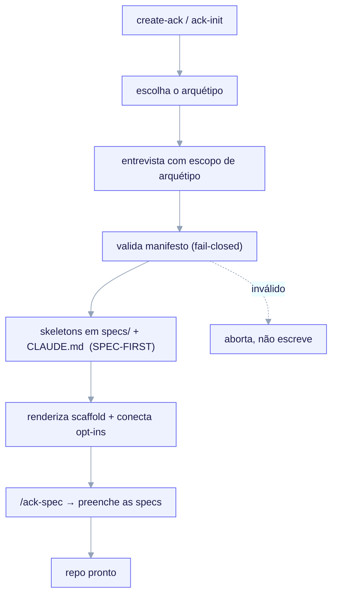

import TerminalCast from '../../../components/TerminalCast'

# Início rápido

Vá de um diretório vazio a um projeto **spec-first, totalmente conectado** em minutos. Uma
entrevista que começa pelo arquétipo conduz tudo; **nenhum LLM no loop de render** significa
que as mesmas respostas sempre produzem o mesmo projeto.

Esta página assume que você tem os
[pré-requisitos](/getting-started/installation#pré-requisitos) (Node ≥ 18; Claude Code e
Python 3 são opcionais).

<TerminalCast src="/demo/ack-spec.cast" />

## O que você ganha — e a ordem em que chega

A tese central do kit: no momento-0 a saída de maior alavancagem é **contexto, não
código**. Então um scaffold novo entrega as **specs primeiro**, e depois o scaffold
conectado ao redor delas:

1. **Specs técnicas completas** (skeletons, depois prosa escrita pelo modelo via
   `/ack-spec`) — `PRD`, `ARCHITECTURE`, `DOMAIN`, `REQUIREMENTS`, `NON-GOALS`, `ROADMAP`
   sob `specs/`.
2. **Um `CLAUDE.md` de primeira linha** — um ponteiro enxuto e spec-first que o Claude lê
   a cada turno (ele aponta para `specs/` e os contratos; não despeja conhecimento).
3. **Um design system + requisitos claros** — para `fullstack`, os skills opt-in do
   shadcn/ui, o `shadcn.mcp.json` e os tokens de tema.
4. **A ferramenta `.claude/` certa** — hooks conservadores, skills e convenções de
   command/agent para o seu arquétipo.
5. **Um portão de contrato opt-in** — um hook PreToolUse de 3 modos (`block`/`warn`/`off`)
   que mantém as edições honestas contra um contrato aprovado.
6. **MCP opcional** e **telemetria de custo offline** — um `.mcp.json` de projeto e o
   agregador de custo baseado em transcrições + mapa de preços.



## 1. Execute a entrevista

Escolha **um** dos pontos de entrada — eles rodam a mesma entrevista e escrevem o mesmo
manifesto (veja
[Instalação](/getting-started/installation#os-dois-pontos-de-entrada-escolha-um)).

**CLI sem fork (recomendado):**

```bash
npx @arthurghz/create-ack@latest my-product --archetype fullstack
```

A tag `@latest` faz cada execução do `npx` baixar a CLI publicada mais nova, sem uma cópia
em cache desatualizada. Trabalha muito no kit? Instale-a uma vez
(`npm i -g @arthurghz/create-ack@latest`) e mantenha-a atualizada com `create-ack update`.
A CLI é a espinha dorsal — o scaffold e as visões de telemetria (`cost`, `dora`, `report`,
`dashboard`, …) vivem todas atrás de um único binário; veja
[Comandos](/reference/commands#a-cli-create-ack--a-espinha-dorsal).

Omita `--archetype` para ser perguntado sobre ele. Adicione `--yes` para aceitar todos os
padrões de forma não interativa (ótimo para uma olhada rápida ou CI):

```bash
npx @arthurghz/create-ack@latest my-product --archetype backend-api --yes
```

**Ou a entrevista dentro do Claude** — dentro de um repositório com fork, execute:

```text
/ack-init
```

## 2. Escolha um arquétipo (perguntado primeiro, obrigatório)

A primeira pergunta de todas é o **arquétipo** — o eixo de ramificação (invariante **I3**).
Ele seleciona tanto as perguntas que você responde a seguir quanto o conjunto de templates
que será renderizado.

| Arquétipo | Profundidade v1 | O que renderiza |
|---|---|---|
| `backend-api` | **Profundo** | scaffold completo, portão de contrato, seed OpenAPI, persistência |
| `fullstack` | **Profundo** | scaffold completo + instalação opcional de design-system (shadcn/ui) |
| `monorepo` | Núcleo mínimo | apenas o núcleo seguro (skills, convenções `.claude/`, manifesto) |
| `library-sdk` | Núcleo mínimo | apenas o núcleo seguro |
| `infra-iac` | Núcleo mínimo | apenas o núcleo seguro |

Como o arquétipo é o eixo de ramificação, um projeto `infra-iac` **nunca recebe perguntas
de banco de dados**, e a instalação de design-system é **oferecida apenas para
`fullstack`**. Esse gating é determinístico, lido de
`templates/interview/questions.yaml` — não um palpite de LLM.

> Arquétipos planejados incluem um stack SaaS **Vercel + Next.js + React + shadcn +
> Supabase** e um shape **fullstack + IaC** (AWS/GCP). Veja o [roadmap](/roadmap).

## 3. Responda apenas as perguntas que se aplicam

A entrevista percorre `questions.yaml` em ordem, pulando qualquer pergunta cujo
`applies_to` exclua o seu arquétipo ou cujo `ask_if`/`skip_if` seja falso dadas as
respostas anteriores. As perguntas cobrem:

- **Identidade + stack** — nome, descrição, linguagem, runtime, gerenciador de pacotes,
  framework (um enum com escopo de arquétipo), arquitetura.
- **Recursos** (alternâncias opt-in) — `hooks`, `mcp`, `agent_teams`, `sdd_gate` (a
  chave-mestra do portão de contrato).
- **Persistência** (`backend-api`/`fullstack` apenas) — engine de DB, ORM, migrations.
- **Portão de contrato** — modo (`block`/`warn`/`off`), caminhos protegidos, escopo, globs
  isentos.
- **Design system** (`fullstack` apenas) — instala os skills Apache-2.0 incluídos.
- **Telemetria** — atribuição offline, modo de atribuição, caminho do mapa de preços.

A CLI pergunta as poucas respostas-chave interativamente; todo o resto cai para os padrões
de `questions.yaml`. Com `--yes`, *todas* as respostas vêm desses padrões.

## 4. O manifesto é escrito e validado (fail-closed)

Suas respostas são escritas por completo na subárvore `managed:` de
`project.manifest.yaml` — a **única fonte de verdade** — depois validadas contra o
JSON-Schema congelado **antes de qualquer arquivo ser renderizado**.

- **Manifesto inválido → aborta, não escreve nada** (fail-closed em tempo de autoria,
  invariante **I6**). Uma chave com erro de digitação é um erro rígido, não um descarte
  silencioso (`additionalProperties: false`, invariante **I5**).
- **Mesmas respostas → manifesto byte a byte idêntico.** A subárvore `managed:` é
  canonicalizada e hasheada em `manifest_hash`. Nenhum LLM no loop (invariante **I2**).

```yaml
# project.manifest.yaml  (excerpt — a backend-api result)
schema_version: 2
managed:
  manifest_hash: "sha256:..."          # written last, over the canonical managed: subtree
  project:
    name: acme-orders-api
    language: python
    framework: fastapi
  archetype: backend-api
  features: { hooks: true, mcp: false, agent_teams: false, sdd_gate: true }
  contract_gate:
    mode: block
    protected_paths: ["src/**", "migrations/**", "openapi/**"]
user:
  notes: ""
  overrides: {}
```

## 5. O scaffold chega — specs primeiro

Agora o renderizador estampa o seu projeto. Para um arquétipo **profundo** ele entrega, em
ordem:

- os **skeletons de `specs/`** (PRD/ARCHITECTURE/DOMAIN/REQUIREMENTS/ROADMAP/NON-GOALS + um
  diretório `adr/`) — cada seção carrega um prompt de autoria inline;
- o **ponteiro `CLAUDE.md` enxuto e spec-first** (ele substitui o stub do arquétipo);
- o **scaffold do arquétipo** com variáveis `${dotted.path}` substituídas de `managed:` e
  guardas de diretório `_when.*` incluindo/omitindo arquivos;
- os **opt-ins que você ligou** — portão de contrato (`.claude/hooks/contract-gate`,
  totalmente omitido quando `sdd_gate` é falso), MCP (`.mcp.json`), telemetria e o bundle
  de design-system do `fullstack`;
- um **site de docs local do produto** sob `docs/` (pule com `--no-docs`).

Cada arquivo é registrado em um livro-razão de propriedade `rendered_files[]` para que as
re-execuções sejam idempotentes. Os hooks do filho referenciam os artefatos do filho por
meio do literal `${CLAUDE_PROJECT_DIR}` — nunca um caminho absoluto ou relativo a
`templates/` (forkabilidade, invariante **I7**).

> Arquétipos de núcleo mínimo (`monorepo`/`library-sdk`/`infra-iac`) ainda não trazem uma
> árvore de templates profunda, então recebem um manifesto válido + apenas o núcleo seguro;
> o `/ack-spec` escreve as specs e o `CLAUDE.md` deles do zero no filho.

## 6. Escreva as specs com `/ack-spec` — o próximo passo principal

O scaffold te deu **skeletons** de spec. A coisa de maior alavancagem que você pode fazer a
seguir é preenchê-los com intenção real. Abra o projeto no Claude Code e execute:

```text
/ack-spec
```

`/ack-spec` roda uma entrevista de descoberta profunda e narrativa (visão → usuários →
casos de uso → não-objetivos → domínio → arquitetura → NFRs → marcos → riscos) e **escreve
as specs em Markdown preenchidas** — PRD, ARCHITECTURE, DOMAIN, REQUIREMENTS, ROADMAP,
NON-GOALS — além de um `CLAUDE.md` atualizado, e semeia um primeiro contrato em rascunho
(`docs/contracts/C-001-…`) quando o portão está ligado. Ele emite **prosa, não código**: as
specs lideram, o código segue.

É idempotente e re-executável — `--review` reporta o que ainda é skeleton ou está
desatualizado, `--from <prd>` o semeia a partir de um documento existente, `--only
PRD,DOMAIN` o limita a docs específicos.

## Uma primeira execução completa (copiar e colar)

```bash
# 1. faz o scaffold de um projeto fullstack spec-first
npx @arthurghz/create-ack@latest acme-app --archetype fullstack

# 2. entre e revise o que chegou
cd acme-app
ls                       # CLAUDE.md  project.manifest.yaml  specs/  .claude/  docs/  ...
cat project.manifest.yaml   # managed: é de propriedade da máquina; edite apenas user:

# 3. abra no Claude Code e escreva as specs
#    → execute  /ack-spec   (preenche specs/, atualiza CLAUDE.md, rascunha C-001 se o portão estiver ligado)

# 4. (opcional) pré-visualize o site de docs local do produto
cd docs && npm install && npm run dev
```

## O que fazer a seguir

- **Escreva as specs** — execute `/ack-spec` (acima). Este é o ponto do kit.
- **Revise e aprove o primeiro contrato** — se você habilitou o portão, defina
  `docs/contracts/C-001-….contract.md` como `status: approved` antes de editar os caminhos
  protegidos. Um humano o aprova; o modelo nunca o vira.
- **Implemente contra a spec** — as specs lideram, o código segue. Construa a primeira
  fatia com o portão observando os caminhos protegidos.
- **Re-execute quando o stack mudar** — `/ack-init` (ou `create-ack` em um diretório novo)
  re-renderiza o scaffold derivado do manifesto; `/ack-spec` mantém as specs atualizadas.
  Ambos são **idempotentes**: respostas idênticas → um no-op com zero escritas, e edições
  manuais *fora* das regiões gerenciadas pelo ack sempre sobrevivem.

## Aprenda o modelo

- [A fronteira META vs CHILD](/concepts/two-layer-model) — a única coisa para nunca
  confundir.
- [Entrevista → Manifesto → Render](/concepts/manifest-and-interview) — os contratos que a
  entrevista obedece.
- [Motor de render](/concepts/render-engine) — variáveis, diretórios `_when.*`,
  idempotência.
