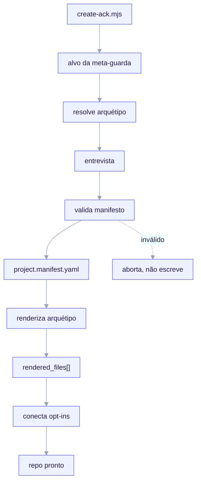

# Início rápido

Isto percorre o fluxo completo de `/ack-init` de ponta a ponta:
**fork → `/ack-init` → entrevista que começa pelo arquétipo → `project.manifest.yaml` →
render → conexão dos opt-ins.** Ele assume que você já fez o fork do repositório conforme a
[Instalação](/getting-started/installation).



<small>`node bin/create-ack.mjs my-product --archetype X` inicia um filho autônomo a partir dos templates congelados — sem fork, sem árvore META, sem LLM no loop. A meta-guarda recusa fazer scaffold sobre o kit; o arquétipo é o eixo de ramificação; a entrevista cai para os padrões de `questions.yaml` sob `--yes`; o manifesto é montado e validado por `lib/manifest.mjs` contra o JSON-Schema (fail-closed) antes de `scripts/render.mjs` renderizar `templates/archetypes/X/` e gravar o livro-razão `rendered_files[]` de volta no manifesto, então os opt-ins (gate / telemetry / design-system) são conectados.</small>

## O fluxo em uma olhada

```
/ack-init  (inside the fork)
   1. meta-repo guard         → refuse if run in ai-core-kit itself
   2. ask ARCHETYPE first     → the branch axis (narrows every later question)
   3. deterministic interview → answers written to managed: paths
   4. validate manifest       → against the frozen JSON-Schema (fail-closed)
   5. render archetype tree   → ${VAR} substitution + _when.* conditional dirs
   6. write rendered_files[]   → ownership ledger for idempotent re-runs
```

## 1. Execute o comando

A partir da raiz do seu fork:

```text
/ack-init
```

`/ack-init` é o **único escritor** do manifesto. Ele semeia `user:` uma vez na primeira
execução e, então, nunca mais o toca; em toda execução ele regenera por completo a subárvore
`managed:` a partir das suas respostas.

## 2. Escolha um arquétipo (perguntado primeiro, obrigatório)

A primeira pergunta de todas é o **arquétipo** — o eixo de ramificação (invariante **I3**).
Sua resposta seleciona tanto o subconjunto de perguntas que você responderá quanto o conjunto
de templates que será renderizado.

| Arquétipo | Profundidade v1 | O que renderiza |
|---|---|---|
| `backend-api` | **Profundo** | scaffold completo, portão de contrato, seed OpenAPI, persistência |
| `fullstack` | **Profundo** | scaffold completo + instalação opcional de design-system (shadcn/ui) |
| `monorepo` | Núcleo mínimo | apenas o núcleo seguro (skills, convenções `.claude/`, manifesto) |
| `library-sdk` | Núcleo mínimo | apenas o núcleo seguro |
| `infra-iac` | Núcleo mínimo | apenas o núcleo seguro |

Como o arquétipo é o eixo de ramificação, **um projeto `infra-iac` nunca recebe perguntas
de banco de dados**, e a **instalação de design-system só é oferecida para `fullstack`**.
Isto é gating determinístico a partir de `templates/interview/questions.yaml` — não um
palpite de LLM.

## 3. Responda apenas as perguntas que se aplicam

A entrevista percorre `questions.yaml` em ordem, pulando qualquer pergunta cujo `applies_to`
exclua o seu arquétipo ou cujo `ask_if`/`skip_if` avalie como falso contra respostas
anteriores. As 39 perguntas cobrem:

- **Identidade do projeto + stack**: nome, descrição, linguagem, runtime, gerenciador de
  pacotes, framework (enum com escopo de arquétipo), arquitetura.
- **Recursos** (alternâncias opt-in, desligadas por padrão exceto hooks/gate): `hooks`,
  `mcp`, `agent_teams`, `sdd_gate` (a chave-mestra do portão de contrato).
- **Persistência** (`backend-api`/`fullstack` apenas): engine de DB, ORM, migrations.
- **Portão de contrato**: modo (`block`/`warn`/`off`), caminhos protegidos, escopo, globs
  isentos.
- **Design system** (`fullstack` apenas): instala os skills Apache-2.0 incluídos.
- **Telemetria**: habilita atribuição offline, modo de atribuição, caminho do mapa de preços.
- **Discovery** e alvo de **CI/CD**.

Cada resposta é escrita em um caminho pontilhado `writes_to` sob `managed:`. O banco completo
está documentado em [Entrevista → Manifesto → Render](/concepts/manifest-and-interview).

### Execuções não interativas

Você pode conduzir a entrevista a partir de um conjunto de respostas preparado em vez de
digitar. Os padrões em `questions.yaml` são o que as execuções não interativas usam, e o
`default` de um `select` é sempre uma de suas `options` declaradas.

## 4. O manifesto é escrito e validado

As respostas coletadas são escritas por completo na subárvore `managed:` de
`project.manifest.yaml` (a **única fonte de verdade**), depois validadas contra o
JSON-Schema congelado **antes** de qualquer arquivo ser renderizado.

- **Manifesto inválido → aborta, não escreve nada** (fail-closed em tempo de autoria,
  invariante **I6**). Uma chave com erro de digitação é um erro de validação rígido, não um
  descarte silencioso (`additionalProperties: false`, invariante **I5**).
- **Mesmas respostas → manifesto byte a byte idêntico.** As chaves são emitidas na ordem de
  declaração do schema; a subárvore `managed:` é canonicalizada e hasheada em `manifest_hash`.
  Não há LLM no loop (invariante **I2**).

```yaml
# project.manifest.yaml  (excerpt — a backend-api result)
schema_version: 2
managed:
  manifest_hash: "sha256:..."          # written last, over the canonical managed: subtree
  project:
    name: acme-orders-api
    language: python
    framework: fastapi
  archetype: backend-api
  features: { hooks: true, mcp: false, agent_teams: false, sdd_gate: true }
  contract_gate:
    mode: block
    protected_paths: ["src/**", "migrations/**", "openapi/**"]
user:
  notes: ""
  overrides: {}
```

## 5. O conjunto de templates do arquétipo é renderizado

O motor de render percorre `templates/archetypes/<archetype>/`, substitui variáveis
`${dotted.path}` de `managed:` e inclui ou omite arquivos com base nas guardas de diretório
`_when.*` e em `render.map.yaml`. Ele escreve de volta um livro-razão de propriedade
`rendered_files[]` para que as re-execuções sejam idempotentes. Detalhes:
[Contrato do motor de render](/concepts/render-engine).

## 6. Os extras opt-in são conectados

Tudo que você alternou para ligado é conectado no filho:

- **Hooks** (`features.hooks`): hooks conservadores de PreToolUse/PostToolUse.
- **Portão de contrato** (`features.sdd_gate`): o hook PreToolUse de 3 modos
  (`.claude/hooks/contract-gate`); totalmente omitido quando `sdd_gate` é falso.
- **MCP** (`features.mcp`): um `.mcp.json` de projeto.
- **Telemetria** (`telemetry.enabled`): o agregador offline + mapa de preços.
- **Design system** (`fullstack` + `design_system.install`): os skills shadcn/ui,
  `shadcn.mcp.json` e tokens de tema.

Os hooks do filho referenciam os artefatos do filho por meio do literal
`${CLAUDE_PROJECT_DIR}` — nunca um caminho absoluto e nunca um caminho relativo a
`templates/` (forkabilidade, invariante **I7**).

## Re-executando `/ack-init`

Uma segunda execução com **respostas idênticas** é um no-op: `manifest_hash` coincide e todo
caminho em `rendered_files[]` permanece inalterado em disco, então o comando sai com 0 e zero
escritas. Edições manuais **fora** das regiões gerenciadas pelo ack sobrevivem — o
renderizador é dono apenas de blocos gerenciados delimitados em arquivos compartilhados (por
exemplo, `CLAUDE.md`, `settings.json`) e nunca toca em arquivos ausentes do livro-razão. Veja
[Motor de render — idempotência](/concepts/render-engine#idempotent-re-renders).

## Próximo

- Entenda a fronteira dentro da qual você está trabalhando:
  [A fronteira META vs CHILD](/concepts/two-layer-model).
- Veja os contratos que a entrevista obedece:
  [Entrevista → Manifesto → Render](/concepts/manifest-and-interview).
