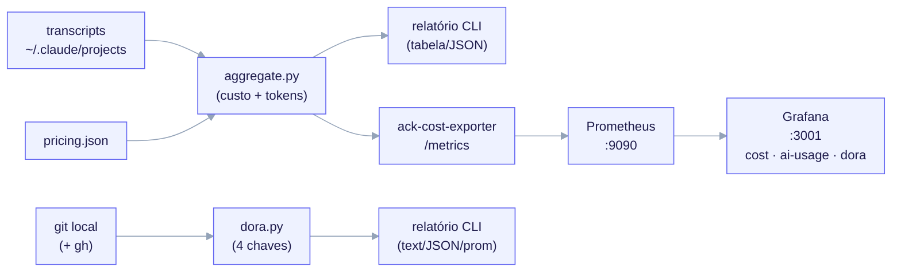

import TerminalCast from '../../../components/TerminalCast'

# Referência de Observabilidade

<TerminalCast src="/demo/ack-telemetry.cast" />

O ai-core-kit oferece duas visões honestas e complementares de uma execução do
Claude Code:

1. **Uso de IA** — o custo em USD **e em tokens** da execução, derivado
   **offline** do transcript. Não existe API de custo ao vivo para o gasto do
   Claude Code (issue
   [#11008](https://github.com/anthropics/claude-code/issues/11008)), então isto
   é contabilidade precisa *a posteriori*, **nunca um medidor ao vivo**.
2. **DORA** — as quatro "chaves" de entrega (frequência de deploy, lead time,
   taxa de falha de mudança, tempo para restaurar), calculadas a partir do seu
   **histórico git local** (e do `gh` quando presente). Isto é **exato**, não uma
   estimativa de transcript.

Esta página é a lista completa, sem omissões, dessas peças: o agregador, o mapa
de preços, os orçamentos, o módulo DORA, o exportador Prometheus e a stack
docker-compose com seus três dashboards. O modelo de atribuição de custo está
detalhado em [Telemetria de Custo Offline](/features/cost-telemetry).


<small>Dois motores, uma stack. <code>aggregate.py</code> × <code>pricing.json</code> precifica o uso de tokens do transcript (OFFLINE — near-real-time no melhor caso, nunca um medidor ao vivo). <code>dora.py</code> lê o git local (+ <code>gh</code>) para as quatro chaves (EXATO). Ambos aparecem na mesma stack Prometheus + Grafana via três dashboards autoprovisionados por pasta.</small>

## As peças, num relance

| Peça | Tipo | Camada | O que faz |
|---|---|---|---|
| `aggregate.py` | telemetria | META | Agregador offline de **custo + tokens** — lê transcripts, multiplica as contagens de tokens pelo mapa de preços versionado, atribui por `model`/`feature`/`agent`/`session`/`day` e compara totais com orçamentos consultivos. |
| `pricing.json` | telemetria | META | Mapa versionado `model → USD/MTok`, `unknown_model_policy=error`. |
| `dora.py` | telemetria | META | As **quatro chaves** DORA a partir do histórico git local (+ `gh` opcional), com self-test. Saída text / JSON / Prometheus. |
| `ack-cost-exporter` | telemetria | META | Wrapper Prometheus fino que **importa** o `aggregate.py` (sem reimplementação) e expõe gauges de custo/tokens em `/metrics`. |
| `observability-stack` | telemetria | META | Stack docker-compose Prometheus + Grafana + exportador com três dashboards. |

Caminhos:

| Peça | Caminho |
|---|---|
| `aggregate.py` | `telemetry/aggregate.py` |
| `pricing.json` | `telemetry/pricing.json` |
| `dora.py` | `telemetry/dora.py` |
| `ack-cost-exporter` | `telemetry/observability/exporter/ack_cost_exporter.py` |
| `observability-stack` | `telemetry/observability/docker-compose.yml` |
| dashboards | `telemetry/observability/grafana/dashboards/{ack-cost,ack-ai-usage,ack-dora}.json` |

Cada uma dessas peças vive no `telemetry/` da camada META e é espelhada no payload
FILHO sob `templates/telemetry/`, conectada pelo `/ack-init` quando
`telemetry.enabled: true`.

---

## Uso de IA — `aggregate.py` (custo **e** tokens)

Ferramenta pós-execução apenas com stdlib. Para cada linha `assistant` ela lê
`message.usage` (presente em todo turno do assistente, com ou sem ferramenta,
capturando 100% do gasto) e a precifica contra o `pricing.json`. **Cada grupo
carrega contagens de tokens — `input` / `output` / `cache_read` /
`cache_write_5m` / `cache_write_1h` — ao lado do custo em USD**, então isto é
contabilidade real de uso de tokens, não só um valor em dólares. É **fail-LOUD**:
modelo desconhecido, `pricing.json` ausente/inválido ou soma de grupos que não
reconcilia com o total saem com código diferente de zero. Uma única linha JSONL
malformada é ignorada (não é fatal).

```bash
# máquina inteira, todos os eixos, a tabela de uso de IA (custo + tokens) + JSON:
python3 telemetry/aggregate.py

# uso por sessão, apenas este build:
python3 telemetry/aggregate.py --by session --since 2026-06-01
```

```
## by session                turns   cost USD    in+out tok    cache tok
e3b61498-3313-49..            3872    441.4824     3,546,105   446,558,196
a29e493f-f2aa-4d..            5496    340.2362     3,670,522   442,059,374
```

### Eixos de atribuição — agora incluindo `day`

`--by` seleciona um ou mais de `model,feature,agent,session,day`:

- **model / session** — chaveados no `message.model` / `sessionId` exato. Sempre exato.
- **agent** — `isSidechain` separa o gasto `main` do `subagent:<requestId>`.
- **feature** — fornecido por `--branch-prefix` (feature = branch após o prefixo)
  ou por um `--sidecar-map` (timestamp → bucket); o que não casar cai no
  `--default-bucket` (nunca descartado silenciosamente).
- **day** — cada turno cai no seu **dia de calendário UTC** (`YYYY-MM-DD`); turnos
  sem timestamp caem num bucket explícito `undated`. Isto alimenta a série
  temporal de tokens + custo por dia que o dashboard `ack-ai-usage` plota.

Todo eixo **reconcilia**: a soma por grupo é provada igual ao total geral, ou a
execução sai com código diferente de zero.

### Orçamentos são consultivos

`pricing.json` produz **valores reais**. **Orçamentos** (tetos de USD consultivos)
sinalizam o excesso — eles nunca impõem nem bloqueiam nada ao vivo. Duas formas de
defini-los:

- **Manifesto FILHO** — `telemetry.budgets[]` (escopo
  `project|feature|contract|agent`), lido por `aggregate.py --manifest` e pelo
  exportador (`ACK_MANIFEST`).
- **Ad-hoc na CLI** — `--budget USD` para o total geral, ou `--budget-axis AXIS` +
  `--bucket-budget NOME=USD` repetido para tetos por grupo. O excesso é
  **reportado**; `--budget-strict` faz o excesso sair com código diferente de zero
  (falha de reconciliação **sempre** sai com código diferente de zero,
  independentemente dos orçamentos).

## `pricing.json` — o mapa de preços versionado

Um mapa `model → USD/MTok` com `schema_version`, uma data `as_of` e
`unknown_model_policy: error`. Chaves por modelo: `input`, `output`,
`cache_write_5m`, `cache_write_1h`, `cache_read`. Um bloco `aliases` mapeia ids
nus/aliasados para um id precificado (sufixos datados `-YYYYMMDD` são removidos
automaticamente); `skip_models` lista pseudo-modelos não faturáveis. Um
`message.model` ausente do mapa é erro fatal nomeando o id ofensor — o custo nunca
é subcontado silenciosamente. A correção: adicionar uma linha (copie uma do mesmo
tier, defina os valores USD/MTok, atualize o `as_of`).

---

## DORA — `dora.py` (as quatro chaves, exatas a partir do git)

<TerminalCast src="/demo/ack-metrics.cast" />

Um irmão do `aggregate.py`, apenas com stdlib, que lê o **histórico git local** —
sem servidores, sem pip — e calcula as quatro chaves DORA sobre uma janela
(`--since 30d|12w|6m|1y|YYYY-MM-DD`, padrão 30d). Diferente do custo, isto é
**exato**, não uma estimativa de transcript.

```bash
python3 telemetry/dora.py                       # modo tag (tags de release = deploys)
python3 telemetry/dora.py --deploy-mode merge   # repos trunk/CD (first-parent = deploy)
python3 telemetry/dora.py --selftest            # fixa a matemática num fixture sintético
python3 telemetry/dora.py --prom                # texto de exposição Prometheus
```

| Chave | Definição (nesta ferramenta) | Bandas de rating |
|---|---|---|
| **Frequência de deploy** | deploys na janela ÷ dias. | elite ≥1/dia · high ≥semanal · medium ≥mensal · low |
| **Lead time para mudanças** | mediana(commit **autorado** → primeiro deploy que o contém). | elite &lt;1d · high &lt;1sem · medium &lt;1mês · low |
| **Taxa de falha de mudança** | failed_deploys ÷ deploys. | elite/high ≤15% · medium ≤30% · low |
| **Tempo médio para restaurar** | mediana(marcador de falha → próximo deploy que resolve). | elite &lt;1h · high &lt;1d · medium &lt;1sem · low |

**Deploys e falhas são PROXIES — o `dora.py` é honesto sobre isso.** Um repo git
não tem um stream de deploy real, então um *deploy* é uma **tag** de release
(`--deploy-tag-glob`, padrão `v*`; o modo padrão) ou um **commit first-parent** na
branch padrão (`--deploy-mode merge`, para repos trunk/CD). Uma *falha* é um deploy
que contém um **revert** (`Revert …` / `This reverts commit …`) ou um commit de
**hotfix** (`--hotfix-glob`, padrão `*hotfix*`; também `fix!:` / `[hotfix]`), ou —
apenas com `--use-gh` — um deploy cujo SHA tem um run de CI com falha. Históricos
com squash/rebase/force-push e fluxos sem tags vão estimar errado; escolha o
`--deploy-mode` que casa com o seu jeito de entregar e leia a nota heurística que o
relatório imprime.

A enriquecimento via `gh` é **best-effort**: `gh` ausente, não autenticado ou
offline pula silenciosamente a detecção de falha por CI (a detecção de
revert/hotfix continua rodando); o relatório diz qual caminho seguiu. O
**`--selftest`** assevera a matemática exata das quatro chaves num fixture
sintético, sem git (e os casos de borda: sem deploys, janelamento, falha só por CI,
a gramática da janela) — faz parte do gate de testes.

`--prom` emite estes gauges (para o exportador surfacar DORA sem reimplementar a
matemática): `ack_dora_deploys_total`, `ack_dora_deploy_frequency_per_day`,
`ack_dora_deploy_frequency_per_week`, `ack_dora_lead_time_seconds`,
`ack_dora_change_failure_rate`, `ack_dora_failed_deploys_total`,
`ack_dora_mttr_seconds`, `ack_dora_window_span_days`. Uma métrica sem dados é
emitida como `NaN` (o Prometheus registra "sem amostra" em vez de um `0`
enganoso).

---

## `ack-cost-exporter` — gauges Prometheus

Um wrapper Prometheus fino que **importa** `load_pricing`, `discover_jsonl` e
`aggregate` do `aggregate.py` irmão — ele **não** reimplementa preço nem
atribuição. A cada scrape (sujeito ao cache `ACK_SCRAPE_TTL`, padrão 30s) ele
reanalisa o transcript JSONL e re-agrega, então a atualidade é "a partir do último
recompute", nunca um medidor de token ao vivo. É **fail-soft no scrape**: em
qualquer erro ele mantém os últimos gauges bons e define `ack_scrape_error=1` (um
diretório de transcripts vazio/ausente não é erro — emite zeros limpos).

| Métrica | Significado |
|---|---|
| `ack_total_cost_usd` | Total geral em todos os turnos do assistente. |
| `ack_assistant_turns_total` | Número de turnos do assistente precificados. |
| `ack_files_scanned` | Arquivos de transcript descobertos. |
| `ack_cost_usd{model,feature,agent}` | Custo por grupo de eixo (1-D; eixos inativos fixados em `*`). |
| `ack_tokens_total{kind,feature,agent}` | Tokens por tipo por grupo de eixo. |
| `ack_budget_usd{feature}` | Tetos de orçamento consultivos do manifesto (`scope=project` → `__project__`). |
| `ack_reconciled` | `1` se todos os eixos reconciliam, senão `0`. |
| `ack_pricing_as_of{as_of,reconciled}` | Metadados do doc de preços (Info). |
| `ack_scrape_duration_seconds` | Tempo de relógio do último recompute. |
| `ack_scrape_error` | `1` se o último scrape deu erro (obsoleto, não confie). |
| `ack_last_scrape_unixtime` | Timestamp unix do último recompute. |

Config (ambiente): `ACK_PROJECT_DIR`, `ACK_PRICING`, `ACK_MANIFEST` (opcional;
fornece orçamentos), `ACK_BRANCH_PREFIX` (padrão `feat/`), `ACK_DEFAULT_BUCKET`,
`ACK_SINCE`, `ACK_PORT` (padrão `9418`), `ACK_SCRAPE_TTL` (padrão `30`).

## `observability-stack` — Prometheus + Grafana

`telemetry/observability/docker-compose.yml` sobe três serviços:

| Serviço | Imagem | Porta | Papel |
|---|---|---|---|
| `exporter` | `ack-cost-exporter:local` (build) | `9418` (interna) | Reanalisa transcripts a cada scrape (cacheado por TTL) e expõe os gauges acima. Monta transcripts, `aggregate.py` e `pricing.json` read-only. |
| `prometheus` | `prom/prometheus:v3.5.3` | `9090` | Faz scrape do exportador a cada 30s; armazena as séries por 30 dias. |
| `grafana` | `grafana/grafana:12.4.3` | `3001` (→ 3000) | Dashboards; Viewer anônimo por padrão. Porta de host 3001 porque a 3000 é o site de docs. |

```bash
docker compose up -d        # inicia (de telemetry/observability/)
open http://localhost:3001  # Grafana (Viewer anônimo)
docker compose down         # para (adicione -v para apagar as séries armazenadas)
```

### Três dashboards (autoprovisionados por pasta)

O Grafana autocarrega **todo** `*.json` sob `grafana/dashboards/` via o provider
`ack.yml` — um novo dashboard não precisa de edição de provisionamento.

| Dashboard | UID | O que mostra |
|---|---|---|
| **Cost Observability** (`ack-cost.json`) | `ack-cost-observability` | Custo total, turnos, saúde do exportador; custo por feature/model/agent; pizza de participação; top sessões; gauges de orçamento. |
| **AI Usage** (`ack-ai-usage.json`) | `ack-ai-usage` | Contagens de **tokens** (não só USD) — tokens ao longo do tempo por tipo, participação de cache-read, um razão de tokens feature×tipo, tokens por feature/agente, gasto por sessão, gauges de orçamento e um stat "Data Freshness" da idade do recompute OFFLINE. |
| **DORA** (`ack-dora.json`) | `ack-dora-metrics` | As quatro chaves como painéis stat + timeseries de tendência (frequência de deploy, lead time/MTTR, taxa de falha, falhos-vs-total), vindas dos gauges `ack_dora_*`. |

Copie `.env.example` para `.env` para sobrepor portas, diretório de projeto e
credenciais do Grafana. Os números de custo/tokens são **near-real-time**
(atualizados a cada scrape, limitados por `ACK_SCRAPE_TTL`), não um medidor de
token ao vivo.

---

## A restrição forte, e o que é exato

> Não existe medidor de custo ao vivo para o gasto do Claude Code, e nunca poderá
> existir — os hooks não carregam campos de token ou custo
> ([#11008](https://github.com/anthropics/claude-code/issues/11008)). Declare isto
> antes de prometer qualquer número em tempo real.

Então **o custo de IA é offline** (transcript × preços, near-real-time no melhor
caso). **O DORA é exato** (derivado do git, não do transcript). Duas skills do
payload FILHO ficam sobre o motor de custo (ambas MIT):

- **`cost-telemetry`** — roda o `aggregate.py` e interpreta sua saída; a única
  fonte da verdade para *os números*. Renderizada quando
  `features.cost_telemetry == true`.
- **`cost-audit`** — investigação evidência-primeiro de *por que* o gasto subiu;
  delega os números à `cost-telemetry` e nunca rederiva a matemática de preços.

Veja também: [Telemetria de Custo Offline](/features/cost-telemetry) (modelo de
atribuição, reconciliação, orçamentos), [Catálogo de Skills](/features/skills-catalog).
